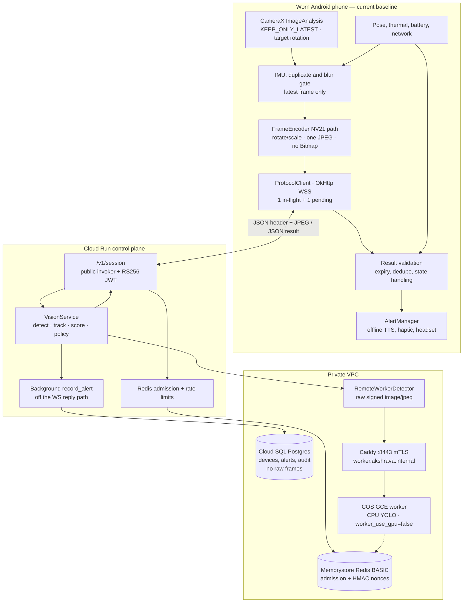
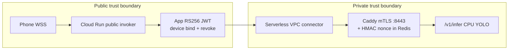

# Akshrava — Important End-to-End Architecture

**Status:** authoritative architecture and operating boundary for the recycled-phone assistive-vision pilot. It consolidates the important decisions from the build plan with the implementation that exists in this repository. Where the two differ, **the implemented, fail-closed behaviour is the current truth**; the broader design is explicitly marked as a release-gated target.

## 1. Purpose, safety boundary, and release truth

Akshrava is a supervised-pilot aid for blind and low-vision users in India. It uses a worn Android phone to turn a *recent* camera view into a short alert about a limited set of relevant hazards. It supplements—not replaces—a white cane, guide dog, sighted guide, or normal road-safety practice.

The system is **not** navigation, route guidance, collision avoidance, a crossing decision aid, continuous scene description, facial recognition, or a guarantee of detecting every obstacle. It must never say that a road is safe to cross, that a path is clear, or that a vehicle is approaching.

The key honesty boundary is kinematic: at the 0.2–3 FPS envelope used by a recycled phone and cloud round trip, box growth confuses wearer motion, camera swing, autofocus and target motion. Vehicle output is only `vehicle nearby in this recent view`; all results return `motion_evidence: "insufficient"`. A vehicle time-to-collision feature is a separate research programme, not a tuning change.

### Current implementation vs. approved evolution

| Capability | Current repository behaviour | May be enabled only after evidence |
|---|---|---|
| Server detector | `DETECTOR=noop` by default; transport, freshness and policy can be exercised without inventing vision | Approved/licensed weights, fixed runtime, target-device and route-disjoint evaluation, regression and controlled-course gates |
| Tracking | Per-session track lists via `SimpleTracker` (one helper instance per WebSocket `device_id` for ID allocation; association state on `SessionState`); short miss retention never creates motion claims. Isolation is per-session, not durable across reconnects. | A benchmarked tracker may replace it, but never justify “approaching” speech at low FPS |
| Range | Pose is a validity signal; missing/unverified geometry keeps `range_valid=false`. A verified `calibration_profiles` row plus pose/agreement gates may set `range_valid=true`; no numeric distance is spoken | Controlled-course evidence that the verified profile is trustworthy on that mount/route |
| Local fallback | No TFLite/LiteRT model is bundled; offline state says assistance is unavailable | A pinned, evaluated model asset and complete preprocessing/postprocessing contract, device benchmark and controlled-course evidence |
| Pilot use | Bench tests and supervised preparation only | A named mobility instructor, Tier-A device, valid consent, controlled-course pass and release-gate sign-off |

Silence never means safety. The app must state `Camera view unclear`, `Limited alerts`, or `Vision assistance unavailable` when it knows it cannot assist.

## 2. End-to-end system

**Live supervised GCP pilot (2026-07):** Android `ProtocolClient` → Cloud Run
`wss://akshrava-api-c7d3j4nzdq-uc.a.run.app/v1/session` (public invoker + RS256 JWT) → Redis
admission → VPC connector → private DNS `worker.akshrava.internal:8443` (Caddy mTLS) → **CPU**
YOLO worker (`worker_use_gpu=false`; GPU quota 0). Cloud SQL, Memorystore Redis (BASIC), Secret
Manager, Artifact Registry, diagnostics GCS, COS iptables `:8443`, and IAP SSH firewall are in
Terraform; PKI PEMs live under `gcp/pki/` (`manage_pki_in_terraform=false`). This is **not**
unsupervised field production and **not** a live L4 GPU claim. Operator diagrams:
[docs/OPERATIONS.md](docs/OPERATIONS.md).





The architecture is intentionally a freshness pipeline, not a video system. Raw frames are processed in memory, never queued to catch up, and are not retained in normal operation. A consented diagnostic sample is a separate privacy-controlled workflow (GCS bucket when enabled). The repository [`README.md`](README.md) is the short end-to-end map of these code paths; Compose under `infra/` is an alternate local/single-host deploy, not the live pilot edge.

### Frame-to-ear lifecycle

1. The user visibly starts assistance from the accessible Android activity. The foreground service owns the camera, so locking the screen does not transfer ownership back to the activity.
2. `ImageAnalysis` keeps only the latest frame and asks CameraX for the current display rotation. The phone uses motion, thumbnail-difference and blur gates, but periodically samples even when still so gating cannot declare a scene safe.
3. `FrameEncoder` rotates/downscales in NV21 scratch buffers (no Bitmap allocations) and JPEG-encodes a ≤640 px image. Normal walking is about 1 FPS, stillness about 0.2 FPS, and a short confirmed-hazard re-check may reach 2 FPS; this is freshness confirmation, never collision sensing.
4. The phone sends a JSON frame header immediately followed by binary JPEG over one authenticated WebSocket. It permits one in-flight request and one replaceable pending frame; it drops old work rather than building a backlog.
5. The backend authenticates, validates size/timing, rate-limits, runs the configured detector (`noop` / local Ultralytics / remote HMAC worker), associates tracks per session, applies conservative hazard policy, and returns compact JSON plus optional quality guidance. Alert rows are scheduled with `_schedule_record_alert` so PostgreSQL latency cannot delay the phone reply; `shutdown_async` drains those tasks before the DB engine is disposed.
6. The phone rejects stale or mismatched results, deduplicates them, arbitrates speech/haptics, and plays short offline English/Hindi prompts through a single-ear headset where possible.

### Alert return path — detection to spoken word

Once a detector produces boxes, the alert is *composed on the server as a template ID plus slots*, not as a finished sentence, and *rendered to speech on the phone from offline templates*. The server never streams audio; it returns a compact JSON `result`. The phone is the sole owner of freshness, dedupe, mute and the one speaking lane.

```mermaid
sequenceDiagram
    autonumber
    participant Det as Detector (noop/Ultralytics/remote)
    participant Trk as SimpleTracker (per session)
    participant Sc as HazardScorer (pure)
    participant Pol as AlertPolicy (cooldown/rate)
    participant Cmp as composer.hazard_payload
    participant WS as WebSocket result JSON
    participant PC as ProtocolClient.handleMessage
    participant AM as AlertManager (single lane)
    participant Out as TTS + haptics

    Det->>Trk: boxes [label, conf, xyxy]
    Trk->>Sc: associated tracks (hits, box)
    Sc->>Pol: candidate Hazard or None (no state mutation)
    Note over Sc: range_valid=false unless a verified<br/>calibration_profile + pose gates pass
    Pol->>Cmp: admitted Hazard (5s per-key cooldown, 6/min device cap)
    Cmp->>WS: {message_key, bearing, level, severity, haptic,<br/>range_valid, spoken_preview, motion_evidence:"insufficient"}
    Note over WS: late_suppressed frames send NO hazard;<br/>a priority look sends look_summary instead
    WS-->>PC: result (echoes capture_mono_ms)
    PC->>PC: age = elapsedRealtime - capture_mono_ms<br/>reject if > 500ms (250ms urgent / 500ms look)
    alt priority look
        PC->>AM: speakComposed(look_summary)
    else hazard present and fresh
        PC->>AM: announce(message_key, bearing, urgent, haptic)
    end
    AM->>AM: per-object 5s cooldown · 1/2s gap ·<br/>3-in-10s → "busy road" collapse
    AM->>Out: vibrate(haptic) ALWAYS (even muted)
    AM->>AM: mute gate (speech only) ·<br/>protect first 350ms of an urgent phrase
    AM->>Out: TTS speak (QUEUE_FLUSH urgent / QUEUE_ADD caution)
```

**Why the split.** The composer emits `message_key + bearing` (e.g. `vehicle_nearby` / `right`) plus a `spoken_preview` string. The phone re-renders from its own offline template table (`AlertManager.template`), so speech works with the network dead, a Hindi phone always gets Hindi, and an unknown future `message_key` degrades to a safe `Assistance is limited` rather than mis-speaking. `spoken_preview`/`look_summary` are used verbatim only for the on-demand look, which is composed for that single frame.

**Freshness and honesty gates on the return leg.** The phone computes age with its own `elapsedRealtime()` clock against the echoed `capture_mono_ms` (never a server clock) and drops any result older than 500 ms (250 ms for an urgent nearby obstruction). A `late_suppressed` frame carries no hazard at all — the server skips scoring rather than speak an old detection — and a look answered past budget says *"could not check just now"*, never *"no hazard"*.

**The single speaking lane (`AlertManager`).** Every caller — cloud alert, on-demand look, mode/status message, headset repeat — is serialised onto one worker thread so cooldown maps and the TTS queue stay consistent. Rules enforced there: a 5 s per-object cooldown; one utterance per 2 s; three alerts in ten seconds collapse to a single *"busy road, careful"*; an S1 urgent phrase flushes a caution mid-word but its own first 350 ms is protected from a following urgent; **haptics always fire, even while muted**, because the buzz is the channel a muted user still relies on. Mute auto-expires after 15 minutes so it can never be left silently dead, and single-press repeat replays the last alert if it is under 30 s old.

## 3. Timing, freshness, and backpressure

| Stage | Target budget | Invariant when the budget is missed |
|---|---:|---|
| Capture, gate, resize, JPEG | 25–70 ms | Lower size/quality for subsequent frames; do not make a recorder queue |
| Network round trip | normally 40–220 ms | Discard late work; do not replay it after reconnect |
| Decode, inference, tracking, scoring | 45–80 ms target | Shed load through server quality guidance; bounded worker queue only |
| Result validation and audio start | 60–110 ms | Urgent haptic can lead; stale speech is dropped |
| Glass-to-audio p95 | **under 500 ms** | A result older than 500 ms is never spoken; nearby-obstruction urgency uses a tighter 250 ms budget where configured |

Every header includes monotonically increasing `id`, phone-local `capture_mono_ms`, dimensions, JPEG byte count, calibration ID, filtered pitch/roll and pose age. The phone calculates age with its own elapsed-realtime clock and rejects a result if it is too old; it never relies on server-clock comparison. The backend also rejects headers that arrive too quickly and consumes their JPEG companion so the stream remains aligned.

Server quality replies are advisory and bounded: normal `640/Q60/1 FPS`, then `512/Q45/0.7 FPS`, then `384/Q35/0.5 FPS` under pressure. The phone adapts in this order: fewer frames, smaller side, lower JPEG quality. It remains responsible for freshness. A per-device token bucket normally permits 1.2 FPS with a two-frame burst and is Redis-shared in production.

Reconnect uses exponential backoff with jitter and re-authentication, never a retained image backlog. After repeated missed heartbeats or roughly 10 seconds without a successful result, announce outage once: `Vision assistance unavailable. Use cane or guide.` Recovery is announced once (`Connection restored`) and connectivity status is rate-limited. The same unavailable phrase is used when no separately approved local model exists — never imply limited on-device obstacle alerts after the server link is lost.

## 4. Wire contract and trust boundary

The production endpoint is `wss://HOST/v1/session`. The live supervised pilot uses
`wss://akshrava-api-c7d3j4nzdq-uc.a.run.app/v1/session` with a public Cloud Run invoker and
app-level RS256 JWT (not a private-invoker-only edge). A short-lived device JWT is sent in the
WebSocket upgrade request and is bound to device/session claims. Development may use `ws://` and
`dev-device-token` only in debug/local workflows; release builds accept WSS only.

```json
{"type":"frame","id":841,"capture_mono_ms":93211455,"capture_epoch_ms":1752883094000,"w":640,"h":480,"jpeg_bytes":61423,"camera_calibration_id":"pilot-phone-r0","pitch_cdeg":-1180,"roll_cdeg":90,"pose_age_ms":12,"mode":"normal"}
```

The server first returns `ready` with `max_in_flight: 1` and `vision_enabled`. `vision_enabled: false` is a transport-only bench state: the app must announce that vision is unavailable and not send frames. For a valid image the server returns a compact result containing the echoed `frame_id`, age, alert level/kind/bearing, `range_valid`, confidence, message key and haptic hint. It may also return a `quality` message.

Before decode, enforce image-size and supported-dimension limits (200 KB default), token expiry/audience/device binding, monotonic frame times, rate limits, and request-size limits. Do not use a browser `Origin` header as native-app security. Store the provisioned token with Android Keystore; a Keystore failure requires visible re-provisioning, never plaintext fallback.

## 5. Android phone architecture and device policy

### Service and platform lifecycle

- Minimum supported API is 26 (Android 8); Tier-A pilot devices are Android 10+, 64-bit ARM and at least 4 GB RAM. Android 8/9 are compatibility-only, not a promise of equal reliability.
- On Android 14+ the user must press the TalkBack-labelled Start control while an activity is visible and camera permission is granted. The app must not silently start a camera foreground service from boot, a receiver or a background reconnect.
- `AssistService` is a visible camera foreground `LifecycleService`. It calls `startForeground()` before binding CameraX and binds analysis to the service, not the activity. Stop is explicit and returns `START_NOT_STICKY`; a watchdog may prompt Start but must not restart the camera silently.
- `CapturePolicy` owns capture cadence decisions for server quality, stationary motion, high-alert re-checks, thermal throttling and low battery; `AssistService` remains the Android I/O composition root.
- Use `ImageAnalysis.STRATEGY_KEEP_ONLY_LATEST`, one analyzer/executor, `finally` closure for every `ImageProxy`, a 640×480/640×640 stream, and a Camera2 fallback only for a tested legacy-device failure such as rotation, stream stability or camera selection.
- Camera, socket and wake lock are released on Stop and on critical battery according to the approved policy. A minimal-brightness overlay is only an optional, per-model workaround for screen-off OEM camera killing—not evidence that a device is suitable.

### Capture and resource controls

Use 25 Hz IMU sensing while active, a rolling stillness decision, 160×120 thumbnail difference and a per-device blur threshold. A blurred/obscured image is still sampled periodically so the app can say the camera is obscured. Stabilised nearby tracks may temporarily increase sampling for confirmation. Do not exceed 3 FPS in this cloud architecture.

JPEG is the baseline: target 640 px/Q60 and roughly 45–90 KB, with a lower-quality 512 px/Q45 ladder for poor uplink. Encoding stays in NV21 (`FrameEncoder`) so rotation/downscale does not allocate Bitmaps on the analysis thread. Do not substitute base64 on the phone↔server or control↔worker links (adds bytes/CPU) or continuous HEVC/video (creates keyframe, decode and backlog problems). Test actual data use, heat and battery per device; estimates are not a release claim.

At low battery, thermal warning, hot battery, blocked view, dead service or failed network, reduce/stop assistance and speak the relevant state once. Never charge or issue a visibly hot or swollen donated phone. For OEM power management, document exact manual settings for each model and validate a locked-screen 15-minute walk after reboot. Auto-start tricks are prohibited.

### Accessibility and audio

The audio arbiter has one speaking lane. An urgent stable obstruction may pre-empt caution but does not interrupt the first 350 ms of an urgent phrase. Dedupe `track_id + direction + tier` for several seconds while allowing escalation; globally limit speech to six alerts/minute and collapse excess traffic to one `Multiple obstacles ahead` status. Queue at most one newer urgent item while TTS is busy; discard stale/caution speech.

Use short message keys, offline TTS and haptics: `Obstacle ahead`, `Vehicle nearby, right`, `Camera view unclear`, and network/battery/thermal states. Do not use numeric metres, long object lists or cloud TTS in the safety loop. Provision and test English and Hindi offline in airplane mode; pre-recorded prompts are an acceptable fallback for a critical status phrase. Default to mono speech through a single-ear wired headset; speaker is only a last resort. Accessible Start, Stop, Repeat and Mute controls plus notification Stop are required. MediaSession headset controls are optional and only after testing the exact device; Bluetooth, OCR and an AccessibilityService are not baseline scope.

## 6. Backend, perception, and alert policy

### Ingest and serving

FastAPI handles the session protocol, but inference must not run in its event loop. The phone-facing control plane runs detectors in a thread executor; local Ultralytics instances still serialise through an inference lock, while `noop` and `remote` adapters do not. Production session admission, frame-rate limits and worker replay protection are Redis-shared so API/worker replicas enforce one fleet-wide decision instead of per-process limits. Bounded JPEG batching (default <=8 / ~12 ms) exists only on the private remote worker process (`DETECTOR=remote`), not as a control-plane gather queue. Persisted state is small and relational: device configuration, users, calibration/model versions, audit data and consent state in PostgreSQL (SQLite remains acceptable for early development).

The **live** supervised-pilot inference path is a pinned YOLO weight on the private **CPU**
HMAC/mTLS worker (`detector=remote`, `worker_use_gpu=false`) because this project’s GPU quota is
0. A CUDA/L4 worker remains a Terraform option when quota exists — not the current live posture,
and not a claimed sub-500 ms service on CPU. A fixed 640 shape, conservative batch cap and
runtime-enforced `YOLO_WEIGHTS_SHA256` are more important than an optimistic benchmark. The
control plane sends raw signed JPEG bodies to the private worker, avoiding base64 overhead on the
internal link. Workers claim HMAC nonces atomically in Redis, enabling replay-safe replica
deployment. The static inference registry gives each device stable worker placement and warm-peer
fail-through after transport failure; dynamic health re-pointing and capacity management remain
operational gates. An ONNX Runtime / Triton split is a later response to measured multi-model or
high-concurrency demand, not what Compose or the current GCP pilot ships today.

### Detection, association, geometry

Bootstrap classes are person, bicycle, motorcycle, car, bus and truck, mapped cautiously to user language. The local taxonomy—auto-rickshaw, scooter, cycle rickshaw, carts, dogs, parked vehicles, poles, branches, stairs, pavement and drains—requires route-specific labelled evidence. Traffic lights, signs and OCR are not continuous alert features.

Association stabilises repeated detections, suppresses repeats and permits multi-frame confirmation. It does not repair detector misses or infer approach. Current `SimpleTracker` coasts boxes only to assist IoU matching over 1–3 FPS gaps. Any future ByteTrack-like replacement remains subject to the same kinematic boundary.

Ground-plane geometry may derive a rough band from a verified mount height, pitch, intrinsics/FOV and a box bottom-centre ray. It must reject rather than guess when pose is stale, roll exceeds limits, contact is outside the lower image region, the ray is near parallel, or independent checks disagree. Without a verified `calibration_profiles` record the code keeps `range_valid=false`. Invalid range never becomes spoken distance. Monocular depth is offline error analysis only until separately proven.

### Conservative hazard decision

The scorer considers class, detector confidence, valid proximity, central path corridor and multi-frame stability. S1 urgent output is reserved for a validated nearby central obstruction (`range_valid` plus confidence); S2/caution requires repeated evidence. Vehicle language is awareness-only. On-demand **priority look** (`FrameHeader.priority` or `mode=priority`) skips alert cooldowns / device rate limits and returns a `look_summary` for that frame; the phone speaks it with a **500 ms** freshness budget. Look never invents approach or crossing advice. MediaSession long-press can request a priority frame after device-specific testing.

| Condition | Permitted response | Never infer |
|---|---|---|
| Stable validated central obstruction | `Obstacle ahead` with haptic | Collision prediction, safe route or crossing advice |
| Stable nearby lateral vehicle | `Vehicle nearby, left/right` | Approaching, closing speed or urgency from box growth |
| One frame, uncertain range, stale pose or stale result | No hazard speech; continue tracking or discard | Distance, motion, safety |
| Camera too dark/blocked, detector unavailable, no valid fallback | Explicit status message | A clear path |

## 7. Model, data, and calibration governance

COCO weights are a bootstrap, not safety evidence for chest-mounted Indian street views, autos, drains, missing pavement, glare or monsoon conditions. Before claiming a new class:

1. Confirm code, weight and dataset licences. Ultralytics/YOLO terms can involve AGPL-3.0 or enterprise obligations; obtain a licence decision before deployment.
2. Gather consented, non-adjacent walking frames across several routes, neighbourhoods, lighting/weather conditions and phone models. Keep routes distinct across train/validation/test.
3. Use a written class schema with positive/negative examples, occlusion and ignore regions. Start with a stable core label set; audit a second reviewer sample.
4. Fine-tune and evaluate at the actual operating confidence. Review per-class recall/precision, false negatives by light/distance and alert-level confusion—not mAP alone.
5. Pin the model/export/runtime/labels as a release artifact, record SHA-256 and run replay, device and controlled-course gates before activation.

Potholes, open drains, missing pavement and low branches are explicitly deferred until a larger local labelled dataset validates them. Dataset collection, diagnostic clips and model experiments require their own consent and retention controls.

An on-device fallback, if proposed, is a separately evaluated, INT8 320 px model for broad, stable, large central-obstruction prompts only. It cannot become vehicle-close, direction, pothole, drain, approach or crossing functionality. Its exact asset, labels, tensor contract, quantisation calibration, target-phone heat/latency and held-out recall must be reviewed together; otherwise it remains disabled.

Vehicle time-to-collision research requires an approved phone sustaining 5–10+ analysed FPS, ego-motion compensation, ground truth, route-disjoint day/night/weather tests (including lateral two-wheelers), predeclared error thresholds and mobility-specialist controlled-course review. Failure of any condition retains only awareness language or removes vehicle speech.

## 8. Device provisioning and physical kit

Do not issue every donated phone. Maintain an approved-device record with model/build, ABI/RAM, battery health, camera ID, mount/calibration version, TTS test, carrier test, model SHA-256 and test date.

| Tier | Acceptance | Field promise |
|---|---|---|
| A — pilot | Android 10+, 64-bit, 4 GB RAM, rear camera/LTE/offline TTS work; mount, 30-minute heat/battery and locked-screen service tests pass | Supervised daylight pilot only; never collision avoidance, rain or night by default |
| B — legacy | Android 8/9 with stable stream and service survival | Developer compatibility only; no fallback or equivalent runtime promise |
| C — reject/spares | 2 GB/32-bit only, failed camera/LTE/service test, damaged/swollen battery | No field use |

Provisioning must verify worn-mount orientation/FOV/focus, encode p95, filtered pose stability, service survival after a lock-screen walk, heat/battery behaviour, WSS freshness on each carrier, offline speech intelligibility and any local-model benchmark. The rig should place a rigid, breakaway chest/neck mount about 10–15° downward; a swinging lanyard invalidates calibration. Issue a protective case/rain sleeve only after glare/condensation testing, a BIS-marked power bank and a single-ear headset. Keep environmental hearing available.

## 9. Operations, security, privacy, and observability

On GCP, Cloud Run terminates public WSS; the worker stays private (VPC + Caddy mTLS). Compose
deployments still use a TLS/WSS reverse proxy and bind the API privately. Use `/readyz` for
database-aware readiness, encrypt disks/backups, rotate secrets/device tokens and apply least
privilege/MFA to operator consoles (IAP SSH for the worker VM). Make a tested PostgreSQL
backup/restore routine part of releases. Activate models only from an approved read-only directory;
the service must not download weights during a live session.

Measure aggregate, non-identifying frame accept/reject/drop counts, queue depth, decode/infer/track latency, frame age, alert rate, reconnects, fallback/state activation, device thermal/battery reports, detector/model version and error states. Prometheus/Grafana support operations and neither logs raw frames by default; Prometheus rules route through **Alertmanager** (`ALERT_WEBHOOK_URL`) so a device going silent mid-session, a downed control plane/worker, or chronically late results actually pages an operator rather than only rendering on a dashboard.

Privacy is minimisation by architecture:

- Process normal frames in RAM and discard them; retain no raw video, audio, GPS trail, face recognition output or persistent bystander tracking.
- Use a rotating random device ID, never IMEI. Keep a data map that states purpose, processor/location, retention, access owner and deletion method.
- Obtain accessible, revocable consent for any diagnostic sample. If retained, blur faces/plates on phone before upload, manually review, and never promise perfect anonymisation.
- Encrypt data in transit and at rest, keep frames out of logs and public tools, and implement deletion/access-revocation and incident procedures.
- Default retention target: operational telemetry 30 days, security audit events 90 days, consented diagnostic clips 30 days unless specific incident consent requires otherwise.
- Obtain Indian privacy/legal review before public rollout, especially for children, cross-border processing or retained footage. Compliance design should meet the intended DPDP standard even while legal commencement timing evolves.

## 10. Verification, release gates, and supervised trials

Run the repository verification baseline with:

```bash
./scripts/verify_phases.sh
# equivalent first-time setup: ./scripts/test_backend.sh
./scripts/gcp_preflight.sh   # when changing gcp/
```

`verify_phases.sh` creates `backend/.venv` if needed, runs the full pytest suite (including
**Phase-0 policy replay** over ≥50 synthetic events in `datasets/phase0/`), and ruff when
installed. That replay proves fail-closed speech contracts (`motion_evidence`, no approach/cross
language)—**not** street perception. A green suite is not field-use approval. CI runs the same
backend gate, Compose config, `gcp_preflight`, and Android unit/APK assembly. See
[docs/OPERATIONS.md](docs/OPERATIONS.md) (engineering release sequence).

| Gate | Minimum evidence before progressing | In-repo support today |
|---|---|---|
| Bench → one-phone integration | Policy tests + Phase-0 replay (≥50 synthetic events); every spoken output carries age; no result older than 500 ms is spoken | `verify_phases.sh`, `datasets/phase0/`, Android assemble |
| One phone → field-survival work | 50 controlled-course repetitions per declared static class; ≥45/50 alerts in budget; zero unannounced service deaths; mute/stop without sight | Field evidence (not CI); calibration upsert via `scripts/upsert_calibration_profile.py` |
| Survival → supervised participant trial | Three 45-minute device/carrier sessions; state announcements once each; mobility instructor signs | Process in [docs/README.md](docs/README.md) (field readiness) |
| Participant trial → small pilot | 3–5 guided sessions, no attributable injury, regressions triaged, alerts understandable | Process + ops runbooks |

Operator scripts that close the documented working path:

| Script | Purpose |
|---|---|
| `scripts/upsert_calibration_profile.py` | Insert/update mount geometry; `--confirm-verified` after course sign-off |
| `scripts/mint_device_token_gcp.sh` | Mint RS256 device JWT from Secret Manager private key |
| `scripts/build_gcp_images.sh` | Build/push API (with GCP extras) + worker images |
| `scripts/install_worker_weights.sh` | Copy + SHA-verify YOLO weights onto the worker VM |
| `scripts/gcp_migrate_then_deploy.sh` | `terraform apply` then Cloud Run Job `akshrava-migrate` |
| `scripts/e2e_gcp_pilot.sh` / `e2e_android_*.sh` | Live WSS + remote-vision E2E (not field gates) |
| `scripts/gcp_preflight.sh` | `terraform fmt/validate` + remote-detector SHA gate |

The test pyramid is unit policy/state tests; Phase-0 synthetic replay; controlled closed-course
obstacles with no moving vehicles; then daylight guided sessions. A blindfolded developer is not
a mobility-validation proxy.

Stop a session after an unexpected urgent miss, repeated stale alerts, unannounced service death, overheating, a fall/near fall or participant distress. The guide—not the app—intervenes for danger. Before each trial, explain the safety boundary orally, demonstrate mute/stop, check mount/battery/network and confirm consent. Afterward, collect oral feedback on helpful, late, wrong, frequent and audible alerts and read it back for confirmation.

## 11. Delivery sequence and explicit non-goals

| Phase | Deliverable and exit condition |
|---|---|
| 0 — prove the policy | Laptop replay/webcam, detector experiment, stable alert policy and measured p95; no app, cloud, depth, users or pothole claims |
| 1 — one device/route | Visible-start Kotlin service, WSS, one approved server, English/Hindi states and a small alert class set; supervised daylight route only |
| 2 — survive reality | OEM checklist, bounded queues, heat/battery/network states, regression suite and an evidence-gated fallback decision across phones/carriers |
| 3 — supervised participant | Accessible onboarding, consent, controlled course then short guided route, incident/replay loop |
| 4 — small monitored pilot | Approved-device inventory, support, rollout/rollback, privacy workflow and local failure labels; no scale or iOS promise until Android is stable |

Keep `NOT_NOW.md` as an enforceable scope guard. Deferred features include GPS hazard memory, optical-flow/looming or local approach tracking, foveated native-resolution uploads, continuous OCR, iOS, broad language rollout and large-scale cloud operations. Revisit each only with a specific evidence, privacy, latency and operating-cost case.

Before Phase 1, name the NGO safety partner and stop authority; choose one familiar daylight route and first Tier-A phone; settle English/Hindi audio and retention defaults; obtain a recurring-cost owner and monthly shutoff policy; and define success as timely, comprehensible alerts for a narrow class set without increased cognitive load—not “AI navigation.”

## 12. Primary implementation references

- [README.md](README.md) — end-to-end architecture map, code paths, local setup and verification.
- [docs/README.md](docs/README.md) — WebSocket contract, Android policy, privacy, field readiness.
- [docs/OPERATIONS.md](docs/OPERATIONS.md) — Compose/GCP deploy, model activation, tokens, E2E, failure handling.
- [gcp/](gcp/) — Terraform for Cloud Run API, SQL, Redis, mTLS worker, secrets, Artifact Registry, IAP SSH, diagnostics GCS. PKI PEMs: `gcp/pki/` (not TF state).
- [datasets/phase0/](datasets/phase0/) — synthetic Phase-0 policy replay fixtures (not street evidence).
- [NOT_NOW.md](NOT_NOW.md) — deferred scope guard.
