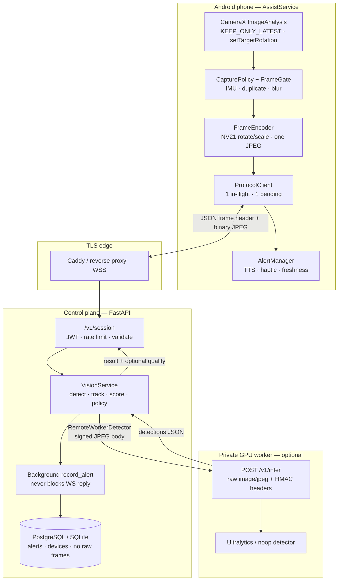

# Akshrava

Recycled-phone assistive vision for blind and low-vision users in India.

Akshrava turns a **recent** chest-mounted Android camera view into a short, rate-limited alert. It supplements a white cane, guide dog, or sighted guide. It is **not** navigation, collision avoidance, route guidance, or a crossing aid.

**Hard safety boundary**

- Never says a road is safe to cross, a path is clear, or a vehicle is *approaching*.
- At 0.2–3 FPS, box growth confounds wearer motion with target motion. Vehicle speech is only `vehicle nearby`. Results carry `motion_evidence: "insufficient"`.
- Silence never means safety. The phone must say when the camera, network, or detector cannot assist.

This repository is a **bench and supervised-pilot** implementation. A green CI run is not field-use approval. Authoritative depth lives in [`Important Architecture.md`](Important%20Architecture.md); this README is the end-to-end map of what the code actually does.

---

## End-to-end architecture



### Frame-to-ear path (implemented)

| Step | Code | Behaviour |
|---:|---|---|
| 1 | `AssistService` | Visible Start → camera foreground `LifecycleService`; Stop is explicit (`START_NOT_STICKY`). Watchdog may **prompt**, never silently restart the camera. |
| 2 | `ImageAnalysis` | Latest frame only; `setTargetRotation` prefers already-oriented buffers. |
| 3 | `FrameGate` / `CapturePolicy` | Motion, duplicate, blur gates; periodic sample so stillness cannot imply “safe”. |
| 4 | `FrameEncoder` | NV21 scratch buffers for rotate/downscale; **no Bitmap** path; one `YuvImage` JPEG. |
| 5 | `ProtocolClient` | JSON `frame` header + binary JPEG over one authenticated socket; 1 in-flight + 1 replaceable pending. |
| 6 | `VisionService.analyze` | Detector (noop / ultralytics / remote) → `SimpleTracker` → `HazardScorer` → `AlertPolicy`. Late frames skip scoring so cooldowns are not burned. |
| 7 | Persist | `_schedule_record_alert` fire-and-forget; phone gets the hazard **before** DB commit. |
| 8 | `AlertManager` | Phone-local freshness (≤500 ms normal, ≤250 ms urgent S1); TTS/haptic; never invents approach/cross language. |

Default detector is `DETECTOR=noop` until licensed weights and release gates exist.

---

## Repository layout

| Path | Role |
|---|---|
| `android/` | Kotlin app: CameraX, NV21 encode, WSS client, TTS/haptics, watchdog |
| `backend/akshrava_backend/` | FastAPI control plane, vision policy, optional GPU worker |
| `gcp/` | GCP Terraform (Cloud Run API, private GPU worker, SQL, Redis, mTLS, secrets) |
| `infra/` | Compose profiles: `control-plane`, `gpu-worker`, edge, monitoring |
| `docs/` | Protocol, ops, privacy, field guide, Android matrix |
| `scripts/` | `verify_phases.sh`, backend run/test, token minting |
| `Important Architecture.md` | Full product / safety / release boundary |
| `NOT_NOW.md` | Explicit non-goals (GPS memory, looming, foveated upload, …) |

---

## Wire contract (phone ↔ control plane)

Production: `wss://HOST/v1/session` with `Authorization: Bearer <device JWT>`.

1. Server → `ready` (`max_in_flight: 1`, `vision_enabled`).
2. Client → JSON `frame` header, then one binary JPEG.
3. Server → `result` (optional `quality`, optional `look_summary` for priority look).

```json
{
  "type": "frame",
  "id": 841,
  "capture_mono_ms": 93211455,
  "w": 640,
  "h": 480,
  "jpeg_bytes": 61423,
  "camera_calibration_id": "pilot-phone-r0",
  "pitch_cdeg": -1180,
  "roll_cdeg": 90,
  "pose_age_ms": 12,
  "mode": "normal",
  "priority": false
}
```

`capture_mono_ms` is **phone elapsedRealtime**. The phone owns staleness; the server does not compare clocks. Full rules: [`docs/PROTOCOL.md`](docs/PROTOCOL.md).

### Control plane ↔ GPU worker

`RemoteWorkerDetector` posts the **raw JPEG body** (not base64):

```http
POST /v1/infer
Content-Type: image/jpeg
X-Akshrava-Timestamp: <unix>
X-Akshrava-Nonce: <urlsafe>
X-Akshrava-Signature: HMAC-SHA256(secret, ts.nonce.body)
```

Legacy JSON/`image_b64` bodies are rejected (`415`). Nonces are claimed in Redis for replica-safe replay protection.

---

## Performance invariants (in code)

| Concern | Implementation |
|---|---|
| DB must not delay alerts | `VisionService._schedule_record_alert` + `drain_persists` / `shutdown_async` before engine dispose |
| Phone GC / frame drops | `FrameEncoder` NV21 rotate/scale; CameraX target rotation first |
| Worker link CPU/bytes | Raw JPEG + HMAC headers; no base64 on the hot path |
| Local model GIL | Bounded `ThreadPoolExecutor`; Ultralytics stays `requires_serial_execution`; production scales via **remote** workers (not `ProcessPoolExecutor`) |
| Freshness | Drop late work; never build a catch-up queue of frames |

---

## Run locally (bench)

```bash
# Backend venv + tests
./scripts/test_backend.sh
./scripts/run_backend_dev.sh
# → http://127.0.0.1:8000/healthz
# Dev WebSocket: DEV_AUTH_BYPASS / dev-device-token only for local debug
```

```bash
# Full verification baseline (noop detector + ruff when installed)
./scripts/verify_phases.sh
```

```bash
# Android debug APK (SDK Platform/Build-Tools 36; set ANDROID_HOME)
cd android
./gradlew :app:assembleDebug
./gradlew :app:testDebugUnitTest
```

Release builds accept **only** `wss://`. Debug may use `ws://` for emulator/device. Assistance starts only from a visible user action — never from boot or a silent receiver.

### Optional Compose stack

```bash
cd infra
# Copy and fill .env (Postgres/Redis secrets, JWT material, worker secret, …)
docker compose --profile control-plane up -d
# GPU worker profile when DETECTOR=remote and weights are provisioned:
# docker compose --profile gpu-worker up -d
```

See [`docs/DEPLOYMENT.md`](docs/DEPLOYMENT.md) and [`docs/OPERATIONS.md`](docs/OPERATIONS.md). GCP live deploy lives under [`gcp/`](gcp/) — see the **GCP** section in the deployment guide.

---

## Deploy on Google Cloud

```bash
# 1) Build images (API includes gcp extras for diagnostic uploads)
./scripts/build_gcp_images.sh YOUR_PROJECT_ID us-central1

# 2) Apply IaC (defaults DETECTOR=noop so phones can connect before GPU weights exist)
cp gcp/terraform.tfvars.example gcp/terraform.tfvars
# edit project_id
terraform -chdir=gcp init
terraform -chdir=gcp apply

# 3) Run schema migrations once
gcloud run jobs execute akshrava-migrate --region us-central1 --wait

# 4) Point the Android debug/release WSS URL at the output
terraform -chdir=gcp output websocket_url
# Provision device JWTs with the private key from Secret Manager: akshrava-jwt-private
```

When licensed weights are ready: set `detector = "remote"`, `yolo_weights_sha256 = "<64 hex>"`, place weights on the worker at `/var/lib/akshrava/models/yolo11s.pt`, rebuild/push the worker image, and `terraform apply` again.

## Alert vocabulary (allowed)

| Situation | Spoken / keyed response |
|---|---|
| Stable validated central obstruction | `Obstacle ahead` (+ haptic) |
| Stable nearby lateral vehicle | `Vehicle nearby, left/right` |
| Priority look | `look_summary` for this frame (cooldowns skipped; still no approach/cross) |
| Camera blocked / link down / no detector | Explicit status (`Camera view unclear`, `Vision assistance unavailable`, …) |

Never: numeric metres, “approaching”, “safe to cross”, “path clear”, continuous scene narration.

---

## Privacy

- Normal frames stay in RAM and are discarded. No raw video/audio/GPS trail by default.
- Persisted rows are alert/audit metadata only (`record_alert`), not JPEGs.
- Consent and retention: [`docs/PRIVACY.md`](docs/PRIVACY.md).

---

## Release and field use

| Gate | Minimum |
|---|---|
| Bench | `./scripts/verify_phases.sh` green; protocol + policy tests |
| One-phone | Controlled-course recall; ≤500 ms spoken age; no silent service death |
| Supervised trial | Named mobility instructor with stop authority; Tier-A phone; consent |
| Pilot | Approved device inventory, ops runbook, model SHA pin, privacy review |

Checklist: [`docs/FIELD_GUIDE.md`](docs/FIELD_GUIDE.md) · [`docs/RELEASE_AND_VERIFICATION.md`](docs/RELEASE_AND_VERIFICATION.md).

**Licensing note:** Ultralytics YOLO weights are AGPL-3.0 unless you have an enterprise licence. Do not enable `DETECTOR=ultralytics` / remote YOLO in a closed deployment without a licence decision.

---

## Primary references

| Doc | Contents |
|---|---|
| [`Important Architecture.md`](Important%20Architecture.md) | Full E2E architecture, timing budgets, model governance |
| [`docs/PROTOCOL.md`](docs/PROTOCOL.md) | WebSocket + look / freshness invariants |
| [`docs/ANDROID.md`](docs/ANDROID.md) | API matrix and resource policy |
| [`docs/OPERATIONS.md`](docs/OPERATIONS.md) | Deploy, secrets, failure handling |
| [`docs/DEPLOYMENT.md`](docs/DEPLOYMENT.md) | Compose / edge / worker layout |
| [`NOT_NOW.md`](NOT_NOW.md) | Deferred features |
