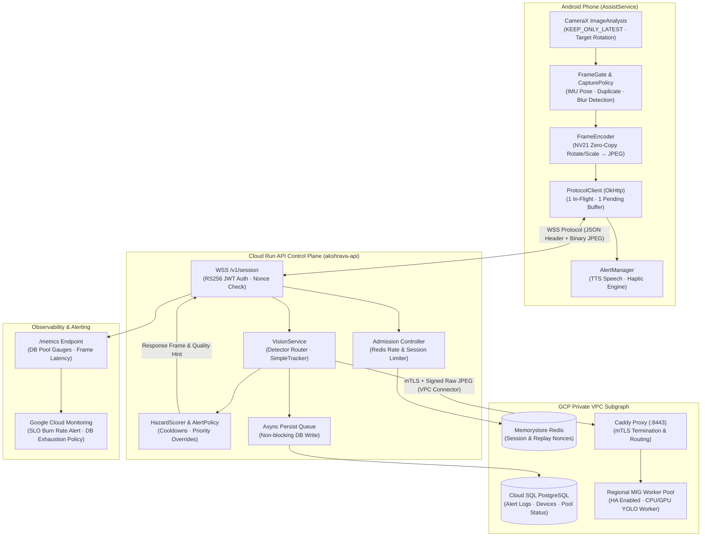
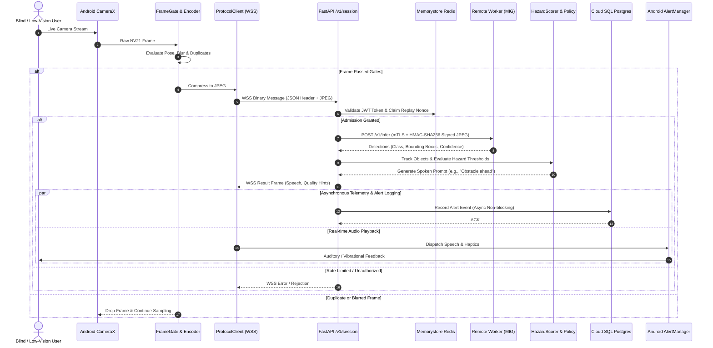
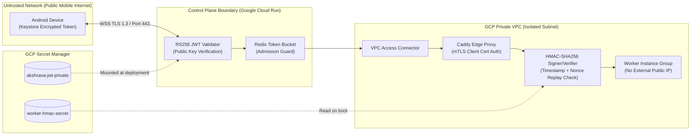
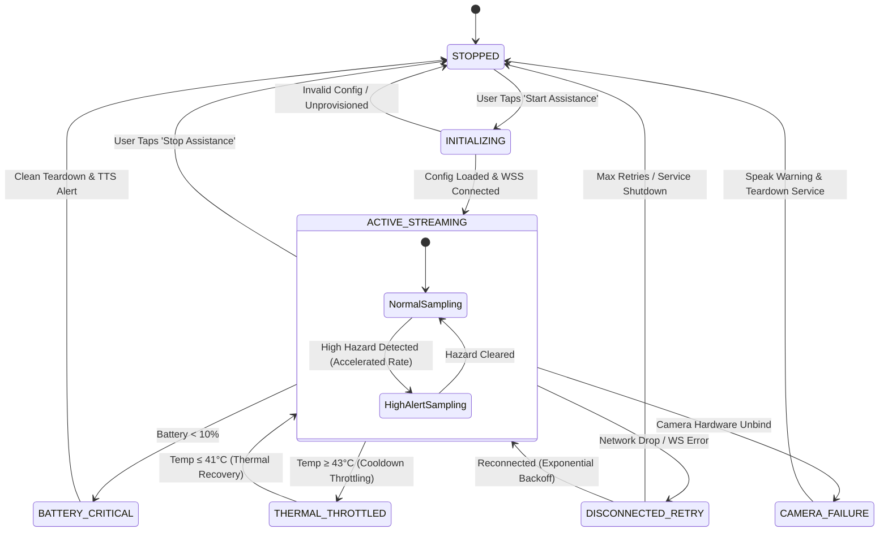
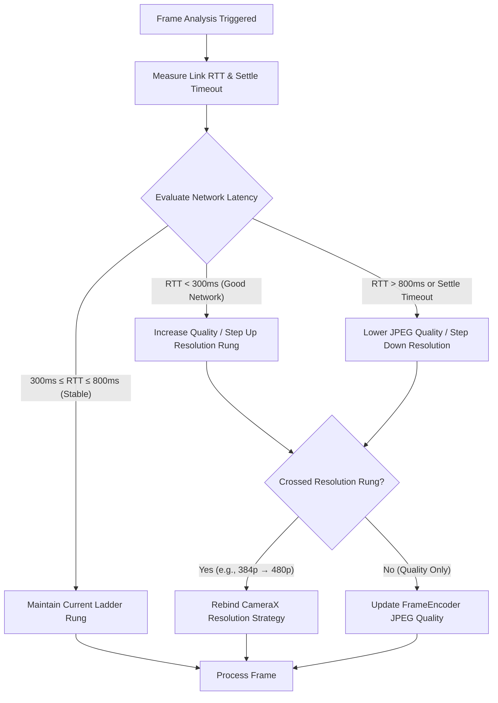

# Akshrava

**Assistive Vision Processing Engine for Blind and Low-Vision Users**

Akshrava transforms a chest-mounted Android camera view into real-time, rate-limited auditory and haptic alerts. It is designed specifically for low-cost / recycled smartphones operating over constrained mobile networks (3G/4G/5G) in India, supplementing a white cane, guide dog, or human guide.

> [!IMPORTANT]
> **Hard Safety Boundaries & Non-Goals**
> - **Not Navigation or Collision Avoidance:** Akshrava never claims a path is "safe to cross", "clear", or that a vehicle is "approaching".
> - **Motion Uncertainty:** At low frame rates (0.2–3 FPS), bounding box growth confounds wearer movement with target motion. Vehicle speech is strictly restricted to static directional cues (e.g., `"Vehicle nearby, left"`).
> - **Fail-Explicit Silence:** Silence never implies safety. The phone must explicitly communicate when camera, network, or detection pipelines are unavailable or degraded.

---

## 1. End-to-End System Architecture

The live GCP pilot topology decouples client-side frame sampling, edge API control plane handling, and isolated GPU/CPU remote inference workers in a private VPC.



---

## 2. End-to-End Frame Processing Sequence

The sequence diagram below traces a single camera frame from capture on the mobile device through API authentication, remote inference, hazard scoring, audio response, and background telemetry persistence.



---

## 3. Security Architecture & Threat Model

Akshrava operates under a strict zero-trust boundary separating public mobile networks from backend compute infrastructure.



### Security Principles
- **Encrypted Local Storage**: Device JWT tokens are stored on the Android device using `AES-256-GCM` via `AndroidKeyStore`. Plaintext tokens are scrubbed immediately.
- **HMAC-SHA256 Replay Protection**: API-to-Worker requests append `X-Akshrava-Timestamp`, `X-Akshrava-Nonce`, and HMAC signatures. Nonces are cached in Redis to reject duplicate or replayed frames.
- **Zero Raw Video Retention**: JPEGs exist only in volatile RAM during inference and are discarded immediately. Database persistence (`Cloud SQL`) stores alert metadata only—never raw video frames.

---

## 4. Android State Machine & Service Lifecycle

The `AssistService` foreground service manages hardware camera streams, network connectivity, thermal constraints, and battery guard thresholds.



---

## 5. Adaptive Quality & Network Rate Control

To maintain low end-to-end latency on variable 3G/4G/5G mobile networks, Akshrava employs a dynamic dual-control loop adjusting both camera resolution rungs and JPEG compression quality.



### Resolution & Quality Rungs
- **Resolution Rungs (`max_side`)**: `320p` $\rightarrow$ `384p` $\rightarrow$ `480p` $\rightarrow$ `512p` $\rightarrow$ `640p`.
- **JPEG Compression Rungs**: Dynamic JPEG quality scaling between `45` and `80`.
- **Zero-Copy Rebinding**: CameraX rebinds automatically when crossing resolution boundaries, avoiding unnecessary CPU scale/rotate operations on the mobile processor.

---

## 6. Core Component & Pipeline Details

### Frame-to-Ear Pipeline Steps

| Step | Component | Responsibilities & Invariants |
| :--- | :--- | :--- |
| **1** | **Android `AssistService`** | Manages `LifecycleService` foreground lifecycle. Manual start/stop only (`START_NOT_STICKY`). |
| **2** | **CameraX `ImageAnalysis`** | Sets `setTargetRotation` to prefer pre-oriented YUV buffers (`KEEP_ONLY_LATEST`). |
| **3** | **`FrameGate` & `CapturePolicy`** | Filters motion blur and stillness duplicates; guarantees periodic heartbeats. |
| **4** | **`FrameEncoder`** | Fast NV21 scratch buffer rotation/downscaling into single-pass `YuvImage` JPEG. |
| **5** | **`ProtocolClient`** | Sends JSON `frame` metadata followed by binary JPEG payload over WebSocket. |
| **6** | **`VisionService` & Worker** | Routes frame to Remote Worker via mTLS; processes detections with `SimpleTracker`. |
| **7** | **`HazardScorer` & `AlertPolicy`** | Evaluates spatial bounding boxes and spatial urgency; enforces strict speech cooldowns. |
| **8** | **Async Storage** | Schedules `record_alert` in background loop; never delays client WebSocket response. |
| **9** | **`AlertManager`** | Enforces freshness constraints (≤500ms normal, ≤250ms urgent S1) before playing TTS. |

---

## 7. Protocols & Wire Contracts

### A. Phone ↔ Control Plane (WebSocket Wire Protocol)

Production Endpoint: `wss://akshrava-api-c7d3j4nzdq-uc.a.run.app/v1/session`  
Header: `Authorization: Bearer <device RS256 JWT>`

1. **Server Handshake**: `ready` message specifying `max_in_flight: 1` and `vision_enabled`.
2. **Client Upload**: One JSON `frame` header text frame, followed by one binary JPEG frame.
3. **Server Response**: JSON `result` message containing speech prompt, quality adjustment hints, or priority look summaries.

```json
{
  "type": "frame",
  "id": 1042,
  "capture_mono_ms": 19482012,
  "w": 640,
  "h": 480,
  "jpeg_bytes": 48210,
  "camera_calibration_id": "pilot-phone-r0",
  "pitch_cdeg": -1120,
  "roll_cdeg": 45,
  "pose_age_ms": 10,
  "mode": "normal",
  "priority": false
}
```

### B. Control Plane ↔ Remote Inference Worker (HTTP / mTLS)

Endpoint: `https://worker.akshrava.internal:8443/v1/infer`

The Control Plane sends raw JPEG bytes (zero Base64 overhead) with HMAC-SHA256 signature headers:

```http
POST /v1/infer
Content-Type: image/jpeg
X-Akshrava-Timestamp: 1784563400
X-Akshrava-Nonce: 7c4e82b9a10f
X-Akshrava-Signature: <HMAC-SHA256(Secret, Timestamp + Nonce + Body)>
```

---

## 8. System Observability & Infrastructure Reliability

The system implements enterprise-grade reliability patterns verified via automated CI and GCP monitoring:

- **Database Pool Protection**: SQLAlchemy pool status (`checkedin` / `checkedout`) is exported via `/metrics`. Automated Cloud Monitoring alerts trigger if pool usage exceeds 80%.
- **SLO Burn-Rate Alerting**: Fast-burn alert policies monitor the 99.9% API availability SLO, detecting rapid error budget consumption within 1-hour windows.
- **Worker High Availability (HA)**: Deploys a Regional Managed Instance Group (MIG) across multiple zones for GPU/CPU detection workers.
- **Dependency Injection**: Route handlers utilize FastAPI `Depends()` for settings, metrics, and state management to prevent global state mutation.

---

## 9. Repository Structure

```
Akshrava/
├── android/                        # Native Android Kotlin Client
│   └── app/src/main/java/org/akshrava/app/
│       ├── AssistService.kt        # CameraX & Foreground Service Lifecycle
│       ├── ProtocolClient.kt       # WebSocket Client & Reconnection Engine
│       ├── FrameEncoder.kt         # NV21 Image Processing & Compression
│       ├── FrameGate.kt            # Motion, Blur & Duplicate Filter
│       └── AlertManager.kt         # Text-To-Speech & Haptic Controller
├── backend/                        # FastAPI Control Plane & Vision Service
│   ├── akshrava_backend/
│   │   ├── main.py                 # FastAPI Application & Lifecycle Handlers
│   │   ├── service.py              # VisionService, Tracker & Hazard Scorer
│   │   ├── storage.py              # PostgreSQL / SQLAlchemy Storage & Pool Stats
│   │   ├── worker.py               # Remote GPU/CPU Worker Endpoint Handlers
│   │   └── metrics.py              # Prometheus Gauges & Counters
│   └── tests/                      # Automated Integration & Unit Tests
├── gcp/                            # Terraform Infrastructure as Code (IaC)
│   ├── app.tf                      # Cloud Run Service Definition
│   ├── database.tf                 # Cloud SQL PostgreSQL Instance
│   ├── monitoring.tf               # SLO Burn-Rate & DB Pool Alert Policies
│   └── variables.tf                # Regional MIG HA & Resource Settings
├── scripts/                        # Automation & E2E Validation Tools
│   ├── verify_phases.sh            # Automated Test & Verification Pipeline
│   └── install_android_debug.sh    # Android Build, Install & Port Forwarding
└── docs/                           # Architecture & Production Guides
```

---

## 10. Local Development & Verification

### Running Backend Tests & Verifications

```bash
# Run complete test suite and lint checks (uses Postgres service container in CI)
./scripts/verify_phases.sh

# Run backend dev server locally
./scripts/run_backend_dev.sh
# Server active at http://127.0.0.1:8000/readyz
```

### Building & Installing the Android App

```bash
# Connect phone via USB with USB Debugging enabled, then run:
./scripts/install_android_debug.sh
```

---

## 11. License & Attribution

- **Application Code**: Licensed under Apache 2.0.
- **YOLO Model Weights**: Ultralytics YOLO model weights are licensed under AGPL-3.0. Enterprise deployment requires appropriate licensing decisions.
