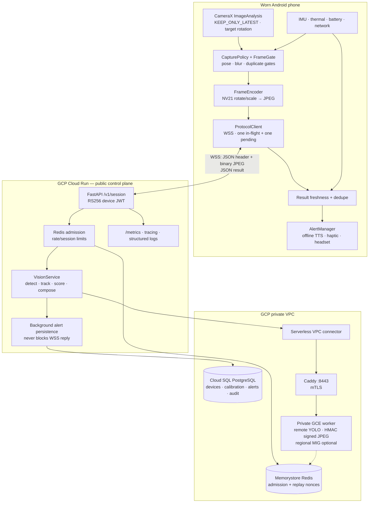
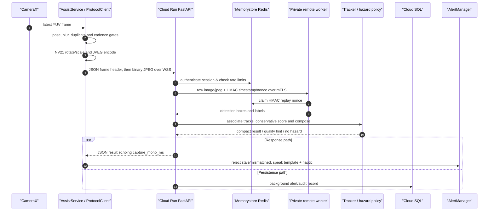
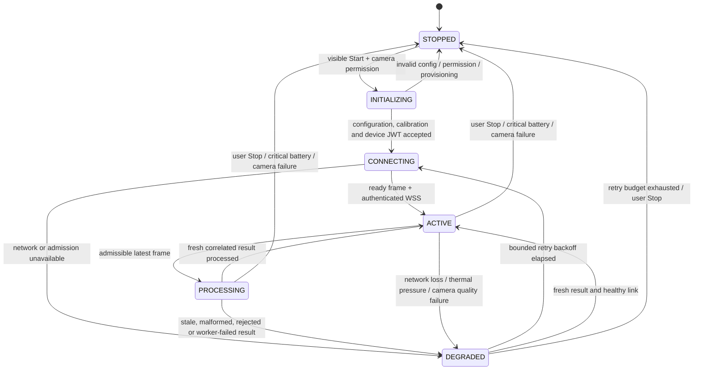
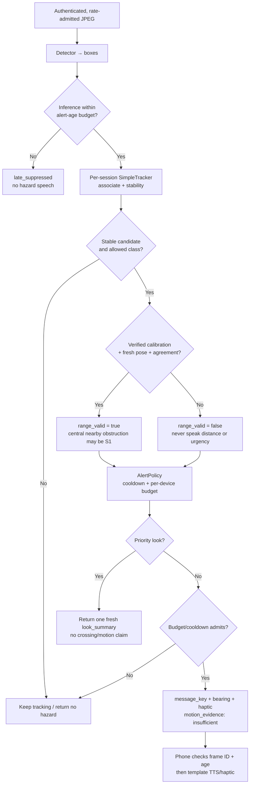
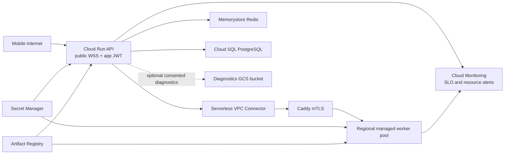
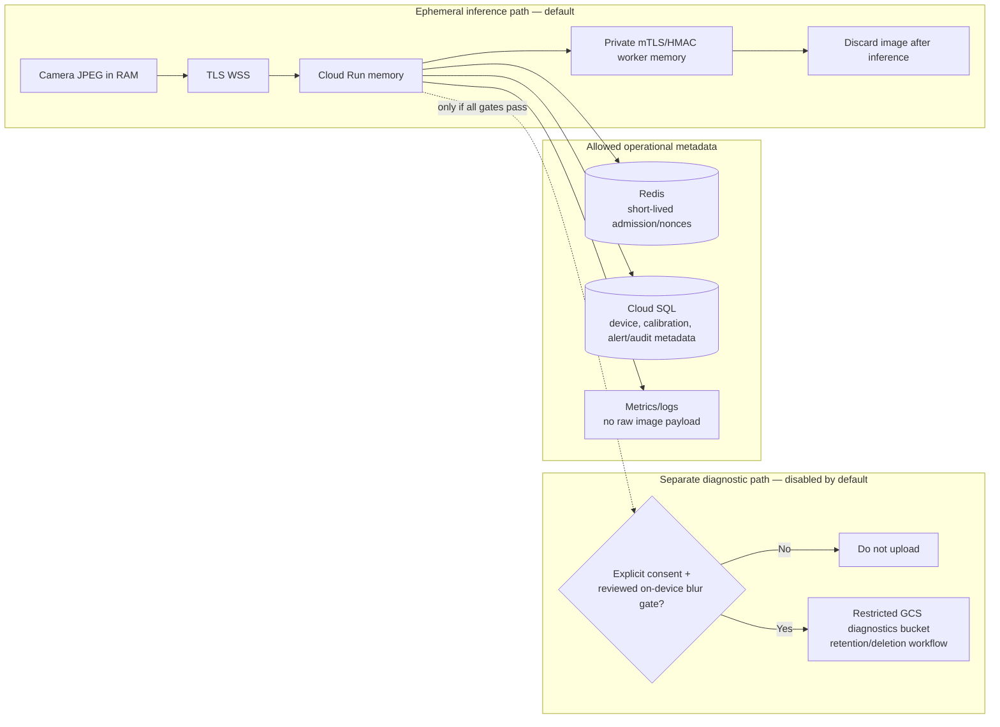
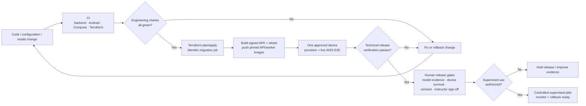

# Akshrava

**Assistive vision for supervised use by blind and low-vision people.** Akshrava turns a recent view from a worn Android phone into short, conservative spoken and haptic alerts. It is designed for supported recycled Android phones on variable mobile networks and supplements a white cane, guide dog, sighted guide, and normal road-safety practice.

> [!IMPORTANT]
> ## Safety boundary
>
> Akshrava is **not** navigation, collision avoidance, route guidance, a crossing-decision aid, continuous scene description, facial recognition, or a guarantee of detection. It never says that a path is clear, a road is safe to cross, or a vehicle is approaching. Silence never means safety: when the camera, network, model, or service is unavailable, the app explicitly reports a limited/unavailable state.

The detailed safety, evidence, operating, and release boundary is in [Important Architecture.md](Important%20Architecture.md); this README is the comprehensive end-to-end implementation and architecture map.

## Built with Codex

Akshrava was developed with human direction and iterative assistance from OpenAI Codex. Codex helped turn architecture reviews and safety requirements into implementation work across the Android client, FastAPI backend, GCP/Terraform infrastructure, tests, operational scripts, and project documentation.

The collaboration included:

- tracing the physical-phone failure from camera capture through WebSocket readiness and discovering the loopback endpoint misconfiguration;
- reviewing and hardening endpoint policy, secure device provisioning, freshness gates, reconnect behavior, privacy boundaries, and observability;
- implementing Android diagnostics, backend detection telemetry, calibration fail-closed behavior, and regression tests;
- validating builds, backend tests, Terraform configuration, deployment preflight checks, and the live Cloud Run health path;
- consolidating architecture decisions, verifying end-to-end code reviews, and explaining the system clearly in this README and `Important Architecture.md`.

Codex was used as an engineering collaborator for code exploration, design critique, test planning, debugging hypotheses, documentation, and careful review of safety-sensitive trade-offs. Human review remained responsible for approving changes, protecting credentials, supervising device testing, and deciding what evidence is sufficient for real-world use. The model did not replace controlled testing, accessibility expertise, or the requirement for a cane, guide, or other established mobility support.

## Cloud Architecture Diagram



### Current deployment truth

The live supervised-pilot path is:

`Android ProtocolClient` → Cloud Run `wss://<cloud-run-endpoint>/v1/session` → Redis admission → Serverless VPC connector → `worker.akshrava.internal:8443` → Caddy mTLS → remote CPU YOLO worker.

The current worker setting is `worker_use_gpu=false` (CPU pilot with `ALERT_MAX_AGE_MS=8500`); GPU quota is not assumed. Cloud SQL, Memorystore Redis, Secret Manager, Artifact Registry, diagnostics GCS, private networking, COS firewall rules, IAP SSH, Cloud Monitoring, and alert policies are defined under [cloud/gcp/](cloud/gcp/). The separate [cloud/local/](cloud/local/) directory is the Compose-based local/single-host alternative, not the live pilot edge.

## Data Flow Diagram (DFD)



The system is a **freshness pipeline**, never a video recorder or catch-up queue:

- CameraX keeps only the latest frame. The phone allows one in-flight request and one replaceable pending frame; old frames are dropped.
- The default capture envelope is roughly 0.2–1 FPS, with short confirmation sampling up to 2 FPS and never above 3 FPS in this cloud design.
- `capture_mono_ms` is the phone's elapsed-realtime clock. The server echoes it. Both ends synchronize freshness through the WebSocket `ready` frame: the server sends `alert_max_age_ms` (8500 ms for CPU remote, 2500 ms for GPU/noop), and the client sets `configuredStaleAlertMs = serverMaxAge.coerceAtLeast(STALE_ALERT_MS)` using `STALE_ALERT_MS=2500` as a local safety floor. Late inference remains telemetry and is never spoken.
- The backend accepts bounded input, rate-limits before work, and performs alert persistence outside the WebSocket response path via background tasks drained safely on shutdown.
- Raw images are processed in memory and discarded. Normal operation never stores video or JPEG frames.

## State Machine Diagram



`ACTIVE` may produce an offline TTS/haptic alert only from a fresh, correlated, policy-admitted result. `DEGRADED` and `STOPPED` suppress hazard claims and expose a limitation state; neither silently restarts camera capture.

Every transition has an explicit user-facing status. A disconnected socket, expired JWT,
blocked camera, unavailable detector, invalid calibration, stale result, overheated battery, or
critical battery state suppresses hazard speech and announces the corresponding limitation. The
watchdog can prompt the user to start again, but must not silently restart camera capture.

## Client architecture: Android 8 through Android 16+

The app has `minSdk 26` (Android 8). Android 8/9 are compatibility tiers; the supervised field baseline is Android 10+, 64-bit ARM, 4 GB RAM, reliable rear camera/LTE, and a verified mounted-phone calibration.

| Component | Responsibility |
|---|---|
| `MainActivity` and `AppConfig` | Accessible configuration, provisioning state, explicit Start/Stop, persisted non-secret endpoint settings, and `ActivityResultLauncher` for overlay permission requests. |
| `AssistService` | Visible camera foreground `LifecycleService`; owns camera/socket lifecycle, manages `OkHttpClient` connection pool eviction, and stops explicitly with `START_NOT_STICKY`. |
| `CameraLifecycleOwner`, `DisplayRotation`, `PreviewSurfaceDrain` | Service-scoped CameraX lifecycle, modern display rotation compatibility, and stable preview/image analysis plumbing. |
| `CapturePolicy`, `FrameGate`, `PoseTracker` | Cadence, stillness, IMU pose age, thumbnail difference, blur/occlusion gates, and periodic re-sampling. |
| `FrameEncoder` | Allocation-conscious NV21 rotate/scale and JPEG encoding; no base64 or video stream. |
| `ProtocolClient`, `LinkQualityController`, `SessionFlags` | WSS protocol, reconnect/backoff, bounded quality adaptation, one-flight backpressure, dynamic `alert_max_age_ms` negotiation, stale-result rejection. |
| `AlertManager`, `HeadsetControls`, `StopReceiver` | Single speaking lane, locale-aware offline TTS, haptic arbitration, mute expiry (15m), repeat/stop controls, and safe notification/headset handling. |
| `Watchdog`, `WatchdogReceiver`, `ScreenKeepAlive`, `AgentDebugLog` | Explicit recovery prompt (matching user locale), OEM-specific service-survival support (wake-locks/overlays), and NDJSON debug telemetry; they never silently restart camera capture. |
| `AndroidSupportMatrix`, `DeviceCapability`, `ReflexEngine` | Device capability policy and gated compatibility/local-reflex native lifecycle management; no unevaluated fallback is presented as vision assistance. |

The app uses CameraX `STRATEGY_KEEP_ONLY_LATEST`, closes every `ImageProxy`, and makes the service—not the activity—the camera owner. On Android 14+, a visible activity and user action start the camera foreground service. Camera, socket, native ML resources (`ReflexEngine.release()`), and wake resources are released on Stop and critical safety/power conditions.

### Audio, haptics, and user-facing states

`AlertManager` is the single owner of speech and haptics. It renders server `message_key` and bearing from offline phone templates, so speech does not depend on cloud audio. It applies per-object cooldowns (5s), a minimum speech gap (2s), burst collapse (3 in 10s -> "Busy road, careful"), priority handling, mute expiry (15m), and last-alert repeat (<30s old). Haptics still fire while speech is muted.

Examples of permitted language are `Obstacle ahead`, `Vehicle nearby, left`, `Camera view unclear`, and `Vision assistance unavailable. Use cane or guide.` The app never converts a detection into distance, approach speed, a safe route, or a crossing recommendation.

## Wire contracts and trust boundaries

### Phone to control plane

Release builds use WSS only:

```text
wss://HOST/v1/session
Authorization: Bearer <short-lived RS256 device JWT>
```

The server sends `ready` with payload:
```json
{
  "type": "ready",
  "max_in_flight": 1,
  "vision_enabled": true,
  "alert_max_age_ms": 8500
}
```

The client configures its freshness budget to `max(8500, 2500) = 8500 ms` and then sends one JSON header followed immediately by one binary JPEG; the response is a compact JSON `result`, `quality`, status, or rejection message.

```json
{
  "type": "frame",
  "id": 1042,
  "capture_mono_ms": 19482012,
  "capture_epoch_ms": 1752883094000,
  "w": 640,
  "h": 480,
  "jpeg_bytes": 48210,
  "camera_calibration_id": "pilot-phone-r0",
  "pitch_cdeg": -1120,
  "roll_cdeg": 45,
  "pose_age_ms": 10,
  "mode": "normal"
}
```

The control plane validates token expiry/audience/device binding, frame order/timing, image limits, supported dimensions, rate limits, and the header/JPEG pairing before decode. Debug-only local workflows may use `ws://` and a development token; those values are not valid production provisioning.

### Configuration ownership

The Android build supplies an endpoint placeholder by default; a pilot build must set
`AKSHRAVA_WSS_URL` at build time or provision the endpoint through the accessible settings screen.
The live pilot hostname is `akshrava-api-c7d3j4nzdq-uc.a.run.app` when that deployment is active.
Device JWTs are short-lived and device-bound; they are minted by an authorized operator, stored in
Android Keystore-backed storage, and revoked server-side when a device is lost or reissued.
Backend secrets, worker certificates, Redis URLs, database URLs, model paths, and diagnostic
settings are server configuration/Secret Manager concerns and must never be embedded in the APK.

### Control plane to private worker

`RemoteWorkerDetector` sends raw `image/jpeg` bytes—not base64—to the private worker:

```http
POST /v1/infer
Content-Type: image/jpeg
X-Akshrava-Timestamp: <unix seconds>
X-Akshrava-Nonce: <unique nonce>
X-Akshrava-Signature: <HMAC-SHA256(timestamp + nonce + body)>
```

The VPC connector reaches Caddy at `worker.akshrava.internal:8443`. mTLS authenticates the hop; HMAC protects the signed request; Redis atomically claims worker nonces so replay protection remains valid when worker replicas scale. Workers have no public inference endpoint.

## Backend services and perception pipeline

| Area | Implemented components |
|---|---|
| Application/session | `application.py`, `main.py`, `session_handler.py`, `protocol.py`, `config.py`, `logging_util.py`, `tracing.py` establish FastAPI lifecycle, WebSocket framing, settings, structured logs, and traces. Session admission cleanup during disconnect is isolated in try/except blocks so Redis errors never leak in-memory session state. |
| Identity and admission | `auth.py`, `session_admission.py`, `rate_limit.py`, `coordination.py`, `redis_util.py` validate RS256 device tokens, revoke/device-bind sessions, provide fleet-shared rate/session limits, and coordinate replay-safe state. |
| Vision | `service.py`, `detector.py`, `worker.py`, `cloud_fallback.py`, `model_integrity.py` choose `noop`, local, or remote detection; enforce model integrity, properly close Pillow Image resources, and keep remote inference off the control-plane event loop. |
| Alert decisions | `tracker.py`, `hazards.py`, `alert_policy.py`, `composer.py`, `domain.py` associate detections per session, apply geometry/pose validity and conservative policy, then produce a template key, bearing, tier, haptic hint, and honesty metadata. |
| Data | `storage.py`, `gcp_storage.py` manage PostgreSQL records for devices, calibration profiles, alerts, audit/consent metadata, and optional consented diagnostic storage. Alert writes are scheduled asynchronously and drained safely on shutdown. |
| Operations | `metrics.py` exports Prometheus metrics; `/readyz` is database-aware readiness; health, error, timing, and pool signals support rollout and alerting. |

`DETECTOR=noop` is a deliberate transport/policy test mode, not vision. The live pilot uses `DETECTOR=remote` with a pinned YOLO weight on the private CPU worker. Local Ultralytics inference serializes through a lock; remote worker micro-batching is bounded and exists only in the private inference process.

### Persistence and schema ownership

PostgreSQL stores only operational metadata: `devices` (binding, calibration, revocation),
`calibration_profiles` (focal length at a reference JPEG height, mount height, verification state), and `alert_events`
(device/frame, class, bearing, confidence, severity, message key, track and timestamp). Redis
holds short-lived admission/session counters, revocation lookups, and atomically claimed HMAC
nonces. SQLAlchemy uses bounded Cloud SQL pools and health checks; Alembic migration revision
`20260721_01` is applied by the deployment job before the API rollout. SQLite is for local tests
only. Schema initialization is not raced by production API replicas.

### Failure and recovery contracts

| Failure | Backend behavior | Phone behavior |
|---|---|---|
| JWT expired/revoked or nonce replayed | Reject session/frame; emit structured security metric | Stop sending and request re-provisioning/status |
| Redis unavailable | Fail admission closed; do not accept uncoordinated replay/rate state | Announce assistance unavailable |
| Worker timeout/5xx or model-integrity failure | Return no hazard and bounded quality/status signal; never fabricate detections | Keep haptics/speech fail-closed and retry with backoff |
| PostgreSQL slow/unavailable | Keep response path independent; bounded background writes may be dropped with metric | Continue only while the live result path is healthy |
| Late, duplicate, malformed, or out-of-order frame/result | Consume paired JPEG, reject or suppress, preserve stream alignment | Drop stale result; never speak it later |
| Camera, thermal, battery, or OEM service failure | No server-side safety claim | Speak state, release resources, and require explicit restart |

### Conservative perception policy

The tracker makes repeated detections stable enough for suppression/confirmation; it does **not** infer motion. At low frame rate, box growth can be caused by wearer motion, camera swing, and autofocus. Every result keeps `motion_evidence: "insufficient"` for this operating envelope.

Range remains invalid unless a verified `calibration_profiles` record and pose/agreement gates pass. Focal length is scaled from its reference JPEG height to the current frame so quality downscaling does not inflate distance. Invalid, stale, or uncertain geometry never becomes a spoken distance. The policy permits urgent language only for a validated nearby central obstruction; vehicle language is awareness-only and directional. An uncertain frame, stale result, blocked camera, unavailable detector, or missing valid fallback produces no hazard claim and, where appropriate, an explicit state message.



## Cloud deployment topology



Terraform in [cloud/gcp/](cloud/gcp/) covers Cloud Run and migration job, VPC/subnets/private DNS/serverless connector, Cloud SQL, Redis, a private worker (with optional regional MIG HA using safe `try()` index evaluation for forwarding rules), TLS wiring, Secret Manager, IAM (with explicit `depends_on` bindings preventing provisioning race conditions), Artifact Registry, Cloud Armor (with dynamic uptime check evaluation), Monitoring, diagnostics GCS, and outputs. PKI material is managed outside Terraform state (`manage_pki_in_terraform=false`) under `cloud/gcp/pki/`; treat it as sensitive operational material and rotate it through the documented procedure.

[cloud/local/docker-compose.yml](cloud/local/docker-compose.yml) provides a local/single-host stack with API, worker, PostgreSQL, Redis, Caddy, Prometheus, Grafana, and Alertmanager. It does not replace GCP's public edge, IAM, private VPC, or managed availability controls.

## Security, privacy, and observability

### Security controls

- Android stores provisioned device tokens using Android Keystore-backed encrypted storage; a Keystore failure requires visible re-provisioning, never plaintext fallback.
- Cloud Run verifies app-level RS256 device JWTs. Public Cloud Run invocation does not remove this application trust boundary.
- The API-to-worker path is private, mTLS-authenticated, HMAC-signed, timestamped, nonce-protected, and Redis-coordinated across replicas.
- Secrets come from Secret Manager; access is least-privilege. Operator access uses MFA and IAP SSH for worker administration.
- Model weights are pinned and SHA-verified before activation. Live services do not download arbitrary weights during a session.

### Privacy controls

- Normal JPEGs exist only in volatile memory. The service retains no raw video, audio, GPS trail, face-recognition output, or persistent bystander tracking.
- Use a rotating random device identifier, not IMEI. Keep alert/audit/consent records purpose-limited and access-controlled in PostgreSQL.
- Consented diagnostics are separate from normal inference: blur faces/plates before upload, retain only under the approved workflow, and support revocation/deletion.
- Keep raw frames out of application logs, metrics, dashboards, and public tools. Encrypt data in transit and at rest.



### Observability and response

The system measures accepted/rejected/dropped frames, WebSocket/session state, admission decisions, worker queue/decode/inference/track latency, end-to-end frame age, alert rate, reconnects, thermal/battery states, model version, database pool health, and error paths. Prometheus `/metrics` feeds local Grafana/Alertmanager and GCP Cloud Monitoring. Monitoring policies include API availability/SLO burn and database-pool/resource alarms. Alerts must page an operator for a silent/late path, unavailable control plane/worker, or sustained dependency failure—not merely populate a dashboard.

## Repository map

```text
Akshrava/
├── android/                         Android Kotlin client and unit tests
│   └── app/src/main/java/org/akshrava/app/
│       ├── AssistService.kt          foreground camera service composition root
│       ├── ProtocolClient.kt         WSS transport, freshness, reconnection
│       ├── FrameEncoder.kt           NV21 JPEG processing
│       ├── CapturePolicy.kt          cadence / quality / thermal policy
│       ├── FrameGate.kt              blur, duplicate and pose gates
│       ├── AlertManager.kt           offline TTS and haptic arbitration
│       └── AndroidSupportMatrix.kt   Android-version/device capability policy
├── backend/
│   ├── akshrava_backend/             FastAPI control plane and worker code
│   └── tests/                        unit, protocol, integration, and policy tests
├── cloud/
│   ├── gcp/                          Terraform for the managed pilot infrastructure
│   └── local/                        Compose, Caddy, Prometheus, Grafana, Alertmanager
├── scripts/                          build, provisioning, preflight, migration, E2E tools
├── akshrava.yaml                     model-training dataset configuration
├── datasets/phase0/                  synthetic policy replay fixtures; not street evidence
├── .github/workflows/                CI, Android compatibility, and release pipelines
├── Important Architecture.md         authoritative safety, operations, and release boundary
└── NOT_NOW.md                        deferred capabilities and scope guard
```

## Model training and export

The root [akshrava.yaml](akshrava.yaml) is the fine-tune configuration; this repository contains neither training images nor model weights. Put labelled data in `datasets/akshrava/{images,labels}/{train,val,test}` using route-disjoint splits. Resolve the Ultralytics/weight licence before producing a shippable detector; until then, `noop` remains the fail-closed default.

- Start from the Indian Driving Dataset, then collect 8–10 hours of route-diverse, chest-mounted pilot footage (about 1.35 m high and 12° down), sample at 1 FPS, deduplicate, and label a route-disjoint train/validation/test set.
- Reserve 20–30% hard negatives—shadows, painted patches, speed breakers, puddles, and wet-road reflections—to prevent false hazard claims.
- The acceptance bar is recall on held-out walking footage: at least 0.85 for people/vehicles below 8 m and 0.60 for potholes. A retrain that improves mAP while regressing this evidence is rejected.

```bash
yolo detect train model=yolo11s.pt data=akshrava.yaml imgsz=640 epochs=80 batch=16 mosaic=1.0
yolo export model=runs/detect/train/weights/best.pt format=tflite int8=True imgsz=320 data=akshrava.yaml
```

Record each approved export's SHA-256 in the release manifest and deployment configuration. The model may learn all 12 configured classes, but Phase 1 voices only the separately validated, policy-approved outcomes: person, two-wheeler, car/auto-like vehicle, and large central obstruction.

## Build, verification, provisioning, and release

Run the baseline repository verification from the root:

```bash
./scripts/verify_phases.sh
```

It creates the backend virtual environment when required, runs the backend test suite and Phase-0 policy replay, and runs available linting. Compose and GCP preflight validation are separate CI/script stages. Build/install the debug Android app on a USB-connected device with:

```bash
./scripts/install_android_debug.sh
```

For a complete end-to-end setup that also provisions the Keystore and verifies the live GCP connection, use:

```bash
./scripts/install_android_debug_full.sh
```

Useful operational scripts:

| Script | Purpose |
|---|---|
| `scripts/install_android_debug_full.sh` | End-to-end build, Keystore provisioning, and live WSS verification on a device. |
| `scripts/run_backend_dev.sh` | Start the local backend; check `/readyz`. |
| `scripts/test_backend.sh` | Run backend tests directly. |
| `scripts/gcp_preflight.sh` | Format/validate Terraform and verify remote-detector prerequisites. |
| `scripts/build_gcp_images.sh` | Build and push API/worker container images. |
| `scripts/gcp_migrate_then_deploy.sh` | Apply infrastructure then run the Cloud Run migration job. |
| `scripts/install_worker_weights.sh` | Install and SHA-verify approved worker weights. |
| `scripts/mint_device_token_gcp.sh` | Mint an authorized short-lived device JWT from Secret Manager. |
| `scripts/print_android_pilot_provisioning.sh` | Print the non-secret pilot configuration for an authorized device. |
| `scripts/revoke_device.py` and `scripts/rotate_jwt_rs256.sh` | Revoke device access and rotate signing material. |
| `scripts/e2e_gcp_pilot.sh`, `scripts/e2e_android_gcp.sh`, `scripts/e2e_android_protocol_gcp.sh` | Exercise live WSS/remote-vision paths; they are engineering checks, not mobility approval. |
| `scripts/upsert_calibration_profile.py` | Record mount geometry and explicitly mark a profile verified after course sign-off. |

CI is defined in [.github/workflows/ci.yml](.github/workflows/ci.yml), Android build and compatibility coverage in [.github/workflows/android-pipeline.yml](.github/workflows/android-pipeline.yml) and [.github/workflows/android-compatibility.yml](.github/workflows/android-compatibility.yml), and the release pipeline in [.github/workflows/release.yml](.github/workflows/release.yml).

Pushing a version tag (`vX.Y.Z`) runs the release matrix, signs and publishes one universal Android APK, generates `SHA256SUMS.txt`, and deploys a GitHub Pages download site. The download page lists Android API 26–36 and points every supported version to that same signed APK; API 26/27 are legacy release-smoke-tested compatibility targets that still require device-specific qualification, while API 28–36 are the primary release-validation matrix. Enable **Settings → Pages → Source → GitHub Actions** once to allow the deployment job to publish the site.

The compatibility workflows run API 26–36 emulator smoke tests (Android 8 through the current
API level), plus JVM tests and debug APK assembly. API 28–36 (Android 9 through Android 16,
including Android 12L/API 32) are the release-validation matrix; API 26/27 are legacy build and
protocol compatibility targets and require device-specific camera, foreground-service, TTS, and
locked-screen validation before field use. CI proves build and protocol compatibility, not
detector recall or mobility safety on a particular donated phone.

### Release sequence

1. Run backend policy/unit tests, Phase-0 replay, lint/dependency checks, Android unit tests, APK assembly, Compose validation, and `gcp_preflight.sh`.
2. Apply Terraform and run the `akshrava-migrate` Cloud Run Job for the expected Alembic revision.
3. Build/push API and worker images; install only an approved SHA-verified model on the private worker.
4. Mint a short-lived device token, provision one approved device, and run the live WSS/remote E2E scripts.
5. Build the signed release APK/wheel, verify the tag matches backend and Android versions, and publish the release manifest.
6. Perform human safety, consent, controlled-course, device-survival, rollback, and mobility-instructor gates before participant use.

The release pipeline deliberately does not publish model weights. A green CI or E2E result is an
engineering release signal, never permission for unsupervised operation. Roll back the API and
worker image together when a protocol, model, schema, or alert-policy regression is found; do not
roll forward a database migration without a tested backup/restore plan.



### Device acceptance and calibration

Each field device is registered by model/build, ABI/RAM, camera, battery health, carrier, TTS
language test, endpoint/JWT state, model/runtime version, and calibration ID. A Tier-A device is
Android 10+, 64-bit ARM, at least 4 GB RAM, with a stable rear camera/LTE/offline TTS and passing
30-minute heat/battery, locked-screen service, WSS freshness, and accessible Start/Stop/Mute tests.
Android 8/9 devices may be used for developer compatibility only. A profile is not marked verified
until the mount, pose, focal geometry, and controlled-course evidence pass; unverified profiles
keep `range_valid=false`.

Passing a build, E2E script, or release workflow is **not** permission for unsupervised use. Before any supervised participant session, satisfy the controlled-course, device/carrier survival, accessibility, consent, incident-response, instructor sign-off, and rollback gates in [Important Architecture.md](Important%20Architecture.md). The test pyramid is policy/unit tests → synthetic replay → controlled static obstacles → guided sessions; moving-vehicle and collision claims are outside the current release scope.

## License and model governance

Application code is Apache-2.0. YOLO/Ultralytics weights can carry AGPL-3.0 or commercial licensing obligations. Do not activate a model until its weight, dataset, labels, export/runtime, SHA-256, intended deployment licence, target-device measurements, and controlled-course evaluation are approved together.

## Scope guard

The following are intentionally not enabled by this architecture: GPS hazard memory, safe-route or
crossing advice, optical-flow/looming or time-to-collision claims, continuous OCR, facial
recognition, iOS support, broad language rollout, unreviewed local fallback models, and large-scale
unsupervised operations. [NOT_NOW.md](NOT_NOW.md) and [Important Architecture.md](Important%20Architecture.md)
remain the governing deferred-scope and evidence boundary.
