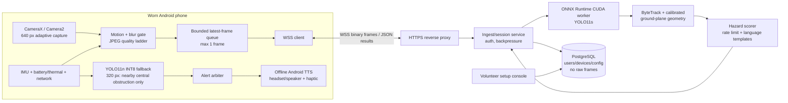

# Recycled-phone assistive vision system — a solo build plan for India

**Audience:** one backend/cloud engineer building evenings and weekends for an NGO.  
**Date:** 19 July 2026. **Planning currency:** ₹86/USD (round it upward before spending).  
**Safety position:** this is a *supplement* to a white cane, guide dog, sighted guide, and normal road-safety practice. It is never a replacement. It can miss a vehicle, invent a hazard, speak too late, lose its network, overheat, or be worn at the wrong angle. Do not test it unsupervised in traffic.

## Assumptions and success boundary

Start with an Android 10+ donated phone with 4 GB RAM, a usable rear camera, LTE, and a wired headset. The system captures a 640×480/640×640 image every 0.8–1.5 seconds, sends it to one GPU service, and speaks only urgent, navigationally relevant alerts. It does **not** promise continuous scene description, GPS routing, facial recognition, medical distance accuracy, or reliable recognition of every sign.

The first useful product is deliberately narrow: detect a person/vehicle/two-wheeler/auto/parked obstruction directly ahead and say `Obstacle ahead` or, at most, `Vehicle nearby, right`. A cane remains the ground-truth sensor for kerbs, holes and drains. Adding potholes, drains, missing pavement and low branches comes only after a labelled local dataset proves they work.

All latency and throughput numbers below are targets to measure on your actual handset/network, not guarantees. The cost estimates assume 30 minutes of outdoor use per day and 26 days/month, and exclude the donated phone and volunteer time.

> **Non-negotiable operating boundary:** a cloud pipeline sampling at 0.2–2 FPS cannot be a collision-avoidance system for fast or lateral traffic. A scooter at 30 km/h travels 8.3 m between one-second samples; box growth also confuses user motion with vehicle motion. Until a modern, approved phone has a locally evaluated 5–10+ FPS time-to-collision pipeline, do **not** say “approaching”, do not use the system to decide whether to cross, and do not position any vehicle alert as timely avoidance advice. In Phases 0–3, vehicle detections mean only **“vehicle nearby in this recent view”**. This narrow boundary is the price of being honest about donated hardware and network latency.

---

## Part 1 — decisions up front

| Area | Pick now | Runner-up | Why this is the solo-builder choice |
|---|---|---|---|
| Android app | **Native Kotlin, one module, AndroidX** | Flutter | Camera, foreground services, TFLite/LiteRT, TTS and OEM power exceptions are all less painful in native Android. Flutter only saves UI work; this app has little UI. |
| iOS | **Defer until Phase 4+** | Swift/AVFoundation | iOS 13 devices have tight background/camera behaviour and no value before Android is safe. Keep protocol portable. |
| Minimum Android | **API 26 / Android 8**, supported tier API 29+ | API 23 | API 26 gives foreground-service and codec basics. Test/issue devices below API 29 only as “best effort”. |
| Camera path | **CameraX with Camera2 interop; Camera2 fallback** | Camera2 only | CameraX removes device-specific preview/rotation work; directly use Camera2 where a legacy phone crashes, has wrong orientation, or CameraX cannot choose a stable low-resolution stream. |
| Capture | **ImageAnalysis, latest-frame only, JPEG 640 px** | H.265 video | Inference needs individual current frames, not a video archive. JPEG lets the server drop backlog and costs less CPU/battery to encode on old phones. |
| Transport | **One authenticated WebSocket per walking session** | gRPC bidi streaming | WebSocket works through ordinary HTTPS reverse proxies and Android libraries, has simple reconnect/backpressure, and carries request/response frames. gRPC is excellent but debugging mobile/proxy HTTP/2 failures solo is not. |
| Cloud detector | **YOLO11s, fine-tuned, ONNX Runtime CUDA** | YOLO11n | `s` has a worthwhile recall margin for small road objects and semi-static obstructions; use `n` on-device. Export/benchmark rather than trusting model-card FPS. It is not a vehicle-collision model. |
| Tracker | **ByteTrack** | OC-SORT | ByteTrack is small, detector-agnostic, and retains useful low-confidence boxes; it gives stable identities, velocity and alert hysteresis. |
| Distance | **Calibrated ground-plane / box geometry; no deployed depth model in Phases 0–3** | Depth Anything V2 as an offline cross-check | Camera pose and known object geometry give a cheap rough near/ahead band. A monocular-depth model adds latency and still fails on glare, rain and uncalibrated cameras; keep it out of the alert path until a local benchmark proves it earns its cost. |
| Pothole/drain model | **YOLO11s segmentation fine-tune after Phase 1** | semantic segmentation network | Segmentation delineates irregular hazards, but it is the first accuracy-expensive feature. Do not claim it from COCO boxes. |
| Serving | **FastAPI + ONNX Runtime + one async worker process** | Triton | One model, one GPU, short requests: FastAPI is visible and debuggable. Move to Triton only when profiling proves batching/concurrency is the bottleneck. |
| Hosting | **GPU on demand for development; one low-cost RTX 4090/3090 pod only for pilots** | AWS/GCP GPU | Marketplace GPU providers are dramatically cheaper; a managed hyperscaler GPU burns the NGO budget. Keep state/storage on a tiny India-region VM if needed. |
| On-device degraded mode | **YOLO11n INT8 LiteRT/TFLite, 320 px, 1–2 FPS** | NCNN | LiteRT has Android Java/Kotlin support and good CPU/GPU delegates. Its job is only broad **nearby central-obstruction** prompts; it cannot promise collision warning. |
| TTS | **Android TextToSpeech, offline Hindi + English voices installed at setup** | cloud TTS | Zero per-character cost, still works without data, lower latency. Verify each donated phone actually has usable Hindi speech. |
| Datastore | **PostgreSQL (or SQLite until Phase 2)** | MongoDB | Users/devices/config/audit rows are relational and tiny. Do not store raw video by default. |
| Object storage | **None by default; encrypted opt-in clips for incidents** | always-on S3 | Continuous public-space video is a privacy/cost trap. Retain labelled, consented samples only. |

**Licensing warning.** Ultralytics’ code and models are offered under AGPL-3.0 or an Enterprise licence; AGPL can require the whole derivative project’s source to be made available. Review the code *and each weight/dataset licence* before an NGO deployment. Do not assume that changing to YOLOX or RT-DETR automatically solves this—evaluate those licences separately. Model choice is low confidence until you complete that review and benchmark on target hardware.

### Supported-device tiers — do not promise “Android 8–14” as one product

| Tier | Accept for | Minimum acceptance test | Do not promise |
|---|---|---|---|
| **A — pilot device** | Phase 1–4 issue devices | Android 10+, 64-bit ARM, 4 GB RAM, working rear camera/LTE, offline TTS works, 30-minute heat/battery test passes | collision avoidance or use in rain/night |
| **B — legacy cloud-only** | developer compatibility testing only | Android 8/9, 3 GB RAM, stable CameraX/Camera2 stream, foreground service survives locked-screen walk | local fallback, Bluetooth reliability, same battery/runtime as Tier A |
| **C — reject / spare-parts** | no field use | 2 GB RAM, 32-bit-only ABI, cracked/unstable camera, swollen battery, unreliable LTE, or failed 15-minute service test | anything; return it to the donation pool safely |

The constraint says “whatever gets donated”; it does not require issuing every donated phone. Maintain an approved-device list with exact model, Android build, battery health, camera ID, mount calibration and test date.

---

## Part 2 — architecture



```mermaid
sequenceDiagram
  participant Cam as Camera
  participant App as Phone app
  participant Net as 4G/WSS
  participant GPU as GPU worker
  participant Audio as Offline TTS
  Cam->>App: frame (0 ms)
  Note right of App: Gate + resize + JPEG: 25–55 ms
  App->>Net: 640 px JPEG + metadata (55 ms)
  Note over Net: uplink 40–140 ms; abandon frame at 250 ms
  Net->>GPU: decoded request
  Note right of GPU: decode 5–10; YOLO 25–55; track/score 2–8 ms
  GPU-->>Net: compact hazard JSON (up to 220 ms)
  Net-->>App: alert candidate (up to 270 ms)
  Note right of App: dedupe + template 1–5 ms
  App->>Audio: speak / haptic
  Note right of Audio: audio starts 60–130 ms
  Note over Cam,Audio: Target glass-to-audio start: 330–400 ms; hard p95 target <500 ms
```

### Latency budget and the rule that makes it attainable

| Stage | p50 / budget | p95 cap | What happens when it exceeds cap |
|---|---:|---:|---|
| Camera acquisition + YUV→JPEG | 40 ms | 70 ms | lower quality/size next frame |
| Queue wait | 0 ms | 20 ms | replace queued frame; never queue old images |
| Radio/WSS outbound + return | 110 ms | 220 ms | discard request/result after 250 ms round trip |
| Decode + inference + tracker | 45 ms | 80 ms | reduce input to 512 px; shed nonurgent classes |
| Phone alert decision + audio start | 90 ms | 110 ms | haptic first for urgent alert |
| **Total** | **285 ms** | **500 ms** | do not speak a late alert; fallback stays active |

The important design is not a fast average; it is **freshness**. Each message includes `frame_id` and monotonic `captured_at_ms`. The phone rejects a result older than 500 ms (250 ms for an urgent *nearby-obstruction* result). A perfectly detected scooter from one second ago is unsafe information. On a 3G fallback, this budget will often fail; reject the late result and announce degraded assistance rather than pretending the route still meets the target.

---

## Part 3 — the phone app

### Cross-version strategy

Set `minSdk = 26`, `targetSdk` to the current Play requirement, and `compileSdk` current. Android 8/9 are deployment compatibility, not the main quality tier.

```kotlin
// app/build.gradle.kts — resolve/pin all transitive dependencies in Gradle lockfiles.
// CameraX 1.6.1 and OkHttp 5.4.0 were current when this plan was reviewed.
android { defaultConfig { minSdk = 26; targetSdk = 36 } }
dependencies {
  val cameraX = "1.6.1"
  implementation("androidx.camera:camera-camera2:$cameraX")
  implementation("androidx.camera:camera-lifecycle:$cameraX")
  implementation("androidx.camera:camera-core:$cameraX")
  implementation("androidx.lifecycle:lifecycle-service:2.11.0")
  implementation("com.squareup.okhttp3:okhttp:5.4.0")
}
```

Do **not** add a floating `+` LiteRT dependency to a safety app. LiteRT’s current Kotlin Compiled Model API is still labelled alpha, while its packaging/API transition has changed over time. In Phase 2, pin the exact runtime/model/export tuple after an APK build and device benchmark; retain the downloaded AAR checksums and model SHA-256 in the release manifest. The cloud app must work before the fallback runtime is introduced.

The camera service has a platform constraint that must be designed into the UX: on Android 14+, the user must press the accessible **Start assistance** control while an activity is visible and camera permission is granted. Then start the camera foreground service and let the user lock the screen. You cannot reliably start it from boot, a background receiver, or a silent reconnect. Build a big, TalkBack-labelled Start button and a physical shortcut that opens that screen—not an auto-start promise.

```xml
<!-- AndroidManifest.xml: include the permissions appropriate to the release's target SDK. -->
<uses-permission android:name="android.permission.CAMERA" />
<uses-permission android:name="android.permission.FOREGROUND_SERVICE" />
<uses-permission android:name="android.permission.FOREGROUND_SERVICE_CAMERA" />
<uses-permission android:name="android.permission.POST_NOTIFICATIONS" />
<uses-permission android:name="android.permission.BLUETOOTH_CONNECT" />

<application ...>
  <service android:name=".AssistService" android:exported="false"
      android:foregroundServiceType="camera" />
</application>
```

Request `CAMERA` and, where needed, `BLUETOOTH_CONNECT` before starting. Request notification permission with a clear explanation but **do not block a safety test solely because it is denied**: Android still shows foreground-service visibility in system surfaces on recent releases. Instead, require the user/volunteer to prove they can stop the service with the in-app control and the notification/task-manager control on that exact device.

The foreground **service**, not the activity, must own the CameraX lifecycle. If the activity owns `bindToLifecycle`, locking the phone destroys the analysis stream even though the service notification survives. Implement `AssistService : LifecycleService()`, call `startForeground()` before binding the camera, and bind analysis to `this`; the accessible activity only sends start/stop/config commands. Use CameraX `ImageAnalysis` with `STRATEGY_KEEP_ONLY_LATEST`; close every `ImageProxy` in `finally`. Bind a 640×480 or 640×640 analysis stream, not a full-res recording stream. On badly behaved phones use a small `Camera2` implementation with `YUV_420_888`, `CONTROL_AE_TARGET_FPS_RANGE` 15/15 or 10/10, and a fixed rear camera ID.

What breaks below Android 10: scoped storage is not your problem here, but older Camera HALs often deliver rotated/strided YUV planes incorrectly, background execution is more aggressively killed, Bluetooth/headset routing is unreliable, and old WebView/TLS stores can fail modern endpoints. Do not use WebView. Test a physical device per major OEM/API pair; emulator camera tests mean almost nothing.

### Capture: do less work, more reliably

Thirty FPS is wrong: it would create 108,000 frames/hour, exhaust data and battery, add network backlog, and still not make cloud results fresh. Begin at 1 FPS while walking, 0.2 FPS while still, and 2 FPS for ten seconds after an urgent event. Do not exceed 3 FPS in this architecture.

1. Read accelerometer magnitude and gyro at 25 Hz. A 2-second rolling variance below a tuned threshold means still; set capture to 0.2 FPS. Do **not** treat IMU stillness as safety—standing at a crossing still needs periodic vision.
2. Compare each candidate’s 160×120 grayscale thumbnail to prior thumbnail. Skip if mean absolute difference <8/255 *and* no recent high-risk track.
3. Reject images whose Laplacian variance is below a per-device blur threshold; send one every five seconds anyway so the user can be told the camera is obscured.
4. When the server returns a stable central person/vehicle box estimated as nearby, set 2 FPS for 10 seconds to re-check the scene. This is sampling for freshness, **not** a time-to-collision estimate. Otherwise settle at 0.7–1 FPS.

Never make motion gating the sole trigger: a stationary open drain and a parked lorry matter.

### Compression and data arithmetic

Use JPEG first. `YUV_420_888` → rotate/downscale → JPEG on a bounded executor. Start 640 px long side at Q=60 (target 45–90 KB); reduce to 512/Q=45 (20–50 KB) after sustained slow uplink. WebP lossless is too costly and lossy WebP is inconsistently fast on old phones. HEVC/H.265 saves bits **only** as a continuous video pipeline; it needs encoder setup, keyframes, server decode, and makes per-frame freshness/backpressure worse.

Assuming a 60 KB average frame:

| Mode | Frames/hour | Data/hour | 30 min/day × 26 | Approx data add-on/month |
|---|---:|---:|---:|---:|
| Still / safe 0.2 FPS | 720 | 43 MB | 0.56 GB | ₹0–15 |
| Normal 0.8 FPS | 2,880 | 173 MB | 2.25 GB | ₹20–50 |
| Walking 1.0 FPS | 3,600 | 216 MB | 2.81 GB | ₹25–65 |
| High alert 2.0 FPS | 7,200 | 432 MB | 5.62 GB | ₹50–125 |
| **Do not use: 30 FPS** | 108,000 | **6.48 GB** | **84 GB** | **₹600–1,500+** |

Those data prices are planning estimates based on a current ₹299/28-day Jio 1.5 GB/day pack (42 GB) and vary by circle/plan; check the actual SIM plan at deployment. The monthly column assumes an adaptive mix near normal mode, not continuously high alert. Count TLS/WebSocket overhead as another 5–10%.

### Battery, heat and OEM killing

Run a visible **foreground service** only while the user explicitly starts navigation. Create a low-importance notification channel: “Navigation aid active — tap to stop.” On Android 13+ request `POST_NOTIFICATIONS` with an explanation, but test the actual stop path if it is denied. Use a `ForegroundServiceType.camera` declaration and obtain the current platform-required permissions. Do not start a camera foreground service in the background; Android versions restrict that.

During volunteer setup, open the exact OEM battery settings page with `ACTION_REQUEST_IGNORE_BATTERY_OPTIMIZATIONS` only after explaining it. The user/volunteer must manually allow it on many phones:

| OEM family | Setup instruction to test on that model |
|---|---|
| Xiaomi/Redmi/POCO (MIUI/HyperOS) | App info → Battery saver → **No restrictions**; Security → Autostart → enable; lock the app in Recents. |
| Oppo/Realme (ColorOS/Realme UI) | App info → Battery usage → **Allow background activity**; Battery → More settings → optimize battery use → Don’t optimize; permit auto-launch if present. |
| Vivo/iQOO (Funtouch/OriginOS) | Battery → Background power consumption management → allow high background use; enable autostart. |
| Samsung | Settings → Apps → app → Battery → **Unrestricted**; remove from Sleeping/Deep sleeping apps. |
| All | Disable “battery saver” for test route; reboot then walk 15 minutes and verify service/reconnect survives. Screens/options change by firmware—store screenshots per donated model. |

Do not “fix” an OEM kill with an `AlarmManager`/boot receiver that silently restarts the camera: modern Android blocks background starts of camera foreground services. If the process dies, it may reconnect only after the user performs the visible Start-assistance action again. The product must say `Vision assistance unavailable` whenever it can still speak; the provisioning test is what prevents issuing a phone that cannot survive.

Expect an old 3,000 mAh battery to give only 2–3.5 hours at 1 FPS LTE + screen mostly off + wired audio; a worn 2,000 mAh pack may give under 90 minutes. Measure the actual device, rather than shipping this estimate. Stop cloud capture at battery <15%, and speak once: `Battery low. Vision alerts may stop soon.` At a skin/device thermal warning or sustained >43°C battery temperature: reduce cloud to 0.2 FPS, disable local inference except a 10-second burst after motion, and say `Device is hot. Alerts reduced.` Never cover the rear/camera with insulation or charge a visibly hot/swollen donated phone.

### Provisioning self-qualification — measure the phone before trusting it

The volunteer runs this once with the mount fitted; it creates an approved-device record, not a user-facing benchmark score.

| Check | Exact test | Pass condition / action |
|---|---|---|
| Camera + mount | 30 captures at 640/Q60 while the phone is worn; inspect rotation, focus, FOV and lens obstruction | correct view and 95th-percentile encode <100 ms; otherwise fix mount/camera selection or reject |
| Pose calibration | phone stationary on the mount, then a short controlled walk | stored pitch/roll transform is stable; flag ground-plane range invalid during lanyard swing |
| Service survival | user presses Start, locks screen, walks 15 minutes, then reconnects once | camera/frame stream and audible state survive; if OEM kills it, complete its manual battery steps then repeat |
| Heat/battery | 30-minute LTE walk with normal capture | no thermal state, no >20% battery drop, no sustained capture slowdown; otherwise lower FPS or move to spare pool |
| Network freshness | 20 WSS round trips on each intended carrier | p95 alert candidate age meets 500 ms on the known route; otherwise mark cloud aid as non-field-ready |
| Local model, if offered | 100 held-out, local frames and a 10-minute heat run | only enable fallback if its measured central-obstruction recall/latency meets its declared narrow policy; otherwise show `Vision assistance unavailable` offline |

Store pass/fail, model SHA-256, calibration version, battery health estimate and firmware version in PostgreSQL; store no test images by default. This turns “donated-phone variability” into a supportable fleet policy rather than a pile of anecdotes.

### Physical kit bill of materials

| Item | Specification / decision | Indicative ₹ | Must buy? |
|---|---|---:|---|
| Donated Android phone | Android 10+, 4 GB RAM preferred; rear camera works; LTE | 0–3,500 | yes (donated ideal) |
| Chest/neck mount | wide lanyard + rigid 3D-printed/metal phone plate; breakaway clasp | 250–600 | yes |
| Case + clear rain sleeve | camera cutout; test glare/condensation | 200–450 | yes |
| 10,000 mAh power bank | BIS-marked, 18 W, short right-angle cable | 900–1,400 | yes |
| Cable strain relief | 20 cm right-angle USB cable + fabric tie | 150–300 | yes |
| Wired 3.5 mm / USB-C earbud | **single-ear**, single-button; leave the other ear open | 250–700 | preferred |
| Bone-conduction headset | optional; leaves both ears open, but test speech intelligibility and Bluetooth delay outdoors | 1,500–4,000 | no |
| SIM + data | separate project SIM, recharge as actual usage requires | 299–450/month | yes |
| **Typical first kit** | phone donated + wired audio | **₹2,050–3,450** | |

Mount with lens at upper chest, pointing 10–15° downward. Mark the correct orientation by touch (raised dot at top). Validate camera view with a sighted volunteer at 0.5, 1, 2, 4 and 8 m; a lanyard that swings is a model-calibration failure. Rain sleeves fog, bright sun clips exposure, and night performance of donated cameras is often unacceptable. Do not offer night use until separately tested. Keep at least one ear free: the forward camera sees only its lens field of view (typically roughly 60–90°), not a vehicle at the rear or beside the wearer. Phone speaker is a last-resort fallback, not the normal street-audio plan.

---

## Part 4 — transport and backend ingest

### Wire protocol

Use WSS (`wss://api.example.org/v1/session`) over TLS 1.3. Authenticate the opening handshake with a short-lived device token. Send a binary JPEG frame preceded by a tiny MessagePack/JSON header, or easier initially, a JSON header message then binary JPEG message with the same `frame_id`. Results are JSON (<2 KB). No base64: it adds ~33% bytes and allocations.

```json
// header before each binary JPEG
{"type":"frame","id":841,"capture_mono_ms":93211455,"w":640,"h":480,
 "jpeg_bytes":61423,"display_rotation_deg":90,"camera_calibration_id":"redmi9a-r0",
 "pitch_cdeg":-1180,"roll_cdeg":90,"pose_age_ms":12,"mode":"normal","client_rtt_ms":108}
// response
{"type":"hazard","frame_id":841,"age_ms":191,"level":"urgent","kind":"vehicle",
 "bearing":"right","range_band":"near","range_valid":false,"confidence":0.78,
 "motion_evidence":"insufficient","message_key":"vehicle_right_nearby","haptic":"double"}
```

The phone owns backpressure: at most **one in-flight request and one replaceable pending frame**. If it cannot write immediately, drop the pending image. The server has a per-device token bucket (normal max 1.2 FPS; burst 2 FPS for 10 s) and replies `{"type":"quality","max_side":512,"jpeg_q":45,"fps":0.5}` when congested. The phone adapts in this order: fewer FPS → smaller side → lower JPEG quality. It never queues old frames to “catch up.”

At provisioning, record camera height, nominal forward pitch, horizontal FOV/focal calibration, lens/camera ID and the IMU-to-camera coordinate transform as a versioned `camera_calibration_id`. With each frame, send the *filtered* gravity/gyro-derived pitch and roll in centidegrees plus its age; do not use a single raw accelerometer sample while the wearer is walking. The server uses pose only to **invalidate** a ground-plane range when pitch/roll is stale or differs too far from the calibrated mount. It must not magically turn a swinging lanyard into accurate pothole distance.

Reconnect after 1, 2, 4, 8, 15 seconds with ±20% jitter; re-authenticate each socket; preserve no image backlog. After 3 missed heartbeats / 10 seconds no successful result, enter degraded mode. One spoken message, then silence except fallback hazards:

> `Network unavailable. Limited obstacle alerts only. Continue with cane or guide.`  
> Hindi: `नेटवर्क नहीं है। केवल सीमित रुकावट अलर्ट। छड़ी या गाइड का उपयोग जारी रखें।`

On recovery: `Network restored.` Do not repeat connectivity messages more than once every two minutes. If both network and fallback fail, haptic triple pulse and `Vision assistance unavailable.`

**Why not the alternatives:** batched HTTP costs connection/retry complexity and encourages stale work; gRPC streaming is viable in a later native-only stack but requires HTTP/2 proxy/mobile debugging; WebRTC solves video media latency but introduces signalling, NAT/TURN, codec/keyframe behaviour, and a media pipeline you do not need at 1 FPS.

### Minimal development server

```bash
python3 -m venv .venv && source .venv/bin/activate
pip install fastapi 'uvicorn[standard]' onnxruntime-gpu ultralytics supervision opencv-python-headless
yolo export model=yolo11s.pt format=onnx imgsz=640 dynamic=False simplify=True
uvicorn app.main:app --host 0.0.0.0 --port 8000
```

Keep inference out of the FastAPI event loop. A bounded `asyncio.Queue(maxsize=1)` per GPU worker, or a separate process consuming ZeroMQ/Redis, is enough initially. Reject images >200 KB and dimensions other than supported sizes before decoding. Add auth, TLS termination, rate limits, request-size limits and structured logs before giving a phone to anyone. Do not depend on a browser `Origin` header for native-app security; validate the device token, expiry, audience and session/device binding instead.

---

## Part 5 — vision pipeline

### The mental model

YOLO sees an image once and emits candidate rows roughly like `[x_center, y_center, width, height, class probabilities]`. After confidence thresholding and non-maximum suppression, each row becomes a box: for example, `two-wheeler, 0.82, [420,180,560,420]`. It does **not** know whether the scooter is moving toward the user, whether it is behind a barrier, or its true metres-away distance.

ByteTrack associates today’s boxes with recent boxes. The matching creates an ID and a short history. It prevents the app from saying “person ahead” five times for the same person and lets you require repeat observations before speech. It does **not** establish that a vehicle is approaching: box growth/lateral movement can be caused by the wearer walking, turning, lanyard swing, autofocus, an ID switch or the target moving. It does not rescue a missed detection, and identity swaps happen under occlusion.

Monocular depth models infer a *relative* depth map from visual patterns. A black pothole, glare, wet road, a camera tilted differently, night scenes, and an unfamiliar phone focal length can make it badly wrong. Do **not** put Depth Anything or any other monocular-depth model in the Phase 0–3 alert path. Keep it as an offline error-analysis / future cross-check candidate—not a source of spoken range. For upright people/vehicles on a road, calibrated ground-plane geometry is more intelligible:

1. Measure camera height `h` and pitch `θ` from the mounting jig.
2. Calibrate horizontal FOV and principal point once per phone model with a checkerboard/ArUco or use Camera2 intrinsics where trustworthy.
3. Take the bottom centre of a detection box as likely ground contact. Convert image y to a camera ray; intersect it with the ground plane.
4. Reject the range if bottom lies outside lower 65% of image, pitch/roll pose is stale or differs from calibration by >8°, or the ray is nearly parallel. The safe output is `range_valid=false`, not a guess.

In the first pilot, omit numeric metres and distance bands altogether. After route/device calibration, a future release may use a broad **nearby / ahead** band only when `range_valid=true`; never turn an invalid or disagreeing estimate into a spoken distance. The server can retain raw geometry values in ephemeral metrics for calibration, not as a user-facing promise.

### Separate research gate: vehicle time-to-collision

Do not add a “vehicle approaching” alert by tuning the score below. It requires a separate, funded experiment with: (1) a Tier-A phone sustaining at least 5–10 analysed FPS, preferably local; (2) IMU/visual ego-motion compensation; (3) a time-to-collision target and ground-truth method; (4) route-disjoint day/night/weather evaluation including fast lateral two-wheelers; (5) a blind-mobility specialist’s controlled-course review; and (6) a false-positive/false-negative threshold agreed before testing. If any gate fails, retain only `Vehicle nearby` as contextual information or remove vehicle speech entirely. This is outside the first six-month build.

### Models and classes

Start cloud inference with `yolo11s` at 640, COCO weights, classes: person, bicycle, motorcycle, car, bus and truck. Map `motorcycle` to two-wheeler and `car` to car/auto-like only provisionally. Keep traffic lights and stop signs as logged research classes, not alerts. Fine-tune a local taxonomy: `auto_rickshaw`, `scooter_motorcycle`, `cycle_rickshaw`, `hawker_cart`, `street_dog`, `parked_vehicle`, `pole`, `low_branch`, `stairs`, `crosswalk`, `pothole`, `open_drain`, `missing_footpath`, `uneven_footpath`.

Do **not** build OCR in Phase 1. Street sign text is too small/blurred at 640 px and reading it is usually less urgent than obstacle detection. Add PaddleOCR only for user-requested, single still-image “read sign” mode later, not continuous streaming.

### Why COCO is inadequate, and a concrete fine-tuning loop

COCO contains common objects but not a reliable India-specific label for autos, open drains, missing pavement, hawker carts or road geometry. Its image distribution also underrepresents the lanyard’s chest-level view, Indian density, monsoon glare and local signage. Pretrained COCO is a bootstrap—not evidence of safety.

| Source | Use | Caution |
|---|---|---|
| IDD / India Driving Dataset | Indian roads, vehicles, signage, drivable areas | vehicle-mounted view; check licence and labels before mixing/redistributing |
| Mapillary Vistas | varied sidewalk/street imagery, segmentation priors | licences/terms; not a replacement for local consented data |
| BDD100K | detector pretraining, weather/time variety | US driving view and taxonomy mismatch |
| Your consented walking captures | **highest value**, exact mount/city/phone | must be privacy-clean and labelled with a written data process |

Collection target for the first **detector** fine-tune: 2,000–3,000 diverse, consented frames (not adjacent video frames), then 5,000–8,000 before claiming anything about potholes/drains. Include 20–30% hard negatives: shadows, painted patches, speed breakers, puddles, shop signs, people holding bikes. Stratify by 3–5 neighbourhoods, sun/cloud/monsoon, road/footpath, morning/evening and at least three phone models. Keep routes separate between train/validation/test; otherwise near-duplicate leakage produces fictional accuracy.

Use CVAT locally or its hosted free tier subject to its terms; label the first 1,000–1,500 frames yourself before involving volunteers so the schema is stable. Then train a weak first model, pre-label the next batch, and ask volunteers to **correct** boxes rather than draw every box from scratch. Define each class with positive/negative photo examples. One box per visible object, `occluded` flag, `ignore` region for ambiguous material. Have a second volunteer inspect 10% and reconcile disagreements. A realistic manual pace is 30–60 simple frames/hour, 10–25 complex street frames/hour; model-assisted correction can be materially faster but must be audited. Budget 100–250 volunteer-hours for 3,000 good frames; paying ₹3–8/frame for simple boxes means ₹9,000–24,000, so recruit supervised NGO volunteers first.

```bash
# Dataset layout: datasets/assist/{images,labels}/{train,val,test}
pip install ultralytics
yolo detect train model=yolo11s.pt data=datasets/assist/data.yaml \
  imgsz=640 epochs=80 batch=16 device=0 workers=4 cache=disk \
  project=runs name=assist-y11s-v1
yolo detect val model=runs/assist-y11s-v1/weights/best.pt data=datasets/assist/data.yaml \
  split=test imgsz=640 conf=0.15
yolo export model=runs/assist-y11s-v1/weights/best.pt format=onnx imgsz=640 simplify=True
```

Use 80/10/10 route-disjoint split. Review per-class precision/recall at the **operating confidence**, false negatives by distance and light, and alert-level confusion—not only mAP. A model can have good mAP and still miss the small two-wheeler that matters.

### Hazard score: detection to spoken phrase

For each track `i`, calculate a score every inference:

`risk_i = class_weight × confidence × proximity_validity × path_factor × stability`

Suggested start values: class weight 1.0 person/dog/cart, 1.3 parked vehicle/pole, 1.2 vehicle/two-wheeler; proximity validity 1.0 only for a calibrated, valid **nearby** band and 0.6 otherwise; path 1.4 if ground contact projects inside central ±25% corridor (widen to ±40% on a turn); stability 0 until matched in two of last three frames, then 1.0. Do not include a `closing_factor` at this sampling rate. Box-area change may increase capture to 2 FPS for confirmation, never urgency.

| Score / condition | Output | Suppression |
|---|---|---|
| `>=1.3`, stable nearby vehicle in corridor | caution: `Vehicle nearby, right.` | same track 5 s; no “approaching” claim |
| `0.8–1.29`, central obstacle <3 m | `Obstacle ahead.` | same direction 5 s |
| `0.5–0.79`, central obstacle 3–6 m | `Obstacle ahead.` only in normal verbosity | 8 s |
| uncertain depth / only 1 frame | no speech; keep tracking | none |
| camera blocked/too dark/model unavailable | `Camera view unclear.` | 60 s |

Use compass-like directions from horizontal box centre: left < -20°, centre -20°..20°, right >20°. At first speak direction and urgency only when it helps: `Vehicle nearby, right` or `Obstacle ahead`. Class names waste attention and expose errors. Never tell a user “safe to cross.” Traffic-signal/sign recognition is **logging only** in this plan: no signal or crossing speech at all.

### Serving capacity and evolution

With fixed 640 input, a 24 GB RTX 3090/4090 is more than enough for a pilot. Expect roughly 20–50 ms/model image depending on export/runtime/GPU; model it as **10–25 effective FPS after all overhead** until you benchmark. At 1 uploaded FPS/user, that is perhaps 8–20 concurrent normal users per GPU with a conservative 50% utilisation cap. At 100 users you need shedding, auto-scaling and an architecture redesign; do not extrapolate a laptop FPS chart.

Start ONNX Runtime CUDA with one process and a fixed 640 model. Its static shapes and direct Python integration keep failures observable. Batch only requests arriving within an 8–15 ms window and cap batch at 4; latency wins over GPU utilisation. Triton earns its complexity only after you have >20 active users/GPU, multiple model versions, or benchmarked batch scheduling as your bottleneck. PyTorch/FastAPI is fine for the weekend prototype, not the deployment baseline—Torch startup, dependency size and lower predictability waste money.

Instrument: decode/infer/track time, queue depth, frame age, per-class alert rate, dropped frames, reconnects, fallback activation, temperature/battery, and an anonymised model/version ID. Do not log images by default.

### On-device fallback

Export a separately evaluated `yolo11n` detector, 320 px, integer quantised. Use only person, bicycle, motorcycle, car, bus and truck after post-processing. It may issue `Obstacle ahead` for a stable, large central box. It must not say `Vehicle close`, calculate approach, or safely detect potholes, drains, signs or fine spatial direction on 2–4 GB phones.

```bash
# Run after you have 100–300 representative calibration images, not generic internet images.
yolo export model=best-yolo11n.pt format=litert imgsz=320 int8=True \
  data=datasets/assist/data.yaml fraction=0.1 nms=True
# If LiteRT integration is troublesome, evaluate an NCNN export on the actual phone,
# but keep only one production runtime.
```

Quantisation commonly reduces small-object recall and can shift confidence calibration; assume 5–15 percentage points recall loss for the classes that matter until measured. Measure 100 held-out local frames on each device class. If the fallback does not catch large central person/vehicle boxes at adequate recall, **disable its alert claim** and say assistance unavailable when offline. A worse-but-confident safety feature is not an acceptable fallback.

### Ideas reviewed and deliberately deferred

| Proposal | Decision | Reason and earliest revisit |
|---|---|---|
| Always-on 1–3 FPS “reflex” detector for imminent collision | **Do not adopt** | Running the same low-rate detector all the time burns battery/heat but does not provide temporal resolution for a fast two-wheeler. Keep the narrow offline fallback only; revisit only inside the separate 5–10+ FPS collision-research gate. |
| Optical-flow looming / time-to-contact | **Research only** | Promising for unknown obstacles, but lanyard bounce and wearer motion create global flow. It needs high-rate frames, ego-motion compensation and controlled ground truth before it can speak. Not a Phase 3 “quick win.” |
| Local mini-tracker that says “approaching” | **Do not adopt** | A few low-rate box positions cannot disentangle wearer motion, turn, autofocus and target motion. It would reintroduce the forbidden approach claim. |
| GPS memory for confirmed static hazards | **Phase 4 option** | Potentially useful on repeat routes, but 5–15 m urban GPS error means caution zones only. Require separate opt-in for location, keep hazard points not trajectories, expiry/review workflow, and never phrase it as step-precise. |
| Foveated native-resolution ground crop | **Phase 4 experiment** | May help small pothole/drain recall. It adds a second image, server work and latency; test against a strict extra-byte/age budget rather than calling it bandwidth-neutral. Ship only if held-out recall improves without breaking freshness. |

The project’s `NOT_NOW.md` should contain this table. It is a guardrail against attractive sensor-fusion ideas consuming the time needed to make the base device reliable.

---

## Part 6 — alerts and audio

There is deliberately no “critical vehicle collision” tier in the first product. Urgent means a **validated, stable central obstruction**, not a prediction that impact is imminent.

| Tier | Example trigger | English | Hindi | Channel |
|---|---|---|---|---|
| Urgent | stable, large central obstruction with validated nearby geometry | `Obstacle ahead.` | `आगे रुकावट।` | speech + single haptic |
| Caution | stable nearby vehicle at left/right, or suspected validated uneven surface | `Vehicle nearby, right.` / `Uneven ground ahead.` | `वाहन दाईं ओर है।` / `आगे ज़मीन असमान है।` | speech only |
| Status | network/fallback/camera/battery problem | `Network unavailable. Limited alerts.` | `नेटवर्क नहीं है। सीमित अलर्ट।` | speech once + long haptic |

Avoid long sentences, “at 2.37 metres,” or a stream of object names. The audio arbiter has one speaking lane:

* An urgent obstruction pre-empts a caution; never interrupt the first 350 ms of an urgent message.
* Dedupe same `track_id + direction + tier` for 3–8 seconds, but permit escalation.
* Global limit: 6 spoken alerts/minute. There is no “crossing mode” in the first product. If exceeded, collapse to `Multiple obstacles ahead` once, then wait.
* If Android TTS callback has not finished, queue at most one newer urgent alert; drop all stale/caution alerts.

Install offline speech data during setup: Android Speech Services by Google may have English (India)/Hindi voices but availability varies by OEM. Verify by putting phone in airplane mode and playing both phrases. Cache a small set of **pre-recorded human WAV/Opus prompts** for urgent status messages if Hindi TTS is robotic or unavailable; that gives consistent low-latency speech. Cloud TTS is not allowed in a safety loop.

Default to mono speech through a single-ear wired headset; bone conduction is the better funded option. Stereo panning is a low-confidence enhancement: Bluetooth latency/channel mappings vary and an earbud may be missing. A simple left/right haptic pattern is more reliable. Do **not** promise power-button or volume-button gesture capture: Android does not reliably grant a normal foreground app those controls, and an AccessibilityService is disproportionate permission/safety scope. Instead provide TalkBack-labelled Start/Stop/Repeat/Mute controls, a notification Stop action, and—only after testing the exact model—a wired-headset `MediaSession` button for repeat/mute. Keep an accessible volunteer-only settings screen for language, volume test, headset routing, and “start/stop assistance.” Do not require sight to use it.

Adding Tamil, Telugu, Marathi, Bengali etc. should mean: translate message keys with blind native speakers, record/verify the short prompt set, install/test offline TTS voice, and add a language field to device config. Never mechanically translate a phrase and call it a safety feature.

---

## Part 7 — infrastructure and cost

### What to rent and when

For development, run on your laptop CPU/webcam first and rent a GPU only for model training/benchmarking. A current Runpod 4090 listing advertises from US$0.34/hour, while the provider’s general pricing page has higher on-demand tiers; marketplace/Vast-style capacity is volatile and preemptible. At ₹86/USD, use ₹30–100/hour as the planning range for a 24 GB GPU—not a guaranteed price. Spot/community instances can disappear: use them for training, never as the only live safety service without fallback.

Do **not** start CPU-only for users: a CPU can support the Phase 0 webcam demo, but a cheap VM will not consistently meet the <500 ms live alert target at 640 px. Run a GPU only during supervised scheduled pilots, 2–4 hours/day, then shut it down. A 24/7 GPU at even ₹30/hour is ~₹21,900/month; it would consume the whole project budget. The table is a **service-availability** budget, not “one GPU per user”: it assumes normal users upload ~1 FPS and shares one GPU while it has verified headroom.

| Cost item | 1 user / month | 10 users / month | 100 users / month | Basis / warning |
|---|---:|---:|---:|---|
| GPU availability | ₹2,340–7,800 | ₹4,680–15,600 | ₹9,360–73,000 | 78 / 156 / 312–730 GPU-hours at ₹30–100/h: 3h/day pilot, 6h/day rostered pilot, then 12–24h service. More GPUs may be needed for measured peak concurrency. |
| Tiny API/DB VM + domain | ₹400–1,200 | ₹500–1,500 | ₹1,500–4,000 | or co-locate on GPU pilot instance; use backups |
| Logs/metrics/storage | ₹0–300 | ₹200–800 | ₹1,000–4,000 | no raw video; video changes this radically |
| SIM data | ₹25–125 | ₹250–1,250 | ₹2,500–12,500 | adaptive 2.3–5.6 GB/user/month, not daily max plan |
| Device replacement reserve | ₹300 | ₹3,000 | ₹30,000 | ₹3,500 phone amortised over ~12 months; donations lower it |
| Support/field visits | ₹0–500 | ₹2,000–6,000 | ₹15,000–50,000 | often the real expense, omitted from cloud diagrams |
| **Operational total** | **₹3,100–10,225** | **₹10,630–28,150** | **₹59,360–1,73,500** | excludes people, training-label labour and initial kit |

The 100-user figure is intentionally uncomfortable: continuous cloud vision is not a near-zero-budget service. It is only a rough capacity budget until you have a measured peak-concurrency curve. At that point reduce frames/data with better on-device inference, secure recurring funding, and build operations/support before enrolment.

Six-month cash plan: ₹3,000–7,000 for two kits, ₹3,000–10,000 GPU experiments/pilots, ₹3,000–15,000 paid labelling only after schema stabilises, ₹1,000–4,000 SIM/data/domain, plus ₹5,000–14,000 contingency. That fits ₹15,000–50,000 **only if phones, volunteer time and most labels are donated, and Phase 3 remains a small scheduled pilot rather than an always-on service**.

Apply before spending: [Google for Nonprofits](https://www.google.co.in/nonprofits/) (eligibility verification required) and its [Cloud credit programme](https://support.google.com/nonprofits/answer/16245748?hl=en); university GPU/Colab credits; local CSR/NGO partners; model-provider research grants; donated used workstations. Treat every credit as temporary and build a kill switch that prevents surprise billing.

Ranked cost levers: (1) GPU hours/always-on policy, (2) frames and JPEG bytes sent, (3) raw-video retention, (4) device loss/replacement, (5) paid annotation/rework, (6) field support. Model optimisation matters after those.

---

## Part 8 — roadmap for one person

| Phase | Build; explicitly skip | Demoable definition of done | Realistic nights/weekends | New cash cost |
|---|---|---|---:|---:|
| **0 — prove hard part** | Laptop webcam → local YOLO11s → ByteTrack → terminal/audio alerts. Skip app, cloud, depth, potholes, users. | A recorded/webcam scene produces one stable `person/vehicle ahead` spoken alert; p95 local processing measured; replay test exists. | 2 weekends | ₹0–500 GPU |
| **1 — one phone, one route** | Kotlin foreground app, CameraX, WSS, one GPU, English/Hindi status + urgent object alerts. Skip OCR, iOS, route guidance, drains/potholes. | Volunteer walks one daylight route with cane/guide; fresh alert p95 <500 ms for validated person/vehicle cases; stop/mute/reconnect works. | 6–10 weeks | ₹4,000–12,000 |
| **2 — real-world survival** | OEM setup checklist, bounded queues, heat/battery/network modes, evaluated offline fallback, recordings + regression. Skip “all devices” promise. | 45-min daytime sessions on 3 phone models, 2 carriers; no unnoticed service death; fallback/status announced correctly. | 6–8 weeks | ₹3,000–10,000 |
| **3 — first blind user, supervised** | Consent, accessible onboarding, controlled course then short real route with sighted guide/cane. Skip independent use and publicity claims. | 3–5 supervised sessions with pre-agreed stop rules; structured oral feedback; all incidents logged and replayed. | 4–6 weeks | ₹2,000–8,000 |
| **4 — ten users** | Provisioning checklist, device inventory, support channel, version rollout/rollback, privacy workflow, labelled local failures. Skip 100 users and iOS unless Android is stable. | 10 configured kits, monitored pilots, 4 weeks of safe operations, no untriaged urgent incident, monthly cost known. | 10–16 weeks | ₹15,000–50,000+ |

### Phase 0: exact first-weekend commands

```bash
mkdir -p assist-vision/{app,tests,models} && cd assist-vision
python3 -m venv .venv && source .venv/bin/activate
pip install ultralytics opencv-python supervision pyttsx3 pytest
# First place one short, consented test clip at tests/raw-route-01.mp4.
# Sample it at the same one-FPS envelope the phone will use.
ffmpeg -i tests/raw-route-01.mp4 -vf 'fps=1,scale=640:-2' -an tests/route-01-1fps.mp4
yolo predict model=yolo11s.pt source=tests/route-01-1fps.mp4 imgsz=640 conf=0.25 save=True
```

Write `tests/test_alert_policy.py` before an app: fixtures with synthetic tracks must prove that one stable central motorcycle triggers once, a far side vehicle does not, and a repeated frame does not retrigger. Then attach a USB webcam and log timestamps. The model is not the deliverable; the testable alert policy is.

At Phase 1 start, create a private Git repository, CI that runs policy/replay tests, `device_config` schema, and a one-page field checklist. Do not start fine-tuning until the end-to-end stream tells you which failures actually matter.

---

## Part 9 — testing and safety

### Test pyramid

1. **Unit tests:** scoring/directions/rate limits, stale-result rejection, language template selection, network state transitions.
2. **Recorded regression suite:** 200–500 consented clips/frames tagged for expected *alert/not-alert* events. Include scooter from side, parked car, dog, shadow/puddle, crowded footpath, low light, rain, camera swing and obstruction. Run every model/config change and publish false-negative/false-positive deltas.
3. **Controlled course:** cones, mannequins, parked bike, safe static obstacles and a marked simulated drain in a closed campus. No moving vehicles. A cane user and sighted observer assess timing and cognitive load.
4. **Supervised street trial:** only after controlled-course pass; daylight, familiar low-speed route, sighted guide at arm’s reach, cane used normally, one operator monitoring phone/network, predefined stop points.

Do not use a blindfolded sighted developer as a proxy for a blind traveller. It is acceptable for checking that the app can be stopped without looking, but it does not validate mobility skill, alert usefulness or cognitive load.

### Release gates before escalating a phase

| Gate | Minimum evidence | What it does **not** prove |
|---|---|---|
| Phase 0 → 1 | 50 replayed in-scope events; alert-policy tests pass; every output has frame age; no result older than 500 ms is spoken | real-world detection accuracy |
| Phase 1 → 2 | 50 controlled-course repetitions for each declared static class; ≥45/50 event-level alerts start within the measured budget; zero unannounced service stops; participant can mute/stop without sight | safety in traffic or generalisation to other routes |
| Phase 2 → 3 | three 45-minute device/carrier sessions; all state transitions (network loss/recovery, camera block, heat, low battery) spoken exactly once; independent mobility instructor signs off the protocol | independent mobility or vehicle avoidance |
| Phase 3 → 4 | 3–5 guided sessions with no injury/near fall attributable to the system; every deviation triaged into the regression suite; blind participants report that alerts are understandable and not overwhelming | product-market fit or a safety certification |

Do not make vehicle “approach” a pass/fail event in any of these gates—the system is not offering it. A 45/50 controlled-course result is an engineering confidence gate, not a claim that it is 90% safe. Keep the raw count, confidence interval and failure clips with the release record.

There is no acceptable “false-negative catch” mechanism once a user is exposed. Catch them beforehand by replaying every observed near miss, guide-observed hazard and user report; label it; add it to the regression set; and investigate before the next session. During a trial, the guide—not the app—must intervene immediately for danger. Stop immediately after an unexpected urgent miss, repeated stale alerts, service death without spoken status, overheating, a fall/near fall, or user distress. Preserve only consented diagnostic data.

Call out uncertainty: `Camera view unclear`, `Limited alerts`, or `Vision assistance unavailable`. Silence must never imply safety. Do not give walking/crossing permission, route commands, or claim a clear path. The core failure modes to state to every user: lateral fast two-wheelers, occlusion/crowds, potholes/drains/shadows/water, night/rain/glare, wrong mount angle, camera obstruction, stale cloud result, lost connectivity, low battery/hot device, and speech they did not hear.

### Trial script and feedback

Before: explain the safety statement orally in the chosen language, demonstrate mute/stop, confirm cane/guide, agree that the participant can end instantly, check battery/network/mount, and obtain consent. During: one guide gives ordinary mobility support; one observer logs timestamps/ground truth; do not ask the participant to operate a touchscreen. After: ask orally, “Which alert helped?”, “Which alert was late/wrong?”, “Was speech too frequent/fast?”, “Could you hear it over traffic?”, “Would you use it again on this route?” Read answers back for confirmation. Offer a way to withdraw data later.

---

## Part 10 — privacy and legal in India

This is practical engineering guidance, not legal advice. Public-space images can still be personal data when they identify or relate to people; faces, number plates, device IDs, locations, voice feedback and support records all deserve protection.

**Current timing matters.** The [DPDP Act, 2023](https://www.meity.gov.in/static/uploads/2024/02/Digital-Personal-Data-Protection-Act-2023.pdf) and [DPDP Rules, 2025](https://www.meity.gov.in/documents/act-and-policies/digital-personal-data-protection-rules-2025-gDOxUjMtQWa?pageTitle=Digit) were notified with a phased commencement. The core processing/notice/consent and Data Principal-rights sections are scheduled 18 months after the November 2025 notification—around May 2027—not fully in force on this plan’s July 2026 date. Build to that standard now: clear notice and consent where consent is used, reasonable security safeguards, easy withdrawal/grievance handling, purpose-based deletion and a breach procedure. Do not wait for the date to become careless with video.

The participant’s consent does **not** magically obtain consent from bystanders captured in public. The safest practical position is ephemeral, no-retention processing of the minimum pixels needed for the service, no facial recognition, and a separate legal review of the NGO’s lawful basis for any retained clip. Obtain Indian privacy counsel before public rollout, particularly if footage leaves India, any child participates, or a provider retains diagnostic data.

### Minimum viable privacy programme

| Do now | Concrete implementation |
|---|---|
| Data map | Make a spreadsheet: data item, purpose, processor/location, retention, access owner, deletion method. Start with account phone number/device ID, config, coarse telemetry, and opt-in diagnostic frames. |
| Default minimisation | Process a frame in RAM; return detections; discard it. Do not write raw uploaded frames, GPS trails, audio or continuous video in normal operation. |
| Future GPS hazard memory | Do not collect location in Phases 0–3. If Phase 4 adds confirmed static-hazard memory, obtain separate location consent; retain the reviewed hazard point and heading only, not a user’s route history; set an expiry and correction/deletion process. |
| Consent conversation | Volunteer reads a short accessible notice in the user’s language: camera sees public bystanders; frames are live-processed; no routine recording; optional diagnostic samples; how to stop/withdraw/contact NGO. Record consent version/date, not a copy of a blind person’s signature photo. |
| Opt-in samples | Separate, revocable checkbox/voice-confirmed consent for short failure clips. Blur **on phone before upload/storage** if retained; use detector-based face/plate blur plus manual review, because automated blur misses. Never promise perfect anonymisation. |
| Encryption/access | TLS/WSS in transit; encrypted disks/backups at rest; separate per-environment keys; least-privilege service accounts; MFA for console; no frames in logs; rotate device tokens. |
| Retention/deletion | Operational telemetry 30 days, security audit events 90 days, opt-in diagnostic clips 30 days then auto-delete unless a specific incident consent says otherwise. Implement user/device deletion request and produce a deletion log. |
| Processor hygiene | Sign data-processing terms with cloud hosts where possible; know country/region. Do not put frames into free third-party demos, public issue trackers or personal Google Drive. |
| Incident readiness | One contact email/phone, incident register, access-revocation procedure, and a written decision tree for suspected leakage. |

Use a rotating random device ID, not IMEI. Do not use facial recognition, demographic inference or persistent bystander tracking. If a child is participating, obtain verifiable parent/guardian consent and get specialist legal advice. The NGO is likely the data fiduciary even if a cloud host processes data; outsourcing does not outsource responsibility.

---

## Part 11 — where a solo builder gets stuck

| Project killer | Early symptom | Mitigation |
|---|---|---|
| Detection looks good in demos but unsafe outside | COCO screenshots impress; local route has missed scooters, shadows called potholes | Freeze claims, collect route-disjoint local data, make replay regressions the release gate; ship fewer classes. |
| Latency/backlog | GPU is fast but spoken alerts describe where the user was | one in-flight frame, strict expiry, timestamp metrics, scheduled GPU capacity; drop work aggressively. |
| Android/OEM/physical unreliability | App dies in pocket, wrong camera rotation, lanyard swings, hot phone | support a small approved-device list and mounting jig; test reboot/lock-screen/15-minute walk per model; do not promise “Android 8–14 works.” |
| Field trial becomes a safety experiment | pressure to try busy roads or let someone use it alone | written stop rules, guide/cane mandatory, closed course first, explicit non-replacement statement, independent disability-mobility adviser. |
| Burnout and scope creep | you add iOS, GPS, OCR, regional languages and dashboards before one stable route | keep a `NOT_NOW.md`; only one metric per phase; calendar two nights/week and one rest week/month; ask NGO to own recruitment and logistics, not just “feedback.” |

The hardest problem is not training a detector. It is proving that a short alert is timely, comprehensible, and less harmful than silence for a particular mobility situation. If you cannot recruit a blind mobility professional and supervised participants, stop before Phase 3; do not substitute developer intuition.

---

## Part 12 — questions to resolve before Phase 1

| Question | Recommended default | Why it must be decided |
|---|---|---|
| Who is the safety partner and who can stop a trial? | Named NGO mobility instructor + named sighted guide; builder has no unilateral street-test authority | avoids unsafe informal testing |
| First city/route/time? | one familiar, daylight, low-speed 500–800 m route with reliable 4G | local imagery/network determine the architecture |
| Approved first phone? | one Android 10–12, 4 GB, Snapdragon/MediaTek midrange, rear camera, replaceable donated stock | removes uncontrolled device variance |
| Must the app work offline? | yes, but only broad central-obstruction prompts; explicitly limited | prevents an impossible “full cloud capability offline” promise |
| Language/audio choice? | English + Hindi, wired headset default, recorded urgent prompts | test intelligibility before translation work |
| What data may be stored? | none by default; separate 30-day opt-in samples | avoids retrofitting privacy after collection |
| Who pays recurring SIM/GPU cost after pilot? | NGO budget owner signs a monthly cap and shutoff policy | prevents a successful demo becoming an unaffordable service |
| What is the legal/consent owner? | NGO designates data contact; consult Indian counsel before public pilot | someone must receive withdrawal/grievance requests |
| What counts as success? | in controlled course, stable timely alerts for a small, declared class set, without increased cognitive load—not “AI navigation” | gives Phase 1 an honest exit criterion |

## Immediate checklist: do this this week

1. Obtain one phone, lanyard mount, wired headset and power bank; inspect camera/battery/SIM before code.
2. Build the Phase 0 laptop replay loop and write alert-policy tests before streaming anything.
3. Walk the intended route with a sighted volunteer, recording only with permission; list the exact hazards rather than inventing a class catalogue.
4. Decide and document the Phase 1 four-class scope: person, two-wheeler, car/auto-like vehicle, large central obstruction.
5. Create the safety/consent one-pager and get the NGO’s named trial owner.
6. Benchmark: webcam/local → phone/WSS → GPU → phone TTS. Record p50/p95 and fresh-result age. If p95 cannot get below 500 ms, cut image size/FPS/serving complexity before adding ML.

## Sources and confidence notes

* [Ultralytics YOLO11 model documentation](https://docs.ultralytics.com/models/yolo11/) and [export documentation](https://docs.ultralytics.com/modes/export) support the current model/export examples; exact package/runtime compatibility must be pinned and verified at implementation time.
* [Ultralytics licensing statement](https://docs.ultralytics.com/help/contributing/) is the basis for the AGPL/Enterprise warning; obtain licence advice rather than relying on a blog post.
* [ByteTrack paper](https://arxiv.org/abs/2110.06864) is the basis for the tracker recommendation; its benchmark does not prove performance on Indian pedestrian navigation.
* [CameraX ImageAnalysis backpressure documentation](https://developer.android.com/media/camera/camerax/analyze) supports `STRATEGY_KEEP_ONLY_LATEST`; [Android foreground-service type guidance](https://developer.android.com/develop/background-work/services/fgs/service-types) supports the visible-activity/camera-service constraint. Pin Android libraries after checking the [current CameraX release](https://developer.android.com/jetpack/androidx/releases/camera).
* [Runpod pricing](https://www.runpod.io/pricing) and [4090 page](https://www.runpod.io/gpu-models/rtx-4090) support the price range direction, not a future fixed quote. Check at purchase; marketplace availability and region change hourly.
* [Jio prepaid plans](https://www.jio.com/selfcare/plans/) and a reported ₹299/28-day 1.5 GB/day plan are only a data-cost anchor. SIM pricing and 5G policy vary by circle and change frequently.
* [DPDP Act official PDF](https://www.meity.gov.in/static/uploads/2024/02/Digital-Personal-Data-Protection-Act-2023.pdf), [DPDP Rules, 2025](https://www.meity.gov.in/documents/act-and-policies/digital-personal-data-protection-rules-2025-gDOxUjMtQWa?pageTitle=Digit), and the [phased-commencement notification](https://www.meity.gov.in/static/uploads/2025/11/c56ceae6c383460ca69577428d36828b.pdf) are the legal primary sources. The compliance section is deliberately conservative; get Indian legal advice before any public deployment.

**Low-confidence recommendations:** exact GPU capacity, LiteRT speed/accuracy and packaging, battery runtime, offline Hindi TTS availability, camera intrinsics, and all pothole/drain performance. Raise confidence only with target-device and target-route measurements, blinded user feedback, and route-disjoint holdout evaluation—not web benchmarks.
