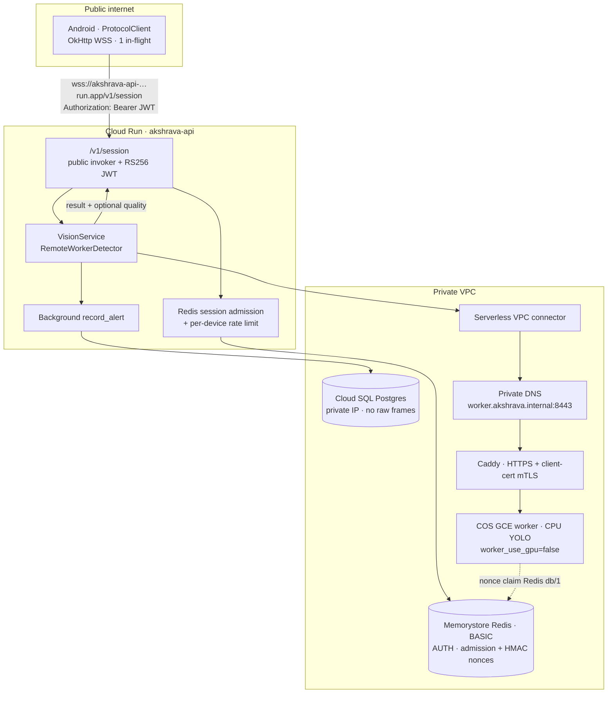
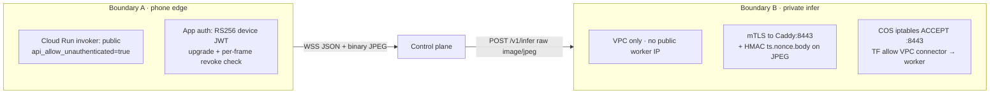
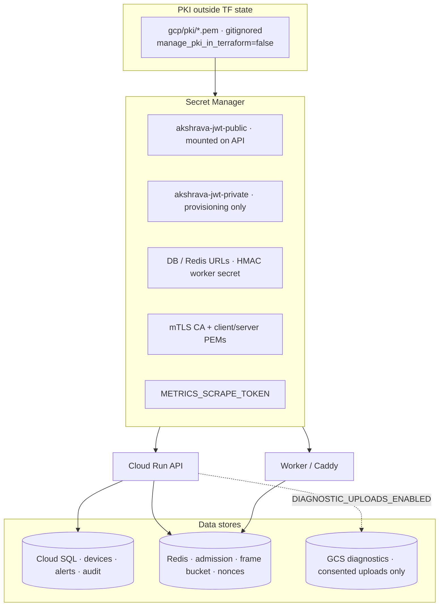
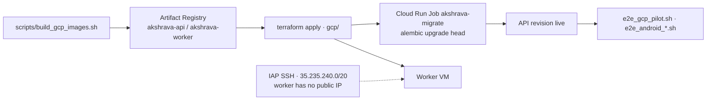

# Operations, deployment, and release

Operator runbook for Compose, GCP, provisioning, model activation, failure handling, and
engineering release checks. Product/protocol/privacy/field content lives in [`README.md`](README.md).

**Live supervised pilot (GCP, 2026-07)**

| Fact | Value |
|---|---|
| WSS | `wss://akshrava-api-c7d3j4nzdq-uc.a.run.app/v1/session` |
| Auth | Public Cloud Run invoker (`api_allow_unauthenticated=true`) + RS256 device JWT on the socket |
| Detector | `detector=remote` → YOLO on a **CPU** worker (`worker_use_gpu=false`; project GPU quota is 0) |
| PKI | PEMs under `gcp/pki/` (gitignored); `manage_pki_in_terraform=false` — keys must not re-enter TF state |
| Readiness | Supervised pilot / E2E only — **not** unsupervised field production |

E2E scripts: `scripts/e2e_gcp_pilot.sh`, `scripts/e2e_android_gcp.sh`,
`scripts/e2e_android_protocol_gcp.sh`.

### Live pilot topology (authoritative)

Compose (`infra/`) remains a local/single-host option (§3). The diagrams below describe the
**deployed GCP supervised pilot**, not a Compose-only or L4-GPU stack.









---

## 1. Before any field use

1. Keep `DETECTOR=noop` (or GCP `detector=noop`) until model licensing, target-device benchmarks, a
   labelled evaluation set, and the controlled-course gate are complete. The default server is a
   transport/policy integration test, not a vision product.
2. Create a unique device ID and a short-lived token. Do not use `dev-device-token` outside local
   development.
3. Provision only a Tier-A device (see [`README.md`](README.md) §5).
4. Configure WSS URL, token, and calibration ID while the phone UI is visible. The user must press
   Start assistance; Android does not permit a silent background camera start.
5. Use a cane/guide and a named mobility instructor for every field session. No independent street use.
6. After controlled-course mount verification, upsert geometry so `range_valid` can leave fail-closed:

```bash
export DATABASE_URL='postgresql+asyncpg://…'
PYTHONPATH=backend python scripts/upsert_calibration_profile.py pilot-phone-r0 \
  --focal-px 520 --camera-height-m 1.35 --confirm-verified
```

Without `--confirm-verified` the row stays fail-closed (`geometry_profile` returns null).

---

## 2. Local backend (bench)

```bash
./scripts/test_backend.sh
./scripts/run_backend_dev.sh
curl http://127.0.0.1:8000/healthz
```

For an Android emulator/debug device only, configure `ws://10.0.2.2:8000/v1/session` with token
`dev-device-token`. Debug builds allow cleartext only for `10.0.2.2`, `127.0.0.1`, or `localhost`;
release builds reject it. The production endpoint must be WSS.

---

## 3. Compose deployment (control plane + optional worker)

This repository supports a single-host deployment and a split deployment. In the split form, the
**control plane** owns phone WebSockets, authentication, alert scoring and PostgreSQL; the
**inference worker** accepts only a short-lived HMAC-authenticated JPEG from that control plane and
returns detector boxes. It has no database, phone endpoint, device token or alert history.

### Before deployment

- Keep `DETECTOR=noop` until the model licence, exact model file/hash, target-device benchmark,
  labelled evaluation and controlled-course gate are approved.
- Set unique, high-entropy `POSTGRES_PASSWORD`, `REDIS_PASSWORD`, and Grafana credentials. In
  pilot/production configure `JWT_ALGORITHM=RS256` and mount only `JWT_PUBLIC_KEY_FILE` on the API;
  keep the matching private key solely on the provisioning workstation. Never use examples.
- Set `AKSHRAVA_ENV=pilot` or `production`; the service rejects `DEV_AUTH_BYPASS=true` outside
  an explicit `development` environment.
- Provision a domain and DNS before enabling Caddy. The public phone endpoint must be WSS.
- Do not deploy a phone without its calibration/provisioning and supervised-trial sign-offs.

### Control-plane deployment

```bash
cd infra
cp .env.example .env
# Set passwords, RS256 public-key path, and DOMAIN in .env.
../scripts/cloud_preflight.sh .env
docker compose --env-file .env --profile control-plane --profile edge up -d --build
```

The one-shot `migrate` role runs Alembic before the API starts. Application processes perform no
schema mutations; a failed migration prevents rollout. The API is deliberately bound to
`127.0.0.1:8000`; Caddy is the public TLS/WSS endpoint. Open only TCP 80 and 443 to the host.
Confirm `/healthz` through the local API before provisioning a device.

Use URL-safe secret values for `POSTGRES_PASSWORD` (Compose places it in the database URL); for
example, `openssl rand -hex 32`. Use `/readyz`, not `/healthz`, for deployment readiness: it
verifies the database connection (and Redis coordination in production).

Start optional monitoring only on a protected host or through an SSH tunnel:

```bash
docker compose --env-file .env --profile control-plane --profile monitoring up -d
```

Prometheus scrapes the aggregate `/metrics` endpoint on the internal Docker network. Caddy does
not publish that endpoint. Grafana provisions the Prometheus datasource and an overview dashboard;
Prometheus includes availability and freshness alert rules. Configure a notification receiver before
treating those rules as pager alerts.

### GPU / remote worker deployment

Use a private WireGuard/overlay address **and** a mutually authenticated TLS proxy between the
hosts. Do **not** expose port 8000 to the public internet. In pilot/production, set
`REMOTE_INFERENCE_URL` to an `https://` worker endpoint; the backend rejects plaintext worker URLs
outside development and refuses to start unless `REMOTE_TLS_CA_FILE`,
`REMOTE_TLS_CLIENT_CERT_FILE`, and `REMOTE_TLS_CLIENT_KEY_FILE` are configured. The API mounts
those files read-only from `WORKER_MTLS_DIR`; the proxy must verify the client certificate.

Set the same `REMOTE_WORKER_SECRET` on both hosts, set the control plane to `DETECTOR=remote`, and
point `REMOTE_INFERENCE_URL` at the worker `/v1/infer` endpoint. For more than one warm worker,
prefer `REMOTE_INFERENCE_REGISTRY_JSON`:

```json
[{"id":"gpu-a","url":"https://gpu-a.internal/v1/infer"},{"id":"gpu-b","url":"https://gpu-b.internal/v1/infer"}]
```

The control plane uses registry IDs for stable device-to-worker placement and fails through to the
next warm peer after a transport failure. A comma-separated `REMOTE_INFERENCE_URL` list is still
accepted for simple deployments. The control-plane timeout defaults to 450 ms on GPU paths; a
failed or late worker result causes fail-closed phone messaging. (The live GCP CPU remote path uses
longer timeouts — see §4.)

On a dedicated inference host:

```bash
cd infra
../scripts/cloud_preflight.sh .env --gpu-worker
GPU_WORKER_BIND_ADDRESS=10.0.0.12 docker compose --env-file .env --profile gpu-worker up -d --build
```

`api-gpu` uses a CUDA PyTorch runtime and one Gunicorn worker so a single GPU model is not
replicated accidentally. In production its signed-request nonce is claimed atomically in Redis.
It refuses to start if CUDA is unavailable when configured for GPU. Health at `/readyz`; private
metrics endpoint — add it to `infra/prometheus-targets/gpu-workers.json` on the monitoring host,
then reload Prometheus.

### Model activation

Only after the release gate is met, set `INSTALL_YOLO=true`, mount an approved model file via
`MODEL_DIR`, set `DETECTOR=ultralytics` (single-host) or `DETECTOR=remote` (split), set
`YOLO_WEIGHTS_SHA256` to the approved file digest, and record it in the deployment record.
`YOLO_WEIGHTS` must resolve to that read-only mounted file. The server and worker verify the digest
before loading and must never download weights while serving a session.

Optional selected-provider image fallback is described in [`README.md`](README.md) §6. It is
disabled by default and requires fresh privacy/consent, cost and latency sign-off.

For a proposed supervised field deployment, run `../scripts/cloud_preflight.sh .env --field`.
It rejects a placeholder/weak secret, bench-mode detector, incorrect model mount, and invalid
Compose configuration. It is a guardrail, not model-validation evidence.

The APK contains no Android TFLite fallback. Do not add an arbitrary `best_11n.tflite` file: a
future fallback needs an exact model asset, labels, tensor layout, preprocessing/postprocessing
contract, target-device benchmark and controlled-course evidence as one reviewed change.

**Licensing:** Ultralytics YOLO weights are AGPL-3.0 unless you have an enterprise licence. Do not
enable `DETECTOR=ultralytics` / remote YOLO in a closed deployment without a licence decision.

### Backups, schema, scale boundary

```bash
../scripts/backup_postgres.sh .env /secure/backup/directory
```

Take an encrypted, access-controlled off-host database backup before each deployment and test a
restore regularly. The helper creates a local dump with owner-only file permissions; it does not
know any cloud-provider credentials.

`/readyz` verifies database connectivity and is used by Docker health checks. `/healthz` is only
process liveness. Caddy exposes neither `/metrics` nor Grafana/Prometheus publicly.

All production schema changes are Alembic revisions under `backend/migrations`. Rehearse each
upgrade and downgrade against a restored backup, run `alembic upgrade head` as the one-shot deploy
role, and record the revision in the release log. Do not add runtime DDL to API startup.

There is no enabled Android fallback. If the network, control plane, or worker fails, the app must
say vision assistance is unavailable and the user must continue with a cane or guide.

The backend records calibration IDs on devices, but loads geometry only from a separately verified
`calibration_profiles` record. Unknown or unverified profiles keep `range_valid=false`.

Redis provides atomic session admission, nonce claims and per-device frame-rate limits across
API/worker replicas. The static inference registry provides stable placement and warm-peer
fail-through, but not automatic health re-pointing. Production still requires authenticated
registry updates, health-checked routing, a warm spare, and a rehearsed failover/restore drill.

---

## 4. GCP (Cloud Run + remote worker)

The [`gcp/`](../gcp/) Terraform module provisions the live Google Cloud path that matches the app
fail-closed contract:

| Resource | Role |
|---|---|
| Cloud Run `akshrava-api` | Phone WSS control plane (RS256 JWT, 1h request timeout) |
| Cloud Run Job `akshrava-migrate` | Alembic `upgrade head` before serving |
| Cloud SQL Postgres (private IP) | Alert/device/audit store — no raw frames |
| Memorystore Redis | Session admission + worker nonce claims |
| GCE worker VM | Remote YOLO (`worker_use_gpu=true` → L4 when quota exists; **current pilot: CPU**) |
| Caddy on worker `:8443` | HTTPS + client-cert mTLS in front of `/v1/infer` |
| Artifact Registry | `akshrava-api` / `akshrava-worker` images |
| Secret Manager | DB URL, Redis URLs, HMAC secret, JWT keys, mTLS PEMs |
| GCS diagnostics bucket | Consented uploads only (`GCP_DIAGNOSTICS_BUCKET`) |

### Current pilot configuration (authoritative)

- Live WSS: `wss://akshrava-api-c7d3j4nzdq-uc.a.run.app/v1/session`
- `api_allow_unauthenticated=true` so phones can reach Cloud Run without a separate edge SA;
  **JWT on the WebSocket remains the auth boundary**. Prefer `api_invoker_members` + private
  invokers when an edge proxy exists.
- `detector=remote` with pinned `yolo_weights_sha256` in `gcp/terraform.tfvars` (not committed
  secrets docs — do not paste private keys here).
- `worker_use_gpu=false` because L4/T4 quota is 0 in this project. CPU remote YOLO is slower; the
  API uses extended worker timeouts on that path. Do not claim GPU inference is live.
- Phone settle budget is **10 s** (matches CPU remote timeouts); repeated hung settles reconnect.
  Server `quality` ladder sheds to 320/Q28/0.35 under multi-second inference; the phone may shed
  further from RTT / settle-timeout stress without raising above the server hint.
- `manage_pki_in_terraform=false`; load PEMs from `gcp/pki/` via `tls.tf`. Bootstrap-only may set
  `manage_pki_in_terraform=true` (keys land in state — rotate if state is copied).
- WSS reliability: API service uses `cpu_idle=false` and `min_instance_count=1`.
- Redis AUTH is always on. Set `redis_transit_encryption=true` for Memorystore STANDARD_HA +
  `rediss://` when in-transit TLS is required.
- This is a **supervised pilot**. Do not claim unsupervised field production readiness.

### Operator sequence

```bash
./scripts/build_gcp_images.sh "$PROJECT_ID" us-central1
# Copy the printed api_image / worker_image digests into gcp/terraform.tfvars
cp gcp/terraform.tfvars.example gcp/terraform.tfvars   # set project_id + digests + pilot flags
# Optional remote state + CMEK: copy gcp/backend.tf.example → gcp/backend.tf
terraform -chdir=gcp init && ./scripts/gcp_migrate_then_deploy.sh "$PROJECT_ID" us-central1
terraform -chdir=gcp output websocket_url
```

`gcp_migrate_then_deploy.sh` runs `terraform apply` then
`gcloud run jobs execute akshrava-migrate --wait` so Alembic must succeed before you treat the new
API revision as live. Run `./scripts/gcp_preflight.sh` before apply.

`/healthz` and `/readyz` remain usable for probes; `/metrics` requires `METRICS_SCRAPE_TOKEN`
(Secret Manager) via `X-Akshrava-Metrics-Token` or `Authorization: Bearer`.

Fetch the provisioning private key (never mount it on Cloud Run):

```bash
gcloud secrets versions access latest --secret=akshrava-jwt-private > jwt-private.pem
```

Point the Android app at the `websocket_url` output. Release builds still require WSS only.
Helper: `scripts/print_android_pilot_provisioning.sh` (defaults to the live pilot WSS URL).

### Live E2E

```bash
# Backend WSS + remote vision path
GOOGLE_APPLICATION_CREDENTIALS=... ./scripts/e2e_gcp_pilot.sh [device_id]

# Android-path live E2E against Cloud Run
GOOGLE_APPLICATION_CREDENTIALS=... ./scripts/e2e_android_gcp.sh [device_id]

# Android protocol client against Cloud Run
GOOGLE_APPLICATION_CREDENTIALS=... ./scripts/e2e_android_protocol_gcp.sh [device_id]
```

These prove authenticated session + remote vision wiring. They do **not** replace controlled-course
or supervised-trial gates in [`README.md`](README.md) §5.

---

## 5. Provisioning and revocation

Mint a production device token from the secured provisioning workstation; its private key is not
mounted on the API host:

```bash
cd backend
source .venv/bin/activate
JWT_ALGORITHM=RS256 JWT_PRIVATE_KEY_FILE=/secure/keys/device-private.pem \
  python ../scripts/mint_device_token.py pilot-phone-001 --days 30
```

The Android app encrypts this token using the device's Android Keystore before storing it. A
keystore failure means the volunteer must re-provision; it must not fall back to plaintext storage.

To revoke a lost or compromised provisioned device:

```bash
cd backend
DATABASE_URL='postgresql+asyncpg://...' python ../scripts/revoke_device.py pilot-phone-001
```

Revocation is checked during WebSocket upgrade, before every frame header, and during event reads.
An already-open session is closed before its next frame; issue a new device ID/token after
re-provisioning, and do not "unrevoke" a lost device.

---

## 6. Operational signals

Prometheus must alert on control-plane availability, worker availability, late-suppressed results,
session-admission saturation, and aggregate capture-to-API frame age. These metrics are
intentionally aggregate: no device, route, or carrier labels are exported from `/metrics`.
Outside development, `/metrics` requires `METRICS_SCRAPE_TOKEN`. Compose injects the token into
the API and Prometheus (`authorization.credentials_file`). Caddy and Cloud Run must not expose an
unauthenticated scrape path publicly. Carrier/device p95 is a field-log analysis task after
explicit consent, not a public metrics label.

---

## 7. Failure handling

- **Connection lost:** the app says “Vision assistance unavailable. Use cane or guide.” It
  reconnects with backoff, but must not queue frames, claim a clear path, or imply a local fallback
  unless a separately evaluated model is explicitly enabled.
- **Service killed:** do not attempt silent restart. The user/volunteer must visibly start camera
  assistance again; investigate that model/OEM before reissuing it.
- **Hot/battery low:** stop the session or reduce capture according to the approved device policy.
  Do not charge a hot or swollen donated phone.
- **Unexpected alert/miss/near miss:** end the session, record the incident without raw video by
  default, and add consented diagnostic evidence to the regression process before the next trial.

---

## 8. Release and verification

### Engineering release

1. Work on a release branch; keep backend tests/lint, Compose configuration, and Android builds green.
2. Open a reviewed pull request to `main`; merge only after required CI passes.
3. Bump backend and Android versions, create an annotated `vX.Y.Z` tag on the merged commit, and
   publish only the workflow-produced signed artifacts.
4. Record the commit, tag, schema revision, model/weight SHA-256, and deployment configuration in
   the release log. Roll back to the last approved tag only after stopping affected sessions.

### Repository verification

```bash
./scripts/verify_phases.sh
./scripts/test_backend.sh
cd backend && .venv/bin/ruff check akshrava_backend tests
cd android && ./gradlew --no-daemon :app:testDebugUnitTest :app:assembleDebug :app:assembleRelease
```

The current backend suite verifies protocol, freshness, priority look, geometry gating, storage,
distributed coordination, migration, remote-worker, authentication, Phase-0 synthetic policy
replay (`datasets/phase0/`), and fail-closed contracts.
The Android unit/build gate verifies protocol freshness handling, watchdog timing, frame gating,
capture cadence policy, API compatibility constants, and debug/release APK assembly. It does not
prove street perception, mount calibration, CUDA performance, carrier handover, or field safety.

Before a deployment, run `cloud_preflight.sh .env` (and `--field` / `--gpu-worker` where relevant),
or `./scripts/gcp_preflight.sh` for the Terraform stack. Rehearse Alembic upgrade/rollback against
a restored backup, and validate readiness, metrics, mTLS, worker failover, and device revocation.
Complete every item in [`README.md`](README.md) §5 before treating a GitHub release as a field release.

### Verification boundary

| Gate | Minimum |
|---|---|
| Bench | `./scripts/verify_phases.sh` green; protocol + policy tests |
| One-phone | Controlled-course recall; ≤500 ms spoken age; no silent service death |
| Supervised trial | Named mobility instructor with stop authority; Tier-A phone; consent |
| Pilot | Approved device inventory, ops runbook, model SHA pin, privacy review |

Bench/CI proves code behavior. Supervised participant and independent field use remain blocked
until the model, device, instructor, consent, and controlled-course evidence are signed off.
