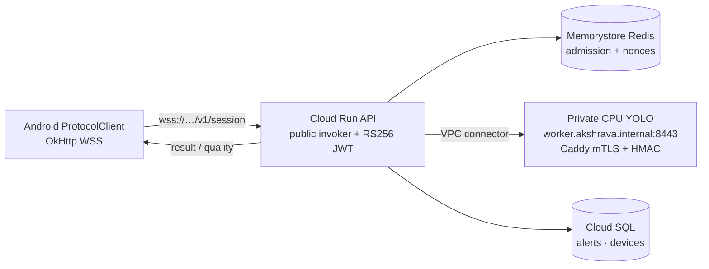

# Akshrava documentation

Authoritative product, protocol, privacy, and field documentation for this repository.
Deployment, operator commands, release checks, and the live GCP pilot runbook live in
[`OPERATIONS.md`](OPERATIONS.md). End-to-end architecture depth remains in
[`../Important Architecture.md`](../Important%20Architecture.md). The root
[`../README.md`](../README.md) is the short code map — not a second ops source of truth.

**Status (2026-07):** supervised GCP pilot only. Not unsupervised field production.
Live phone endpoint: `wss://akshrava-api-c7d3j4nzdq-uc.a.run.app/v1/session`.
Auth is app JWT (RS256); Cloud Run currently allows public invokers so worn phones can reach
WSS. Inference is remote YOLO on a **CPU** worker (`worker_use_gpu=false`; GPU quota is 0).
PKI PEMs live under `gcp/pki/` (gitignored), not in Terraform state.

Operator topology, trust boundaries, stores/secrets, and deploy path diagrams:
[`OPERATIONS.md`](OPERATIONS.md) (live pilot topology).



---

## 1. Safety and product boundary

Akshrava turns a recent chest-mounted Android camera view into a short, rate-limited alert for
blind and low-vision users in India. It supplements a white cane, guide dog, or sighted guide.
It is **not** navigation, collision avoidance, route guidance, or a crossing aid.

- Never say a road is safe to cross, a path is clear, or a vehicle is *approaching*.
- At 0.2–3 FPS, box growth confounds wearer motion with target motion. Vehicle speech is only
  `vehicle nearby`. Results carry `motion_evidence: "insufficient"`.
- Silence never means safety. The phone must say when the camera, network, or detector cannot assist.
- A green CI run is not field-use approval. Independent street use remains blocked until model,
  device, instructor, consent, and controlled-course evidence are signed off.

### Alert vocabulary (allowed)

| Situation | Spoken / keyed response |
|---|---|
| Stable validated central obstruction | `Obstacle ahead` (+ haptic) |
| Stable nearby lateral vehicle | `Vehicle nearby, left/right` |
| Priority look | `look_summary` for this frame (cooldowns skipped; still no approach/cross) |
| Camera blocked / link down / no detector | Explicit status (`Camera view unclear`, `Vision assistance unavailable`, …) |

Never: numeric metres, “approaching”, “safe to cross”, “path clear”, continuous scene narration.

---

## 2. Phone ↔ backend protocol

The phone opens exactly one `wss://HOST/v1/session` socket while assistance is explicitly active
and sends `Authorization: Bearer JWT` in the WebSocket upgrade request. The backend accepts no
unauthenticated production connection. The client keeps **one** frame in flight and may discard
its one replaceable pending frame.

### Messages

1. Server → client: `{"type":"ready","device_id":"...","max_in_flight":1,"vision_enabled":true}`.
   A `false` value means transport-only bench mode; the phone must say vision is unavailable and
   must not send frames.
2. Client → server: a JSON `frame` header followed immediately by one binary JPEG message.
3. Server → client: a `result`, followed by optional `quality` guidance.
4. Optional client → server: `{"type":"look"}` then a priority frame (`priority: true` and/or
   `mode: "priority"`). The server replies `look_ack`, then the priority result includes
   `look_summary` and **skips alert cooldowns / device rate limits**. On the phone, look answers
   use the **500 ms** freshness budget (not the tighter 250 ms S1 window).

```json
{
  "type": "frame",
  "id": 841,
  "capture_mono_ms": 93211455,
  "capture_epoch_ms": 1752883094000,
  "w": 640,
  "h": 480,
  "jpeg_bytes": 61423,
  "camera_calibration_id": "pilot-phone-r0",
  "pitch_cdeg": -1180,
  "roll_cdeg": 90,
  "pose_age_ms": 12,
  "mode": "normal",
  "priority": false
}
```

`capture_mono_ms` is a **phone-local** elapsed-realtime timestamp. The backend echoes it but does
not compare it with its own clock. The phone discards a normal alert when
`elapsedRealtime() - capture_mono_ms > 500` (urgent S1: 250 ms). Priority look results use
**500 ms** even when the hazard is urgent.

Pose values are calibration/validity signals. Missing or unverified geometry keeps
`range_valid=false`. A separately verified `calibration_profiles` record (focal length + mounted
camera height) plus fresh pose and dual-estimate agreement may set `range_valid=true`. The
calibration ID string alone is never measurement evidence. Never manufacture a spoken distance
from pose alone.

`quality` is bounded server-pressure guidance for constrained uplinks (3G/4G) and CPU remote
YOLO. At normal load it requests 640 px/Q55/1 FPS; as server queue/inference grows it steps
through 512/Q48/0.85 → 480/Q42/0.7 → 384/Q35/0.55 → 320/Q32/0.45 → 320/Q28/0.35 FPS. The phone
merges that hint with observed round-trip / settle-timeout stress (never raising cost above the
server floor) and remains responsible for discarding stale network results. Client settle budget
is 10 s so a single slow CPU infer does not tear down the WebSocket; repeated hangs still reconnect.

The server also enforces a per-session normal-rate token bucket of 1.2 frames/second with a
two-frame burst. Priority look frames bypass that bucket. Non-priority excess headers are rejected
as `frame_rate_limited` and their paired JPEGs are consumed so the stream stays synchronised.

### Control plane ↔ inference worker

`RemoteWorkerDetector` posts the **raw JPEG body** (not base64):

```http
POST /v1/infer
Content-Type: image/jpeg
X-Akshrava-Timestamp: <unix>
X-Akshrava-Nonce: <urlsafe>
X-Akshrava-Signature: HMAC-SHA256(secret, ts.nonce.body)
```

Legacy JSON/`image_b64` bodies are rejected (`415`). Nonces are claimed in Redis for replica-safe
replay protection. Network isolation and TLS/mTLS remain mandatory deployment controls.

### Safety invariants enforced in code

- Images are size limited (default 200 KB) and never persisted in normal operation.
- Capture timestamps must strictly increase; the server refuses non-priority frame headers closer
  than 200 ms by default; rejected header/JPEG pairs are consumed together.
- A vehicle message key is `vehicle_nearby`, never an approach/crossing instruction.
- S2/caution alerts require two detections on a track; single-frame S1 is allowed only when
  geometry is `range_valid` and confidence clears the S1 threshold.
- When a hazard is returned, the backend sets `motion_evidence: "insufficient"` at this frame rate.
- The phone owns staleness rejection and TTS rate limiting.
- Priority look (`priority` / `mode=priority`) sets `skip_cooldowns` server-side and returns
  `look_summary`; it does not invent approach or safe-to-cross language.

---

## 3. Android compatibility and device policy

The universal APK has `minSdk=26` and `targetSdk=36`. Android 8/8.1 remains build-compatible;
Tier-A field devices are Android 10+, 64-bit ARM, and at least 4 GB RAM. Android version alone
does not qualify a donated phone.

**“Ten generations older” phones:** if that means ~Android 5–6 (API 21–23), they **cannot install**
this APK. The floor is intentional (NotificationChannel, camera FGS policy). Within the supported
range, low-RAM / &lt;3 GB devices and API 26–29 use `DeviceCapability` to start on a cheaper
capture ladder (mid stress quality, 480 analysis cap) so the 3G/4G quality path does not open at
640/Q55 on weak hardware. Emulator proof for the floor is API 26 (`AKSHRAVA_AVD=akshrava_api26_arm64`
with `./scripts/e2e_android_gcp.sh`); that does not replace OEM camera/thermal field gates.
`AlertManager` initializes TTS only after locks used by `onInit` exist — older engines call
`onInit` synchronously from the constructor.

### Compatibility and release matrix

The release workflow validates API 28–36 (Android 9 through 16, including 12L). It installs and
launches an instrumentation smoke test on each API; API 30+ covers typed camera foreground-service
compatibility, API 31 covers visible-activity-only starts, API 33 covers notification permission,
and API 34 covers the typed camera FGS requirement. The tag release repeats this matrix and refuses
to publish an APK without its configured signing key.

Required GitHub release secrets are `ANDROID_KEYSTORE_BASE64`, `ANDROID_KEYSTORE_PASSWORD`,
`ANDROID_KEY_ALIAS`, and `ANDROID_KEY_PASSWORD`. Local `assembleRelease` output is unsigned build
evidence only and must never be distributed.

### Resource and safety policy

The active service is bounded to:

- one 640×480 CameraX analysis stream and one analyzer thread;
- one JPEG frame in flight, no local recorder or image backlog;
- capture cadence decided by `CapturePolicy`: normally 1 FPS walking, 0.2 FPS stationary, no
  more than 2 FPS during a short re-check, and lower rates for thermal/battery protection;
- 25 Hz pose sensors only while assistance is active; and
- no bundled TFLite model, OCR, Bluetooth integration, or unreviewed offline fallback.

Android 8–9 use legacy foreground-service behavior; Android 10+ declares the camera type; Android
13+ requests notification permission. On critical battery, the app unbinds the camera, closes the
socket, and releases the wake lock. A watchdog may prompt a visible restart, but never starts a
camera service silently.

Emulator tests prove process startup and permission-safe onboarding. They do not prove camera
driver stability, OEM lock-screen behavior, headset behavior, carrier freshness, heat, battery, or
mount quality — those are mandatory field gates in §5.

Release builds accept **only** `wss://`. Debug may use `ws://` for emulator/device
(`10.0.2.2`, `127.0.0.1`, or `localhost` only). Assistance starts only from a visible user action —
never from boot or a silent receiver.

---

## 4. Privacy programme

Practical engineering guidance, not legal advice. Obtain Indian privacy counsel before any public
deployment.

### Legal context

The [DPDP Act, 2023](https://www.meity.gov.in/static/uploads/2024/02/Digital-Personal-Data-Protection-Act-2023.pdf)
and [DPDP Rules, 2025](https://www.meity.gov.in/documents/act-and-policies/digital-personal-data-protection-rules-2025-gDOxUjMtQWa?pageTitle=Digit)
were notified with phased commencement. Core processing/notice/consent and Data Principal-rights
sections are scheduled approximately 18 months after the November 2025 notification — around May
2027. Build to that standard now.

### Data map

| Data item | Purpose | Processor / location | Retention | Access owner | Deletion method |
|---|---|---|---|---|---|
| Phone number (hashed) | Device registration | Backend DB | Until device deregistered | Project lead | DELETE from `devices` |
| Device ID (random, rotating) | Session binding | Backend DB | Until device deregistered | Project lead | DELETE from `devices` |
| Calibration ID | Camera geometry validation | Backend DB | Until recalibration | Project lead | UPDATE calibration record |
| Frame JPEG (640 px) | Live hazard detection | **RAM only** — discarded after inference | 0 seconds (ephemeral) | N/A | Automatic; never written to disk |
| Detection results | Alert generation | Backend RAM | Duration of WebSocket session | N/A | GC on session close |
| Alert events (kind, level, bearing, confidence) | Audit, regression analysis | Backend DB | 30 days | Project lead | Scheduled DELETE |
| Coarse telemetry (latency, frame age, battery temp) | Service monitoring | Structured logs | 30 days | Project lead | Log rotation |
| Security audit events | Incident detection | Structured logs | 90 days | Project lead | Log rotation |
| Opt-in diagnostic frames (consented, blurred) | Failure investigation | Encrypted object storage | 30 days unless incident consent extends | Project lead | Auto-delete / on request |
| GPS / location | **Not collected in Phases 0–3** | N/A | N/A | N/A | N/A |

### Default minimisation

- Process each frame **in RAM**; return detection results; **discard the frame immediately**.
- Do **not** write raw uploaded frames, GPS trails, audio, or continuous video in normal operation.
- Do not use IMEI — use a rotating random device ID.
- Do not perform facial recognition, demographic inference, or persistent bystander tracking.

### Consent conversation

A volunteer reads the following notice **orally** in the participant's language before first use:

> **What the camera sees:** The phone camera captures images of the area in front of you,
> including bystanders in public spaces.
>
> **How images are processed:** Each image is sent to a server, analysed for obstacles,
> and immediately discarded. No images are saved by default.
>
> **Optional diagnostic samples:** If you agree separately, short clips from failed detections
> may be saved for 30 days to improve the system. Faces and number plates are blurred before
> storage. You can withdraw this consent at any time.
>
> **How to stop:** Press the Stop button, ask your guide, or remove the headset. The system
> stops capturing immediately.
>
> **How to withdraw or contact us:** [NGO contact email/phone]. You may request deletion of
> your device data at any time.

Record: consent version, date, language, volunteer name. Do **not** photograph a blind person's
signature as consent evidence.

### Opt-in diagnostic samples

- Require **separate, revocable** voice-confirmed consent (distinct from operational consent).
- **Uploads are disabled by default** (`DIAGNOSTIC_UPLOADS_ENABLED=false`). JWT
  `diagnostic_consent` alone must not upload raw frames. Do not set the flag until face/plate
  blur exists.
- `scripts/mint_device_token.py --diagnostic-consent` refuses unless
  `DIAGNOSTIC_UPLOADS_ENABLED=true` (lab-only override: `--force-unsafe-diagnostic-consent`; API
  still will not upload until enabled).
- **Blur on phone before upload**: detector-based face/plate blur plus manual review.
- Automated blur is imperfect — never promise perfect anonymisation.
- Retain for 30 days maximum, then auto-delete unless a specific incident consent extends.

### Encryption, retention, processors, incidents

| Layer | Measure |
|---|---|
| Transit | TLS 1.3 / WSS only; no unencrypted endpoints |
| At rest | Encrypted disks/backups on all servers |
| Keys | Separate per-environment keys; rotate device tokens at re-provisioning |
| Access | Least-privilege service accounts; MFA for console access |
| Logs | No frames in logs; no PII in structured telemetry |
| Device tokens | Short-lived JWT (RS256 in pilot/production); re-authenticated on each WebSocket connection |

| Data category | Retention | Deletion method |
|---|---|---|
| Operational telemetry | 30 days | Log rotation / scheduled DELETE |
| Security audit events | 90 days | Log rotation |
| Opt-in diagnostic clips | 30 days (unless incident consent extends) | Auto-delete job |
| Device records | Until device deregistered | On request |
| Alert events | 30 days | Scheduled DELETE job |

On deletion request (oral or written), delete all records associated with the device ID within
72 hours. Produce a deletion log entry (device ID hash, deletion timestamp, operator).

- Sign data-processing terms with cloud hosts where possible; know processor country/region.
- Do **not** put frames into free third-party demos, public issue trackers, or personal cloud storage.
- Incident path: contain (revoke access) → assess → notify if required by DPDP → remediate → post-mortem.
- Children under 18: verifiable parent/guardian consent + specialist legal advice.
- Bystanders: participant consent does not obtain bystander consent; keep ephemeral no-retention
  processing; no facial recognition; separate legal review for any retained clip.

Review this programme before each phase transition, when adding collection (especially GPS), when
changing processors, and after any security incident.

---

## 5. Field readiness and supervised trials

This system is a bench/supervised-pilot implementation until every applicable item below is signed
off by a named release owner. Passing code tests never authorizes independent street use.

### Phone qualification and provisioning

- Battery health exceeds 80% original capacity; continuous-camera stress test has no abrupt
  shutdown, thermal excursion above 45°C, or unsafe swelling/heat.
- Rear camera is clear; Tier-A phones have Android 10+, 64-bit ARM, 4 GB RAM, and 32 GB storage.
- Factory reset, install security updates, remove nonessential bloatware, install the signed APK,
  grant Camera / notification / battery-optimization permissions.
- Active SIM/data plan; unique device token and calibration ID; verify Start/Stop, notification,
  WSS connection, outage phrase, and no fake local fallback.
- Verify worn-mount orientation, offline Hindi/English TTS, heat/battery, lock-screen survival,
  haptics, and carrier freshness. Reject damaged, 32-bit, 2 GB, or unreliable devices.

### Engineering and model gate

- Backend tests, Android tests, signed release artifact, deployment preflight, backups/restore,
  readyz recovery, retention, and protected monitoring access all pass.
- Pilot/production use WSS, `DEV_AUTH_BYPASS=false`, RS256 device-token verification, per-device
  revocation, and an approved secrets-rotation procedure.
- Detector licence, exact weight SHA-256, latency evidence, model rollback image, verified
  calibration profile, controlled-course evidence, and private worker checks are recorded.
- `noop` is transport-only bench mode and must never be represented as vision assistance. An
  offline model remains disabled until its own recall, latency, heat, tensor-contract, and
  controlled-course evidence is approved.

### Supervised-trial protocol

Brief participants that Akshrava is experimental and never replaces a cane, guide dog, or mobility
instructor. Demonstrate Start, Stop, alert vocabulary, and the lack of crossing/clear-path advice.
The supervisor stays beside or behind the participant, intervenes immediately for danger, and is
the authority for street crossings. Use a controlled enclosed course first, then a quiet familiar
route; never promise offline detection without an explicitly approved local model.

Record alert reactions, misses/false positives, battery/thermal behavior, and oral feedback. Stop
after an unexpected urgent miss, repeated stale alert, unannounced service death, overheating,
fall/near fall, or participant distress. Every incident reopens the relevant release gate.

Licensed/evaluated weights, a named NGO or mobility instructor, accessible consent, privacy/legal
review, controlled-course evidence, and a real field deployment are external gates — not artifacts
this repository can invent.

---

## 6. Optional cloud image fallback

Disabled by default (`CLOUD_FALLBACK_PROVIDER=none`). The running phone workflow remains still-image
only. The backend always calls the local/remote detector first; it sends an image to the selected
cloud provider **only** when that detector returns no objects. The app neither returns nor stores
cloud captions, tags, raw labels, or the image itself. If the fallback service fails, the result
contains only a coarse availability bit and the phone speaks a one-time degraded-mode warning.

Only a boxed, allow-listed object (`person`, bicycle, motorcycle, car, bus, truck, dog or cat) may
re-enter the existing conservative hazard scorer. Cloud output never creates crossing advice,
distance, or an approach claim.

Set `CLOUD_FALLBACK_PROVIDER` to `aws`, `gcp`, `azure`, or `none`. Rebuild the API after changing
it because the container installs only the SDK for the selected provider. Use one provider per
deployment; confirm region, data-processing terms, and explicit participant consent before enabling.

| Provider | Image service | Credentials |
|---|---|---|
| AWS | Rekognition `DetectLabels` | Workload role with only `rekognition:DetectLabels`; `AWS_REGION` |
| GCP | Cloud Vision labels + object localization | ADC / workload identity with Vision access |
| Azure | Azure AI Vision Image Analysis | `AZURE_VISION_ENDPOINT` + `AZURE_VISION_KEY` in secret manager |

Video (Rekognition Video, Video Intelligence, Video Indexer) is intentionally **not** part of the
phone session. Those require a separate consented clip-upload back-office workflow after privacy
and retention owners approve it.

---

## 7. ADR — transport evolution (accepted)

**Decision:** retain WSS for the current rollout. WebTransport/HTTP3 is an explicit subsequent
scale milestone, not available functionality.

The WebSocket adapter delegates every validated frame to `SessionApplicationService`; it no longer
owns calibration/inference business transactions. That use case is transport-neutral and is the
integration point for a future WebTransport adapter or broker consumer.

**Consequences**

- Horizontally scaled workers use Redis-backed replay protection and per-device frame admission.
- A reconnect starts a fresh short-lived tracker session; no sticky session is required for safety.
- Shipping an unverified alternate transport in an assistive safety path would be a regression.

**Exit criteria for WebTransport**

1. Android transport adapter passes API 28–36 instrumentation tests.
2. Gateway supports WSS and WebTransport negotiation with identical frame/result contract tests.
3. Carrier-handover, packet-loss, and stale-result trials prove no result is spoken beyond the
   phone-owned freshness deadline.
4. Broker-backed GPU result routing has bounded queue depth, cancellation, replay protection, and
   overload SLOs.

---

## Related documents

| Document | Role |
|---|---|
| [`OPERATIONS.md`](OPERATIONS.md) | Deploy, GCP pilot, provisioning, release verification |
| [`../README.md`](../README.md) | Repository map and local run commands |
| [`../Important Architecture.md`](../Important%20Architecture.md) | Full architecture / timing / governance |
| [`../NOT_NOW.md`](../NOT_NOW.md) | Explicit non-goals |
