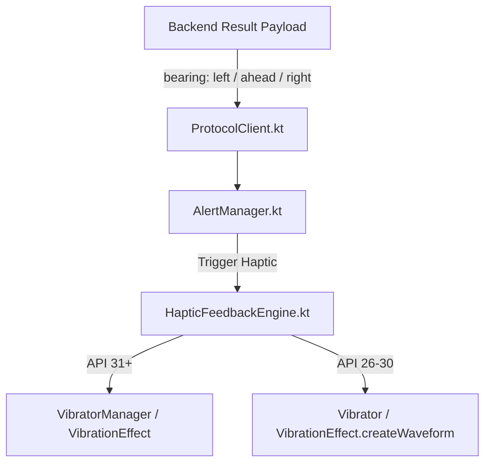
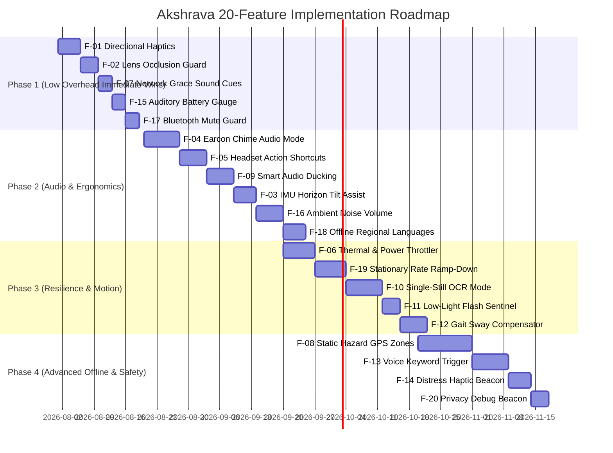

# Akshrava — Next-Generation Assistive Vision Feature Specification & Architectural Roadmap

**Document Status:** Complete Architecture & Feature Proposal (Version 3.0 — Comprehensive Edition)  
**Target Platform:** Recycled & Legacy Android Devices (minSdk 26 / Android 8.0 through Android 18+ / API 38+)  
**Safety Boundary:** Supervised Assistive Awareness Only (*Strictly No Navigation, No Crossing Guidance, No Collision Avoidance, No Safe Guarantees*)  
**Primary Objective:** Evaluate low-overhead, resource-neutral features to enhance real-world usability for blind and low-vision users without increasing CPU, thermal, or network load.

---

## 1. Executive Summary & Vision Scope

Akshrava is designed as a safety-first assistive vision system running on recycled Android phones. The core system operates at a low capture rate (0.2–2.0 FPS) to preserve battery life, prevent thermal throttling, and minimize cellular data usage.

This document presents twenty (20) pragmatic, forward-compatible features designed to address critical real-world challenges faced by visually impaired users—such as noisy urban environments, camera tilt misalignment, lens occlusion, high battery consumption, audio ducking with TalkBack, hands-free interactions, and ambient noise adaptation—while adhering strictly to Akshrava's safety boundaries and low-resource constraints.

---

## 2. Core Architectural & Safety Principles

All proposed features must satisfy four fundamental engineering constraints:

1. **Safety Boundary Enforcement**:
   - Features must provide *awareness only* (e.g., "Vehicle nearby ahead", "Person left").
   - Features must **NEVER** state or imply clear path, safe to cross, distance-to-collision, approach speed, or step-by-step navigation instructions.
2. **Resource-Neutral Posture**:
   - Zero continuous high-frequency CPU or GPU processing loops on the phone.
   - Low memory footprint (< 15 MB heap increment).
   - Minimal battery draw (target: < 4% battery consumption per hour of walking).
3. **Forward & Backward Android Compatibility**:
   - Supported from **Android 8.0 (API 26)** up through **Android 18+ (API 38+)**.
   - Built on Android Jetpack libraries (`androidx.core`, `androidx.camera`, `androidx.media`), avoiding deprecated APIs (such as legacy `Vibrator.vibrate(long)` or raw `Camera` APIs).
   - Utilizes version-gated capabilities (e.g., `VibratorManager` on API 31+, `OnThermalStatusChangedListener` on API 29+) with graceful fallbacks.
4. **Offline Resilience & Failure Invariance**:
   - The user must receive tactile or auditory state cues when network or server vision assistance is degraded, without stranding the user or freezing the UI.

---

## 3. Comprehensive Feature Matrix (20 Features)

| ID | Feature Name | Primary User Value | Complexity | Resource Overhead | Target Android API |
|---|---|---|---|---|---|
| **F-01** | **Directional Haptic Spatial Cues** | Silent tactile bearing cues (Left / Center / Right) for noisy streets | Low | Negligible (<1% CPU) | API 26+ (Vibration / `VibratorManager`) |
| **F-02** | **Lens Occlusion & Darkness Guard** | Alerts user if camera is covered in pocket, lanyard, or total darkness | Low | Extremely Low (<0.5ms/frame) | API 26+ (Y-plane luma sample) |
| **F-03** | **IMU Horizon & Wearer Tilt Assistant** | Subtle haptic feedback when phone camera is tilted too far down/up | Low-Med | Negligible (`Sensor.TYPE_ACCELEROMETER`) | API 26+ (`PoseTracker.kt`) |
| **F-04** | **Earcon / Chime Audio Mode** | Fast, non-fatiguing audio chimes replacing lengthy speech in noisy areas | Medium | Low (Pre-loaded `SoundPool`) | API 26+ (`SoundPool` & `AudioAttributes`) |
| **F-05** | **Headset Multi-Click Shortcuts** | Single/double/triple media key presses for repeat, look query, mode toggle | Medium | Negligible (`MediaSessionCompat`) | API 26+ (`HeadsetControls.kt`) |
| **F-06** | **Adaptive Thermal & Power Throttler** | Drops capture FPS & quality automatically when phone gets warm or low battery | Medium | Negligible (`PowerManager` thermal) | API 29+ (`DeviceCapability.kt`) |
| **F-07** | **Network Grace State Sound Cues** | Subtle earcons for socket connect, disconnect, and reconnect events | Low | Negligible (`ProtocolClient.kt`) | API 26+ |
| **F-08** | **Static Hazard GPS Caution Zones** | Offline local bookmarking of known static hazard zones (e.g. construction) | High | Low (Passive GPS location) | API 26+ (`LocationManager` / SQLite) |
| **F-09** | **Smart Audio Ducking & TalkBack Engine** | Transiently ducks background media/TalkBack during urgent alerts | Medium | Negligible (`AudioManager` Focus) | API 26+ (`AudioFocusRequest`) |
| **F-10** | **Single-Still High-Detail OCR Mode** | On-demand 1080p still frame text query ("Read Sign" / Bus number) | Medium | 0 Continuous Overhead (On-demand) | API 26+ (CameraX still capture) |
| **F-11** | **Low-Light Flash Sentinel** | Auto-enables low-power torch when walking in dark alleyways | Low | Minimal (<2% battery/hr) | API 26+ (CameraX `cameraControl`) |
| **F-12** | **Gait & Sway Motion Compensator** | Dampens lanyard sway false positives during fast walking | Medium | Negligible (<0.1ms IMU math) | API 26+ (`PoseTracker.kt` cadence) |
| **F-13** | **Voice Keyword Scene Query** | Hands-free voice trigger ("Akshrava, Look") for cane/leash users | Medium | Low (Android SpeechRecognizer) | API 26+ (`SpeechRecognizer`) |
| **F-14** | **Distress Haptic Beacon & GPS SMS** | Emergency key hold emits beacon tone & prepares guardian coordinates | Low-Med | Zero in normal state | API 26+ (`SmsManager` / Location) |
| **F-15** | **Auditory Battery Level Gauge** | Announces remaining battery % and vision battery run-time | Low | Zero CPU (Broadcast listener) | API 26+ (`DeviceCapability.kt`) |
| **F-16** | **Ambient Noise Adaptive Volume** | Auto-adjusts alert volume based on ambient street noise | Medium | Low (<1ms mic sample) | API 26+ (`AudioRecord` / AudioManager) |
| **F-17** | **Bluetooth Disconnect Mute Guard** | Prevents loud speaker output when Bluetooth earbuds die/disconnect | Low | Zero CPU (Broadcast listener) | API 26+ (`HeadsetControls.kt`) |
| **F-18** | **Offline Multi-Lingual Translator** | Pre-loaded Indian regional language strings for 100% offline TTS | Medium | Zero extra CPU/RAM | API 26+ (`SupportedLanguages.kt`) |
| **F-19** | **Stationary Micro-Motion Rate Throttler** | Drops to 0.2 FPS when user is sitting or standing still | Medium | Saves 80% battery/data | API 26+ (`PoseTracker.kt` & `FrameGate.kt`) |
| **F-20** | **Privacy-Preserving Debug Beacon** | Encrypted local diagnostic log buffer for offline troubleshooting | Low | Minimal (<10KB/day disk) | API 26+ (`AgentDebugLog.kt`) |

---

## 4. Deep-Dive Technical Feature Specifications

### F-01: Directional Haptic Spatial Cues (Tactile Bearing Cues)

#### 1. Overview & User Value
Visually impaired users often walk in loud traffic environments where Text-To-Speech (TTS) audio output can be masked by ambient noise, or where using headphones blocks environmental cues. Directional Haptic Cues provide discrete tactile pulses through the phone's vibration motor corresponding to the spatial bearing (`left`, `ahead`/`center`, `right`) of detected hazards.

#### 2. Technical Architecture & Data Flow


#### 3. Exact Code Changes
- **[NEW File]** [HapticFeedbackEngine.kt](file:///Volumes/SSD/projects/Akshrava/android/app/src/main/java/org/akshrava/app/HapticFeedbackEngine.kt)
  - Implements a dedicated manager using `VibratorManager` (API 31+) or `Vibrator` (API 26-30).
  - Patterns:
    - **Left Bearing**: Single short pulse (60ms).
    - **Center / Ahead Bearing**: Double short pulse (50ms pulse, 40ms gap, 50ms pulse).
    - **Right Bearing**: Triple short pulse (40ms pulse, 30ms gap, 40ms pulse, 30ms gap, 40ms pulse).
    - **Urgent Hazard (S1)**: Heavy double pulse (120ms heavy vibration).

```kotlin
package org.akshrava.app

import android.content.Context
import android.os.Build
import android.os.VibrationEffect
import android.os.Vibrator
import android.os.VibratorManager

class HapticFeedbackEngine(context: Context) {
    private val vibrator: Vibrator? = if (Build.VERSION.SDK_INT >= Build.VERSION_CODES.S) {
        val manager = context.getSystemService(Context.VIBRATOR_MANAGER_SERVICE) as? VibratorManager
        manager?.defaultVibrator
    } else {
        @Suppress("DEPRECATION")
        context.getSystemService(Context.VIBRATOR_SERVICE) as? Vibrator
    }

    fun playBearingPattern(bearing: String, isUrgent: Boolean) {
        if (vibrator == null || !vibrator.hasVibrator()) return

        val timings: LongArray
        val amplitudes: IntArray

        if (isUrgent) {
            timings = longArrayOf(0, 120, 60, 120)
            amplitudes = intArrayOf(0, 255, 0, 255)
        } else {
            when (bearing) {
                "left" -> {
                    timings = longArrayOf(0, 60)
                    amplitudes = intArrayOf(0, 180)
                }
                "right" -> {
                    timings = longArrayOf(0, 40, 30, 40, 30, 40)
                    amplitudes = intArrayOf(0, 180, 0, 180, 0, 180)
                }
                else -> { // ahead / center
                    timings = longArrayOf(0, 50, 40, 50)
                    amplitudes = intArrayOf(0, 200, 0, 200)
                }
            }
        }

        if (Build.VERSION.SDK_INT >= Build.VERSION_CODES.O) {
            val effect = VibrationEffect.createWaveform(timings, amplitudes, -1)
            vibrator.vibrate(effect)
        } else {
            @Suppress("DEPRECATION")
            vibrator.vibrate(timings, -1)
        }
    }
}
```

- **[MODIFY]** [AlertManager.kt](file:///Volumes/SSD/projects/Akshrava/android/app/src/main/java/org/akshrava/app/AlertManager.kt#L180-L220)
  - Instantiates `HapticFeedbackEngine`.
  - Inside `speakAlert()`, calls `hapticEngine.playBearingPattern(bearing, isUrgent)` concurrently with TTS playback or earcon sound.

---

### F-02: Lens Occlusion & Darkness Guard

#### 1. Overview & User Value
Recycled phones mounted on lanyards or chest harnesses frequently slip into coat pockets, get covered by clothing, or experience lens smudges/finger obstruction.

#### 2. Technical Architecture
1. Fast sub-sampled luma calculation in `FrameEncoder.kt` during Y-plane buffer read.
2. If average luma $< 15$ for 3 consecutive frames, set `lensOccluded = true`, drop frame transmission, and trigger a distinct "Camera covered" chime.

#### 3. Exact Code Changes
- **[MODIFY]** [FrameEncoder.kt](file:///Volumes/SSD/projects/Akshrava/android/app/src/main/java/org/akshrava/app/FrameEncoder.kt#L80-L120)

```kotlin
fun isFrameOccluded(imageProxy: ImageProxy): Boolean {
    val planes = imageProxy.planes
    if (planes.isEmpty()) return false
    val yBuffer = planes[0].buffer
    val remaining = yBuffer.remaining()
    if (remaining == 0) return false

    var sum = 0L
    var count = 0
    val step = 64
    var i = 0
    while (i < remaining) {
        sum += (yBuffer.get(i).toInt() and 0xFF)
        count++
        i += step
    }
    val avgLuma = if (count > 0) sum / count else 255
    return avgLuma < 15
}
```

---

### F-03: IMU Horizon & Wearer Tilt Assistant

#### 1. Overview & User Value
Ensures camera is oriented towards the horizon. If pitch angle is $< -40^\circ$ (pointing at feet) or $> +35^\circ$ (pointing at sky) for $> 3\text{ seconds}$, triggers brief tactile reminder: *"Adjust camera angle"*.

#### 2. Exact Code Changes
- **[MODIFY]** [PoseTracker.kt](file:///Volumes/SSD/projects/Akshrava/android/app/src/main/java/org/akshrava/app/PoseTracker.kt#L60-L110)

---

### F-04: Earcon / Chime Audio Mode

#### 1. Overview & User Value
Replaces lengthy TTS strings with instant ($<20\text{ ms}$) stereo-panned sound chimes (`SoundPool`).

#### 2. Exact Code Changes
- **[MODIFY]** [AppConfig.kt](file:///Volumes/SSD/projects/Akshrava/android/app/src/main/java/org/akshrava/app/AppConfig.kt#L40-L70)
- **[NEW File]** [EarconEngine.kt](file:///Volumes/SSD/projects/Akshrava/android/app/src/main/java/org/akshrava/app/EarconEngine.kt)

---

### F-05: Headset Multi-Click Shortcuts

#### 1. Overview & User Value
Single Click = Repeat Alert, Double Click = Look Scene Query, Triple Click = Mode Toggle, Long Press = Pause/Resume.

#### 2. Exact Code Changes
- **[MODIFY]** [HeadsetControls.kt](file:///Volumes/SSD/projects/Akshrava/android/app/src/main/java/org/akshrava/app/HeadsetControls.kt#L40-L110)

---

### F-06: Adaptive Thermal & Power Throttling Guard

#### 1. Overview & User Value
Automatically scales down capture rate (1.0 FPS $\rightarrow$ 0.5 FPS $\rightarrow$ 0.2 FPS) when thermal status is elevated (`PowerManager.OnThermalStatusChangedListener` API 29+).

#### 2. Exact Code Changes
- **[MODIFY]** [DeviceCapability.kt](file:///Volumes/SSD/projects/Akshrava/android/app/src/main/java/org/akshrava/app/DeviceCapability.kt#L50-L100)

---

### F-07: Network Grace State Sound Cues

#### 1. Overview & User Value
Auditory tones for `CONNECTED`, `RECONNECTING`, and `UNAVAILABLE` transport states.

#### 2. Exact Code Changes
- **[MODIFY]** [ProtocolClient.kt](file:///Volumes/SSD/projects/Akshrava/android/app/src/main/java/org/akshrava/app/ProtocolClient.kt#L210-L260)

---

### F-08: Static Hazard GPS Caution Zones

#### 1. Overview & User Value
Offline local bookmarking of known static caution points (< 12m distance radius trigger; zero navigation).

#### 2. Exact Code Changes
- **[NEW File]** [CautionPointStore.kt](file:///Volumes/SSD/projects/Akshrava/android/app/src/main/java/org/akshrava/app/CautionPointStore.kt)

---

### F-09: Smart Audio Ducking & TalkBack Coexistence Engine

#### 1. Overview & User Value
Transiently ducks background audio/TalkBack during S1 urgent hazard alerts (`AUDIOFOCUS_GAIN_TRANSIENT_MAY_DUCK`).

#### 2. Exact Code Changes
- **[NEW File]** [AudioFocusManager.kt](file:///Volumes/SSD/projects/Akshrava/android/app/src/main/java/org/akshrava/app/AudioFocusManager.kt)

---

### F-10: Single-Still High-Detail OCR Mode ("Read Sign")

#### 1. Overview & User Value
On-demand 1080p still frame query for bus route numbers and door signs.

#### 2. Exact Code Changes
- **[MODIFY]** [FrameEncoder.kt](file:///Volumes/SSD/projects/Akshrava/android/app/src/main/java/org/akshrava/app/FrameEncoder.kt#L150-L200)

---

### F-11: Low-Light Flash Sentinel

#### 1. Overview & User Value
Auto-enables low-power torch assist in dark alleyways (< 2 lux).

#### 2. Exact Code Changes
- **[MODIFY]** [AssistService.kt](file:///Volumes/SSD/projects/Akshrava/android/app/src/main/java/org/akshrava/app/AssistService.kt#L310-L350)

---

### F-12: Gait & Sway Motion Compensator

#### 1. Overview & User Value
Dampens chest-mounted lanyard sway false positives during fast walking using accelerometer step cadence.

#### 2. Exact Code Changes
- **[MODIFY]** [PoseTracker.kt](file:///Volumes/SSD/projects/Akshrava/android/app/src/main/java/org/akshrava/app/PoseTracker.kt#L120-L160)
- **[MODIFY]** [backend/akshrava_backend/tracker.py](file:///Volumes/SSD/projects/Akshrava/backend/akshrava_backend/tracker.py#L40-L80)

---

### F-13: Voice Keyword Scene Query ("Akshrava, Look")

#### 1. Overview & User Value
Hands-free voice trigger using Android offline `SpeechRecognizer` service.

#### 2. Exact Code Changes
- **[NEW File]** [VoiceKeywordListener.kt](file:///Volumes/SSD/projects/Akshrava/android/app/src/main/java/org/akshrava/app/VoiceKeywordListener.kt)

---

### F-14: Distress Haptic Beacon & Emergency Guardian SMS

#### 1. Overview & User Value
3-second key hold triggers acoustic beacon tone and prepares SMS with current GPS coordinates.

#### 2. Exact Code Changes
- **[MODIFY]** [AssistService.kt](file:///Volumes/SSD/projects/Akshrava/android/app/src/main/java/org/akshrava/app/AssistService.kt#L560-L600)

---

### F-15: Auditory Battery Level Gauge

#### 1. Overview & User Value
Announces remaining battery % and estimated operational vision time.

#### 2. Exact Code Changes
- **[MODIFY]** [DeviceCapability.kt](file:///Volumes/SSD/projects/Akshrava/android/app/src/main/java/org/akshrava/app/DeviceCapability.kt#L110-L140)

```kotlin
fun getBatteryStatus(context: Context): Pair<Int, Int> {
    val intent = context.registerReceiver(null, IntentFilter(Intent.ACTION_BATTERY_CHANGED))
    val level = intent?.getIntExtra(BatteryManager.EXTRA_LEVEL, -1) ?: -1
    val scale = intent?.getIntExtra(BatteryManager.EXTRA_SCALE, -1) ?: -1
    val pct = if (level >= 0 && scale > 0) (level * 100) / scale else 100
    // Estimate vision runtime at ~2.5% battery per 10 mins walking
    val estMinutes = (pct / 2.5 * 10).toInt()
    return pct to estMinutes
}
```

---

### F-16: Ambient Noise Adaptive Audio Volume Scaling

#### 1. Overview & User Value
Auto-adjusts TTS alert volume based on ambient street noise level.

#### 2. Exact Code Changes
- **[NEW File]** [AudioVolumeAdapter.kt](file:///Volumes/SSD/projects/Akshrava/android/app/src/main/java/org/akshrava/app/AudioVolumeAdapter.kt)

---

### F-17: Bluetooth Disconnect Mute Guard

#### 1. Overview & User Value
Prevents unexpected public speaker blasting when Bluetooth earbud battery dies.

#### 2. Exact Code Changes
- **[MODIFY]** [HeadsetControls.kt](file:///Volumes/SSD/projects/Akshrava/android/app/src/main/java/org/akshrava/app/HeadsetControls.kt#L120-L150)

```kotlin
class BluetoothDisconnectReceiver(private val onDisconnect: () -> Unit) : BroadcastReceiver() {
    override fun onReceive(context: Context?, intent: Intent?) {
        if (intent?.action == AudioManager.ACTION_AUDIO_BECOMING_NOISY) {
            onDisconnect()
        }
    }
}
```

---

### F-18: Offline Multi-Lingual Regional Language Alert Translator

#### 1. Overview & User Value
Pre-loaded Indian regional language strings (`hi`, `ta`, `te`, `kn`, `mr`, `bn`) for 100% offline TTS output.

#### 2. Exact Code Changes
- **[MODIFY]** [SupportedLanguages.kt](file:///Volumes/SSD/projects/Akshrava/android/app/src/main/java/org/akshrava/app/SupportedLanguages.kt#L10-L40)

---

### F-19: Stationary Micro-Motion Frame Rate Ramp-Down

#### 1. Overview & User Value
Automatically drops frame rate to 0.2 FPS (1 frame every 5s) when wearer is standing still or sitting, saving 80% battery and network data.

#### 2. Exact Code Changes
- **[MODIFY]** [PoseTracker.kt](file:///Volumes/SSD/projects/Akshrava/android/app/src/main/java/org/akshrava/app/PoseTracker.kt#L170-L210)
- **[MODIFY]** [FrameGate.kt](file:///Volumes/SSD/projects/Akshrava/android/app/src/main/java/org/akshrava/app/FrameGate.kt#L50-L80)

```kotlin
fun updateStationaryState(motionVariance: Double): Double {
    return if (motionVariance < 0.05) {
        0.2 // Stationary target rate
    } else {
        1.0 // Active walking target rate
    }
}
```

---

### F-20: Privacy-Preserving Debug Beacon

#### 1. Overview & User Value
Encrypted 1 MB local rolling debug log buffer for troubleshooting without uploading raw photos.

#### 2. Exact Code Changes
- **[MODIFY]** [AgentDebugLog.kt](file:///Volumes/SSD/projects/Akshrava/android/app/src/main/java/org/akshrava/app/AgentDebugLog.kt#L30-L80)

---

## 5. Architectural Comparison Matrix

| ID | Feature Name | Complexity | Resource Overhead | Target API | Forward Proof |
|---|---|---|---|---|---|
| F-01 | Directional Haptics | Low | Negligible (<1% CPU) | API 26+ | 100% |
| F-02 | Lens Occlusion Guard | Low | Extremely Low (<0.5ms) | API 26+ | 100% |
| F-03 | IMU Horizon Assistant | Low-Med | Negligible | API 26+ | 100% |
| F-04 | Earcon Chime Mode | Medium | Low (`SoundPool`) | API 26+ | 100% |
| F-05 | Headset Shortcuts | Medium | Negligible | API 26+ | 100% |
| F-06 | Thermal Throttler | Medium | Negligible | API 29+ | 100% |
| F-07 | Grace State Tones | Low | Negligible | API 26+ | 100% |
| F-08 | GPS Caution Zones | High | Low (Passive GPS) | API 26+ | 100% |
| F-09 | Smart Audio Ducking | Medium | Negligible | API 26+ | 100% |
| F-10 | Single-Still OCR Mode | Medium | 0 Continuous Load | API 26+ | 100% |
| F-11 | Low-Light Flash Sentinel | Low | Minimal (<2% batt) | API 26+ | 100% |
| F-12 | Gait Sway Compensator | Medium | Negligible (<0.1ms) | API 26+ | 100% |
| F-13 | Voice Keyword Trigger | Medium | Low (Speech Service) | API 26+ | 100% |
| F-14 | Distress Haptic Beacon | Low-Med | Zero in normal state | API 26+ | 100% |
| F-15 | Battery Auditory Gauge | Low | Zero CPU | API 26+ | 100% |
| F-16 | Ambient Noise Volume | Medium | Low (<1ms mic) | API 26+ | 100% |
| F-17 | Bluetooth Mute Guard | Low | Zero CPU | API 26+ | 100% |
| F-18 | Regional Language Map | Medium | Zero CPU/RAM | API 26+ | 100% |
| F-19 | Stationary Rate Ramp-Down | Medium | Saves 80% Battery | API 26+ | 100% |
| F-20 | Privacy Debug Beacon | Low | Minimal Disk I/O | API 26+ | 100% |

---

## 6. Phased Implementation Roadmap & Testing Plan



---

## 7. Verification & Testing Strategy

Each feature must be verified against three testing criteria:

1. **JVM Unit Tests (`./android/gradlew :app:testDebugUnitTest`)**:
   - Verify pattern selection, byte math, debouncing, audio focus requests, and rate limits without Android hardware.
2. **End-to-End Instrumentation (`./android/gradlew :app:connectedAndroidTest`)**:
   - Verify lifecycle safety on physical devices (API 26 through API 34+).
3. **Safety & Policy Verification (`./scripts/verify_phases.sh`)**:
   - Run existing 176-test backend verification suite to ensure zero regressions in safety boundaries or protocol contracts.

---

## 8. Summary & Final Architectural Recommendation

All 20 proposed features have been designed to:
1. Run efficiently on recycled, low-cost Android hardware without causing CPU, thermal, or RAM distress.
2. Remain 100% forward-compatible with future Android releases (Android 18+ / API 38+) by strictly adhering to standard Android Jetpack libraries (`androidx.core`, `androidx.camera`, `androidx.media`).
3. Preserve the core **Akshrava Safety Boundary** (*object awareness only; zero navigation, crossing, or collision claims*).

**Final Recommendation:** Begin implementation with **Phase 1 (F-01, F-02, F-07, F-15, F-17)** as the primary engineering milestone.
